::: tip

5 Git本地操作(高层命令)

6 Git分支操作(杀手功能)

7 Git存储

8 配别名

:::

## 5、Git 本地操作（高层命令）

### 5.1、基础

git操作最基本的流程：

- `git init` 创建工作目录
- 对工作目录进行修改
- `git add ./`
  - `git hash-object -w 文件名`：修改了多少个工作目录中的文件此命令就要被执行多少次
  - `git update-index --add --cacheinfo xxx`
- `git commit -m "注释内容"`
  - `git write-tree`
  - `git commit-tree`

### 5.2、初始化新仓库

```bash
git init
```

**解析**：要对现有的某个项目开始用  Git  管理，只需到此项目所在的目录，执行命令

**作用**：初始化后，在当前目录下会出现一个名为  .git  的目录，所有  Git  需要的数据和资源都存放在这个目录中。不过目前，仅仅是按照既有的结构框架初始化好了里边所有的文件和目录，但我们还没有开始跟踪管理项目中的任何一个文件

### 5.3、记录每次更新到仓库

工作目录下面的所有文件都不外乎这两种状态：<mark>已跟踪或未跟踪</mark>

- <mark>已跟踪文件</mark>是指本来就被纳入版本控制管理的文件，在上次快照中有它们的记录，工作一段时间后，它们的状态可能是**已提交**、**已修改**或者已暂存
- 所有其他文件都属于<mark>未跟踪文件</mark>。它们既没有上次更新时的快照，也不在当前的暂存区域

初次克隆某个仓库时，工作目录中的所有文件都属于已跟踪文件，且状态为已提交；在编辑过某些文件之后，Git  将这些文件标为已修改。我们逐步把这些修改过的文件放到暂存区域，直到最后一次性提交所有这些暂存起来的文件。使用  Git  时的文件状态变化周期如下图所示

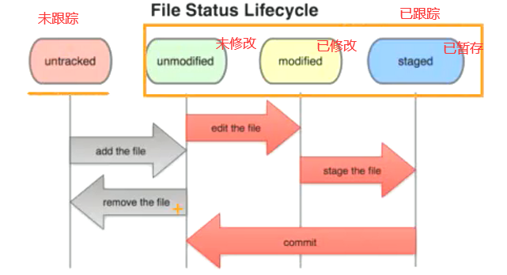

### 5.4、检查当前文件状态

```bash
git status
```

**作用**：确定文件当前处于什么状态

####  5.4.1、克隆仓库后的文件

如果在克隆仓库之后立即执行此命令，会看到类似这样的输出： 

```bash
On branch master 
nothing to commit, working directory clean
```

这说明你现在的工作目录相当干净。换句话说，所有已跟踪文件在上次提交后都未被更改过

此外，上面的信息还表明，当前目录下没有出现任何处于未跟踪的新文件，否则 Git 会在这里列出来

最后，该命令还显示了当前所在的分支是 master，这是默认的分支名称，实际是可以修改的，现在先不用考虑

#### 5.4.2、未跟踪文件

如果创建一个新文件 README，保存退出后运行`git status`会看到该文件出现在未跟踪文件列表中： 

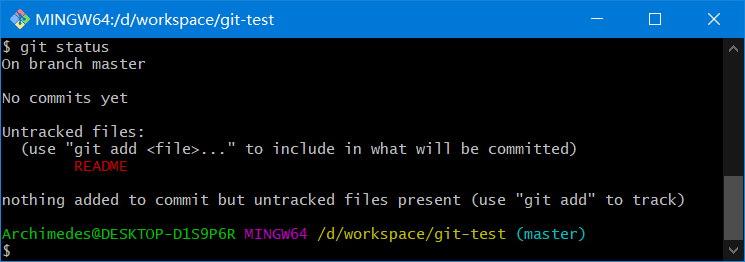

在状态报告中可以看到新建的 README 文件出现在`Untracked  files`下面

**未跟踪文件**意味着 Git 在之前的快照（提交）中没有这些文件

Git 不会自动将之纳入跟踪范围，除非你明明白白地告诉它“我需要跟踪该文件”，因而不用担心把临时文件什么的也归入版本管理

### 5.5、基本操作

#### 5.5.1、跟踪新文件（暂存）

```bash
git add 文件名
```

**作用**：跟踪一个新文件

再次运行`git status`命令，会看到 README 文件已被跟踪，并处于暂存状态

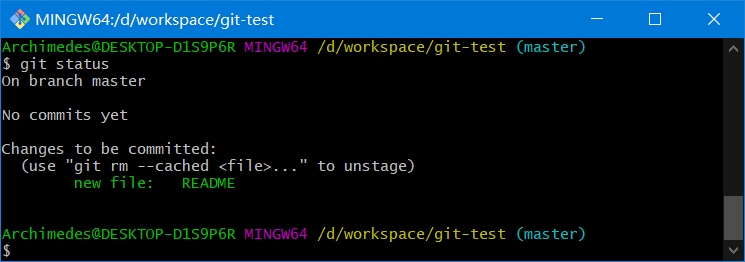

只要在`Changes to be committed`这行下面的，就说明是**已暂存状态**。如果此时提交，那么该文件此时此刻的版本将被留存在历史记录中

在`git add`后面可以指明要跟踪的文件或目录路径。如果是目录的话，就说明要递归跟踪该目录下的所有文件（译注：其实`git add`的潜台词就是把目标文件快照放入暂存区域，也就是`add file into staged area`，同时未曾跟踪过的文件标记为已跟踪。）

#### 5.5.2、暂存已修改文件

现在 README 文件都已暂存，下次提交时就会一并记录到仓库。假设此时，你想要在 README 里再加条注释，重新编辑存盘后，准备好提交。不过且慢，再运行`git status`看看

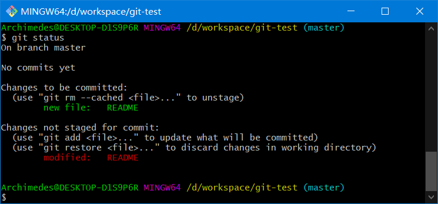

README 文件出现了两次！一次算已修改，一次算已暂存，这怎么可能呢？

好吧，实际上 Git 只不过暂存了你运行`git add`命令时的版本，如果现在提交，那么提交的是添加注释前的版本，而非当前工作目录中的版本。所以，运行了`git add`之后又作了修订的文件，需要重新运行`git add`把最新版本重新暂存起来

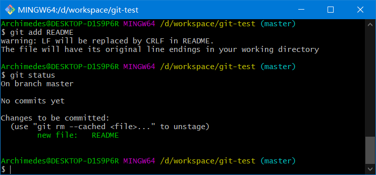

#### 5.5.3、查看已暂存和未暂存的更新

实际上`git status`的显示比较简单，仅仅是列出了修改过的文件，如果要查看具体修改了什么地方，可以用`git diff` 命令

这个命令它已经能解决我们两个问题了：当前做的哪些更新还没有暂存？有哪些更新已经暂存起来准备好了下次提交？ 

- 当前做的哪些更新还没有暂存？命令：`git diff`（不加参数直接输入`git diff`） 
- 有哪些更新已经暂存起来准备好了下次提交？ 命令： `git diff --cached`或者`git diff --staged`(1.6.1 以上) 

```bash
git diff
```

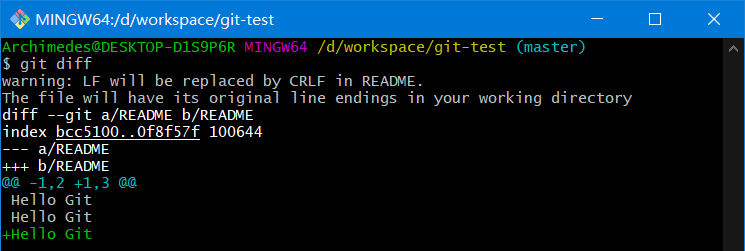

```bash
git diff --cached
git diff --staged
```

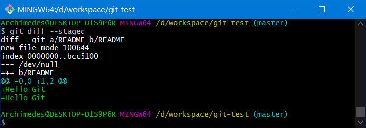

#### 5.5.4、提交更新

当暂存区域已经准备妥当可以提交时，在此之前一定要确认还有什么修改过的或新建的文件还没有`git add`过，否则提交的时候不会记录这些还没暂存起来的变化

所以，每次准备提交前，先用`git status`看下是不是都已暂存起来了，然后再运行提交命令

```bash
git commit
```

**注意**：这种方式会启动文本编辑器以便输入本次提交的说明，默认的提交消息包含最后一次运行`git status`的输出，放在注释行里；另外开头还有一空行，供你输入提交说明。你完全可以去掉这些注释行，不过留着也没关系，多少能帮你回想起这次更新的内容有哪些 

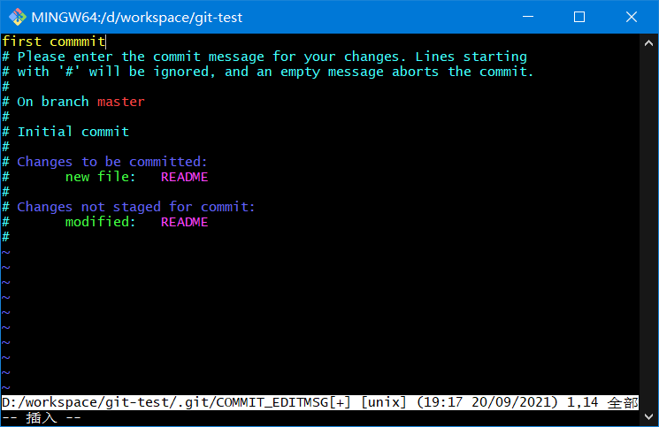

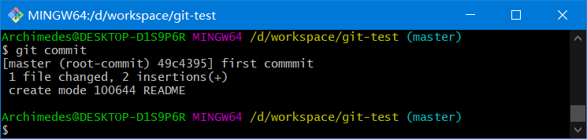

另外也可以用`-m`参数后跟提交说明的方式，在一行命令中提交更新

```bash
git commit –m "message xxx"
```

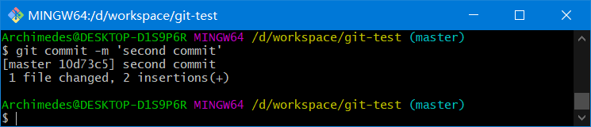

提交时记录的是放在暂存区域的快照，任何还未暂存的仍然保持已修改状态，可以在下次提交时纳入版本管理

每一次运行提交操作，都是对你项目作一次快照，以后可以回到这个状态，或者进行比较

#### 5.5.5、跳过使用暂存区

尽管使用暂存区域的方式可以精心准备要提交的细节，但有时候这么做略显繁琐，Git 提供了一个跳过使用暂存区域的方式

只要在提交时给`git commit`加上`-a`选项，Git 就会自动把所有已经跟踪过的文件暂存起来一并提交，从而跳过`git add`步骤 

```bash
git commit -a
```

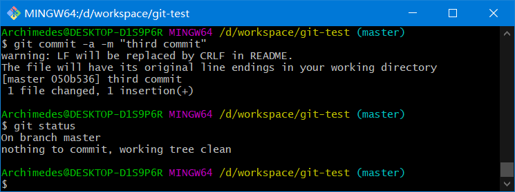

#### 5.5.6、移除文件

要从 Git 中移除某个文件，就必须要从已跟踪文件清单中注册删除（确切地说，是在暂存区域注册删除），然后提交

可以用`git rm`命令完成此项工作，并连带从工作目录中删除指定的文件，这样以后就不会出现在未跟踪文件清单中了

```bash
git rm [文件名]
```

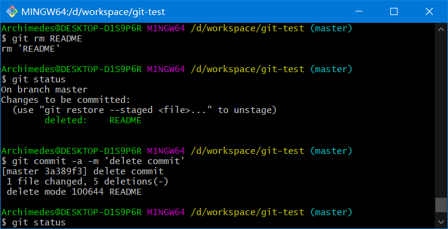

其实，运行`git rm`就相当于运行了下面两条命令

```bash
rm README
git add README
```

#### 5.5.7、文件改名

```bash
git mv 原文件名 新文件名
```

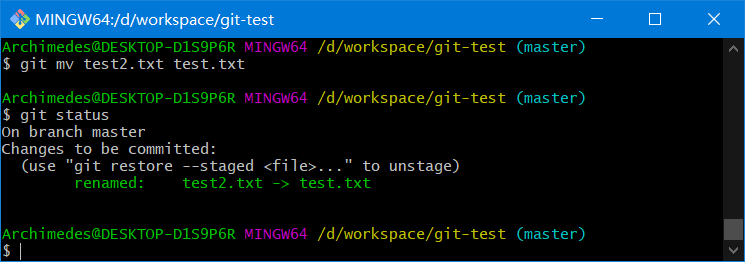

其实，运行`git mv`就相当于运行了下面三条命令

```bash
mv test2.txt test.txt
git rm test2.txt
git add test.txt
```

#### 5.5.8、查看历史记录

在提交了若干更新，又或者克隆了某个项目之后，你也许想回顾下提交历史。 完成这个任务最简单而又有效的工具是`git log`命令

默认不用任何参数的话，`git log`会按提交时间列出所有的更新，最近的更新排在最上面

正如你所看到的，这个命令会列出每个提交的  SHA-1 校验和作者的名字和电子邮件地址、提交时间以及提交说明

`git log`参数 

```bash
git log --pretty=oneline
git log --oneline
```

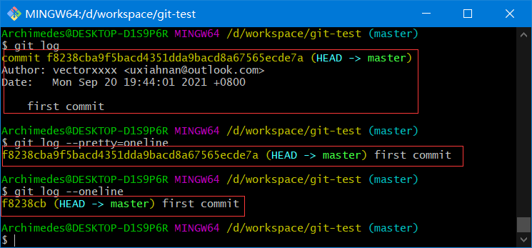

### 5.6、总结

本章节常用命令

```bash
# 初始化本地仓库
git init
# 添加暂存
git add file
# 提交版本库
git commit file
git commit -m "comment" file
git commit -a
git commit -a -m "comment"

# 移除文件并暂存
git rm file
# 文件改名并暂存
git mv file1 file2

# 查看状态
git status
# 查看未暂存
git diff
# 查看已暂存
git diff --staged
# 查看日志
git log
git log --pretty=oneline
git log --oneline
```


## 6、Git 分支操作（杀手功能）

几乎所有的版本控制系统都以某种形式支持分支。使用分支意味着你可以把你的工作从开发主线上分离开来，以免影响开发主线 

在很多版本控制系统中，这是一个略微低效的过程——常常需要完全创建一个源代码目录的副本

对于大项目来说，这样的过程会耗费很多时间

而 Git 的分支模型极其的高效轻量的。是 Git 的必杀技特性，也正因为这一特性，使得 Git 从众多版本控制系统中脱颖而出

### 6.1、创建分支

```bash
git branch 分支名
```

**作用**： 为你创建了一个可以移动的新的指针

**注意**： 创建 一个新分支，并不会自动切换到新分支中去

比如创建一个 testing 分支：`git branch testing`，这会在当前所在的提交对象上创建一个指针

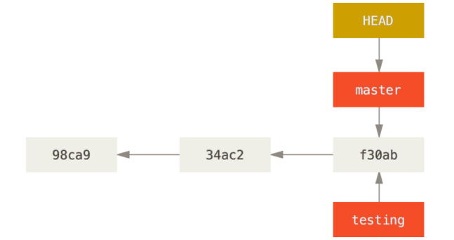

新建一个分支并且使分支指向对应的提交对象

```bash
git branch name commitHash
```

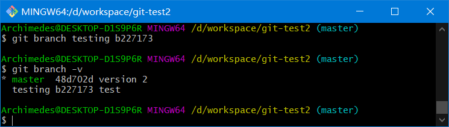

### 6.2、切换分支

```bash
git checkout 分支名
```

切换到`testing`分支上，`git checkout testing`

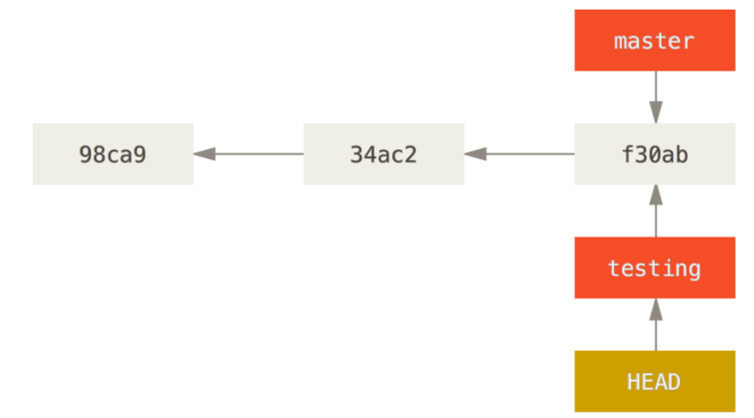

作出修改再提交

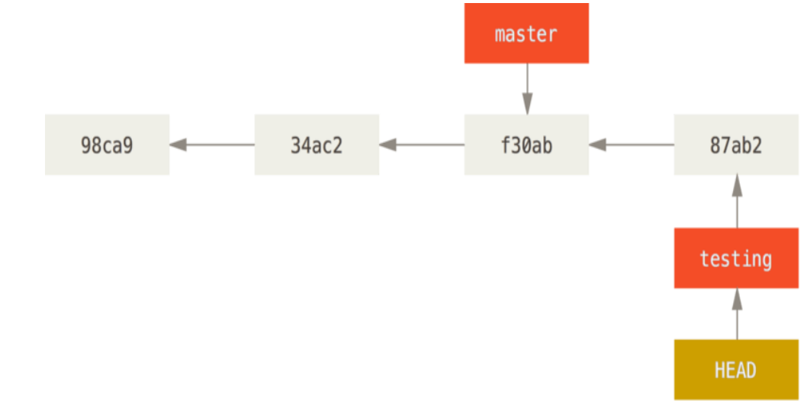

切回`master`，`git checkout master`

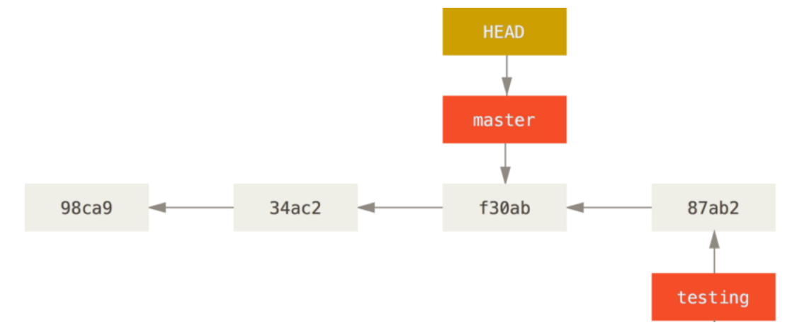

**注意**：分支切换会改变你工作目录中的文件。在切换分支时，一定要注意你工作目录里的文件会被改变。如果是切换到一个较旧的分支，你的工作目录会恢复到该分支最后一次提交时的样子。如果 Git 不能干净利落地完成这个任务，它将禁止切换分支。所以建议，<mark>每次在切换分支前，提交一下当前分支</mark>

### 创建并切换分支

```bash
git checkout -b 分支名
```

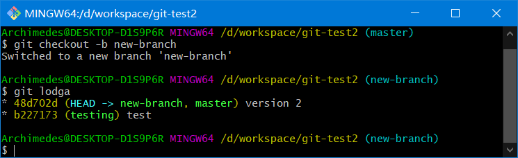

切换分支会动三个地方：

- HEAD
- 暂存区
- 工作目录

**最佳实践**：每次切换分支前，当前分支一定得是干净的（已提交状态）

**坑**：在切换分支时，如果当前分支上有未暂存的修改（首次）或者有未提交的暂存（首次），分支可以切换成功，但是这种切换可能会污染其他分支

### 6.3、查看分支

- `git branch`不只是可以创建与删除分支。如果不加任何参数运行它，会得到当前所有分支的一个列表

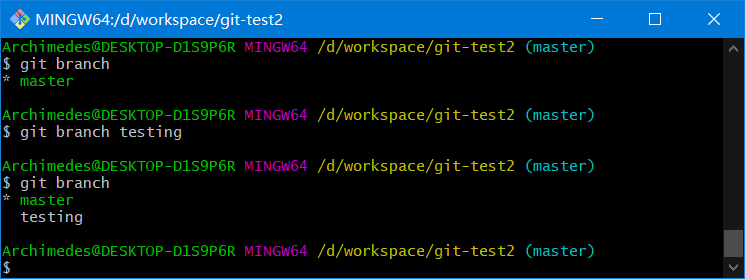

- `git branch -v`可以查看每一个分支的最后一次提交

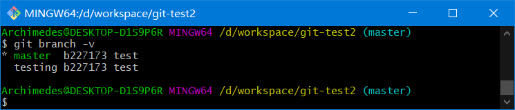

- `git log --oneline --decorate --graph --all`：查看项目所有分支历史

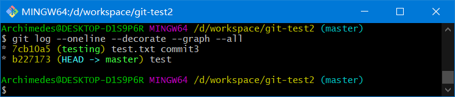

### 6.4、删除分支

- `git branch -d name`：删除分支
- `git branch -D name`：如果分支尚未进行合并，则是不允许删除的。用此命令可以强制删除

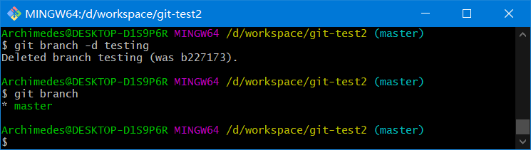

**总结**

- 分支的本质其实就是一个提交对象
- `HEAD`是一个指针，默认指向`master`分支
- 切换分支时，就是让`HEAD`指向不同的分支
- 每次有新的提交时，`HEAD`都会带着当前指向的分支一起向前移动

### 实际案例

**工作流** 

1. 开发某个网站。 
2. 为实现某个新的需求，创建一个分支。 
3. 在这个分支上开展工作。 

正在此时，你突然接到一个电话说有个很严重的问题需要紧急修补。  你将按照如下方式来处理： 

1. 切换到你的线上分支（production branch）。 
2. 为这个紧急任务新建一个分支，并在其中修复它。 
3. 在测试通过之后，切换回线上分支，然后合并这个修补分支，最后将改动推送到线上分支。 
4. 切换回你最初工作的分支上，继续工作。

**Git 流**

首先，我们假设你正在你的项目上工作，并且已经有一些提交

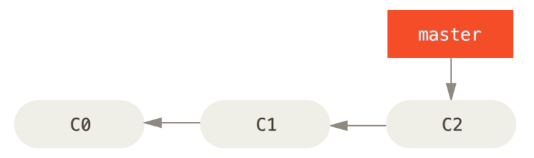

现在，你已经决定要解决你的公司使用的问题追踪系统中的 #53 问题。想要新建一个分支并同时切换到那个分支上

```bash
git checkout -b iss53
```

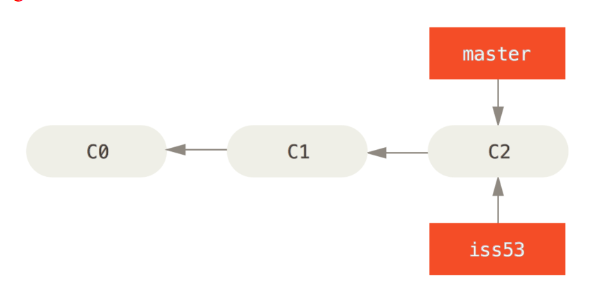

你继续在  #53  问题上工作，并且做了一些提交。  在此过程中，iss53  分支在不断的向前推进，因为你已经检出到该分支

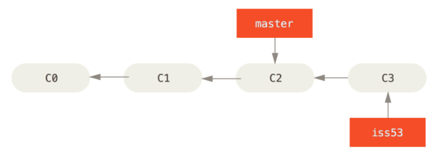

<mark>！！！现在你接到那个电话，有个紧急问题等待你来解决</mark>

有了 Git 的帮助，你不必把这个紧急问题和 iss53 的修改混在一起，你也不需要花大力气来还原关于 #53 问题的修改，然后再添加关于这个紧急问题的修改，最后将这个修改提交到线上分支。你所要做的仅仅是切换回 master 分支

但是，在你这么做之前，要留意你的工作目录和暂存区里那些还没有被提交的修改，它可能会和你即将检出的分支产生冲突从而阻止  Git  切换到该分支。 最好的方法是，在你切换分支之前，保持好一个干净的状态。（提交你的所有修改）

```bash
git checkout master
```

这个时候，你的工作目录和你在开始  #53  问题之前一模一样，现在你可以专心修复紧急问题了。  请牢记：当你切换分支的时候，Git  会重置你的工作目录，使其看起来像回到了你在那个分支上最后一次提交的样子。  Git 会自动添加、删除、修改文件以确保此时你的工作目录和这个分支最后一次提交时的样子一模一样

！！！接下来，你要修复这个紧急问题。让我们建立一个针对该紧急问题的分支（hotfix branch），在该分支上工作直到问题解决

```bash
git checkout -b hotfix
# 做出修改...
git commit -a -m 'fixed the broken email address'
```

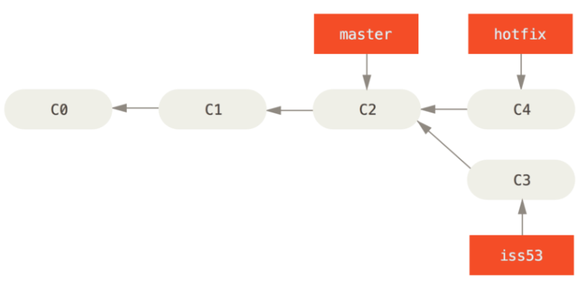

！！！你可以运行你的测试，确保你的修改是正确的，然后将其合并回你的 master 分支来部署到线上。你可以使用`git merge`命令来达到上述目的

```bash
git checkout master
git merge hotfix
```

#### 快进合并

在合并的时候，有时候会出现"快进（fast-forward）"这个词

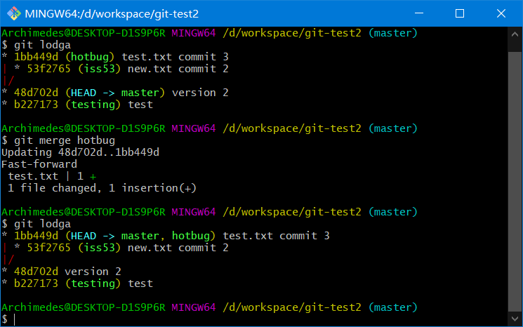

由于当前 master 分支所指向的提交是你当前提交的直接上游，所以  Git  只是简单的将指针向前移动。  换句话说，当你试图合并两个分支时，如果顺着一个分支走下去能够到达另一个分支，那么  Git  在合并两者的时候，只会简单的将指针向前推进（指针右移），因为这种情况下的合并操作没有需要解决的分歧——这就叫做 <mark>“快进合并”</mark>

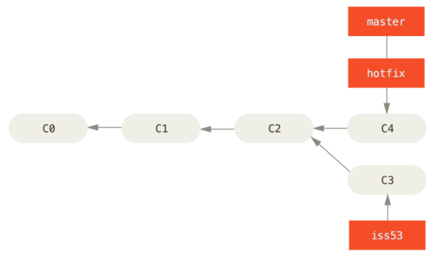

！！！关于这个紧急问题的解决方案发布之后，你准备回到被打断之前时的工作中。  然而，你应该先删除 hotfix 分支，因为你已经不再需要它了—— master 分支已经指向了同一个位置。  你可以使用带`-d`选项的`git branch`命令来删除分支。现在你可以切换回你正在工作的分支继续你的工作，也就是针对 #53 问题的那个分支

```bash
git branch -d hotfix
git checkout iss53
```

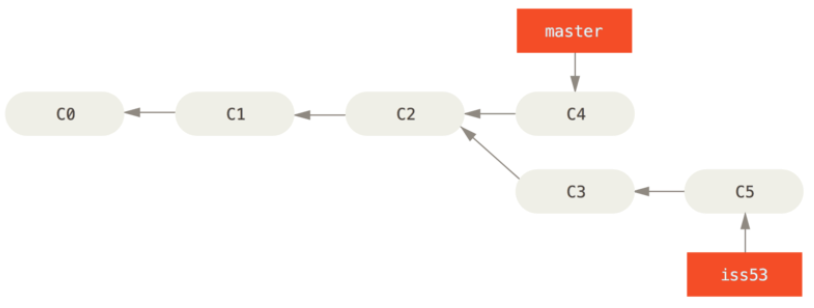

你在 hotfix 分支上所做的工作并没有包含到 iss53 分支中。 如果你需要拉取 hotfix 所做的修改 ，你可以使用`git merge master`命令将master 分支合并入 iss53 分支，或者你也可以等到 iss53 分支完成其使命，再将其合并回 master 分支

```bash
git checkout master
git merge iss53
```

#### 典型合并

当前的合并和你之前合并 hotfix 分支的时候看起来有一点不一样。在这种情况下，你的开发历史从一个更早的地方开始分叉开来（diverged）。因为，master 分支所在提交并不是 iss53 分支所在提交的直接祖先，Git 不得不做一些额外的工作。出现这种情况的时候，Git 会使用两个分支的末端所指的快照（C4 和 C5）以及这两个分支的工作祖先（C2），做一个简单的三方合并

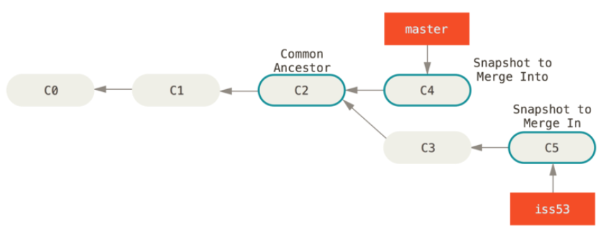

和之前将分支指针向前推进所不同的是，Git 将此次三方合并的结果做了一个新的快照并且自动创建一个新的提交指向它。这个被称作一次 <mark>合并提交</mark>，它的特别之处在于他有不止一个父提交

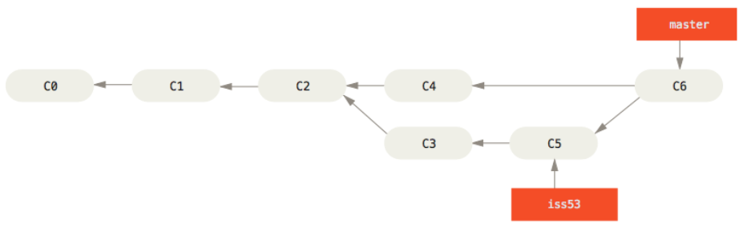

需要指出的是，Git 会自行决定选取哪一个提交作为最优的共同祖先，并以此作为合并的基础；这和更加古老的 CVS 系统或者 Subversion（1.5  版本之前）不同，在这些古老的版本管理系统中，用户需要自己选择最佳的合并基础。Git 的这个优势使其在合并操作上比其他系统要简单很多

最终删除 iss53 号分支

```bash
git branch -d iss53
```

#### 冲突

有时候合并操作不会如此顺利。如果你在两个不同的分支中，对同一个文件的同一个部分进行了不同的修改，Git  就没法干净的合并它们。如果你对 #53 问题的修改和有关 hotfix 的修改都涉及到同一个文件的同一处，在合并它们的时候就会产生合并冲突

此时 Git 做了合并，但是没有自动地创建一个新的合并提交。Git 会暂停下来，等待你去解决合并产生的冲突。你可以在合并冲突后的任意时刻使用`git status`命令来查看那些因包含合并冲突而处于未合并（unmerged）状态的文件

任何因包含合并冲突而有待解决的文件，都会以**未合并状态**标识出来

```bash
<<<<<<< HEAD:index.html 
<div id="footer">contact : email.support@github.com</div> 
======= 
<div id="footer"> 
  please contact us at support@github.com 
</div> 
>>>>>>> iss53:index.html 
```

在你解决了所有文件里的冲突之后，对每个文件使用`git add`命令来将其标记为冲突已解决。  一旦暂存这些原本有冲突的文件，Git 就会将它们标记为**冲突已解决**

### 6.5、分支模式

#### 长期分支（master）

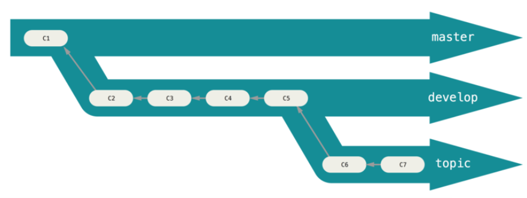

许多使用 Git 的开发者都喜欢使用这种方式来工作，比如只在 master 分支上保留完全稳定的代码——有可能仅仅是已经发布或即将发布的代码。他们还有一些名为 develop 或者 next 的平行分支，被用来做后续开发或者测试稳定性——这些分支不必保持绝对稳定，但是一旦达到稳定状态，它们就可以被合并入 master 分支了，等待下一次的发布。随着你的提交而不断右移的指针。稳定分支的指针总是在提交历史中落后一大截，而前沿分支的指针往往比较靠前

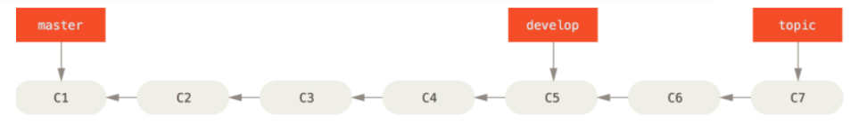

#### 特性分支（topic）

特性分支对任何规模的项目都适用。特性分支是一种<mark>短期分支</mark>，它被用来实现单一特性或其相关工作。也许你从来没有在其他的版本控制系统（VCS）上这么做过，因为在那些版本控制系统中创建和合并分支通常很费劲。然而，在 Git 中一天之内多次创建、使用、合并、删除分支都很常见

### 6.6、分支本质

<mark>Git 分支，其实本质上仅仅是指向提交对象的可变指针</mark>。Git 的默认分支名字是 master。在多次提交操作之后，你其实已经有一个指向最后那个提交对象的 master 分支。它会在每次的提交操作中自动向前移动

**注意：** Git 的 “master” 分支并不是一个特殊分支。它就跟其它分支完全没有区别。之所以几乎每一个仓库都有 master 分支，是因为`git init`命令默认创建它，并且大多数人都懒得去改动它

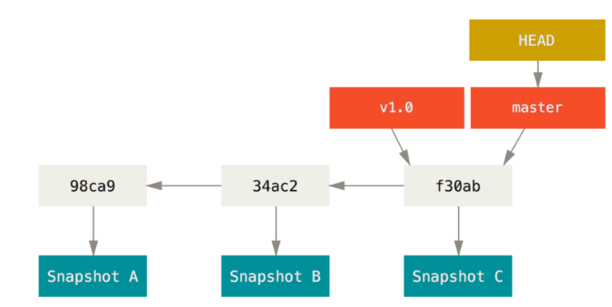

### 6.7、分支原理

#### .git/refs 目录

这个目录中保存了分支及其对应的提交对象 

#### HEAD 引用

当运行类似于`git branch (branchname)`这样的命令时，Git 会取得当前所在分支最新提交对应的 SHA-1 值，并将其加入你想要创建的任何新分支中。当你执行`git branch (branchname)`时，Git 如何知道最新提交的 SHA-1 值呢？答案是 HEAD 文件。HEAD 文件是一个符号引用（symbolic reference），指向目前所在的分支。所谓符号引用，意味着它并不像普通引用那样包含一个 SHA-1 值。它是一个指向其他引用的指针

### 6.8、总结

本节常用命令

```bash
# 从当前分支最新版本创建分支
git branch name
# 从当前分支某一版本创建分支
git branch name commithash
# 创建并切换分支
git checkout -b name
# 删除分支
git branch -d name
git branch -D name
# 查看所有分支
git branch
# 查看所有分支（-v即--verbose，显示最后一次提交）
git branch -v
# 查看所有分支历史
git log --oneline --decorate --graph --all
```


## 7、Git 存储

有时，当你在项目的一部分上已经工作一段时间后，所有东西都进入了混乱的状态，而这时你想要切换到另一个分支做一点别的事情。  问题是，你不想仅仅因为过会儿回到这一点而为做了一半的工作创建一次提交。针对这个问题的答案是`git stash`命令

```bash
git stash  #命令会将未完成的修改保存到一个栈上，而你可以在任何时候重新应用这些改动(git stash apply) 
git stash list  #查看存储
git stash apply stash@{2}  #如果不指定一个储藏，Git认为指定的是最近的储藏
git stash pop  #来应用储藏然后立即从栈上扔掉它
git stash drop  #加上将要移除的储藏的名字来移除它
```


## 8、配别名

Git 并不会在你输入部分命令时自动推断出你想要的命令。如果不想每次都输入完整的 Git 命令，可以通过`git config`文件来轻松地为每一个命令设置一个别名

```bash
git config --global alias.co checkout
git config --global alias.br branch
git config --global alias.ci commit
git config --global alias.st status
```

当要输入`git commit`时，只需要输入`git ci`

上面例子中，我们已经设置了一个命令别名并进行了使用

```bash
git lodga #作用等同于 git log --oneline --decorate --graph --all
```

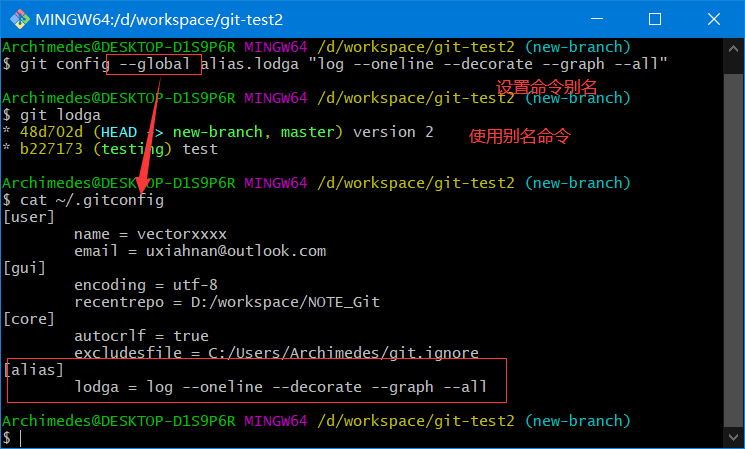

因为我们使用的是`--global`命令，是在用户级别定义的，所以可以在用户家目录下`.gitconfig`中查看到设置的别名信息

当要输入`git log --oneline --decorate --graph --all`时，只需要输入`git lodga`即可