::: tip

9 Git后悔药

10 打tag

11 Git特点

12 Git工作流程

13 什么是远程仓库

:::

## 9、Git 后悔药

### 9.1、撤销

#### 工作区：如何撤回修改

```bash
git checkout -- <file>
```

**注意**：`git checkout -- <file>`是一个危险的命令，这很重要。你对那个文件做的任何修改都会消失——你只是拷贝了另一个文件来覆盖它。除非你确实清楚不想要那个文件了，否则不要使用这个命令

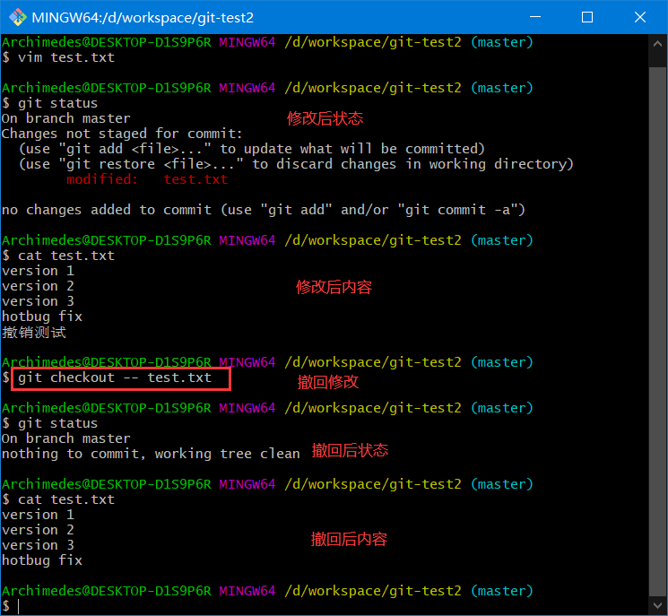

#### 暂存区：如何撤回暂存

```bash
git reset HEAD <file>
```

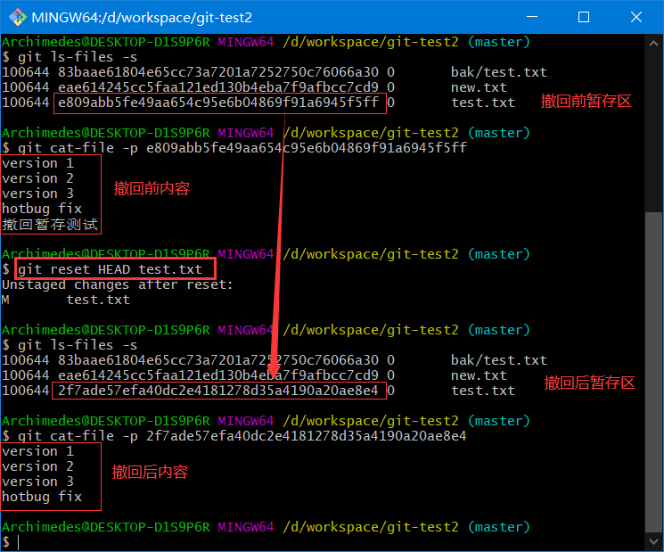

#### 版本库：如何撤回提交

```bash
git commit --amend
```

这个命令会将暂存区中的文件提交。如果自上次提交以来你还未做任何修改（例如，在上次提交后马上执行了此命令），那么快照会保持不变，而你所修改的只是提交信息。最终你只会有一个提交——第二次提交将代替第一次提交的结果

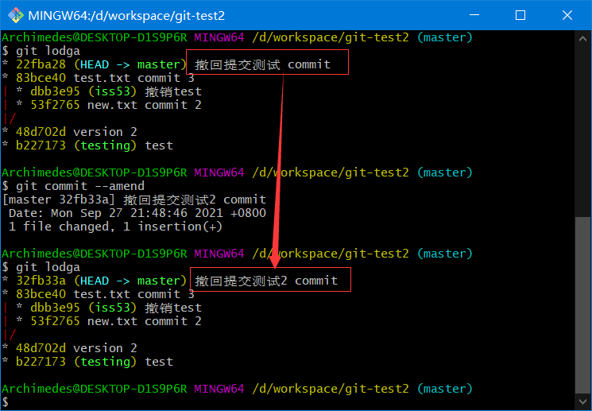

### 9.2、重置

#### 第一部：移动 HEAD

`reset`做的第一件事是移动 HEAD 的指向。假设我们再次修改了 file.txt 文件并第三次提交它

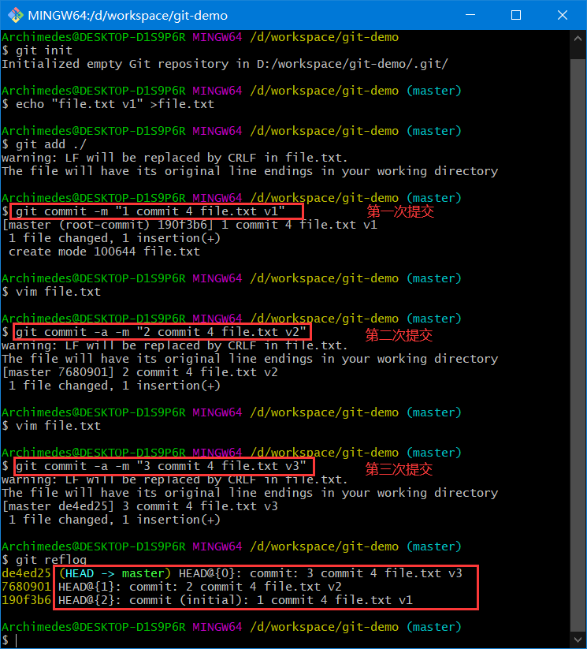

现在的历史看起来是这样

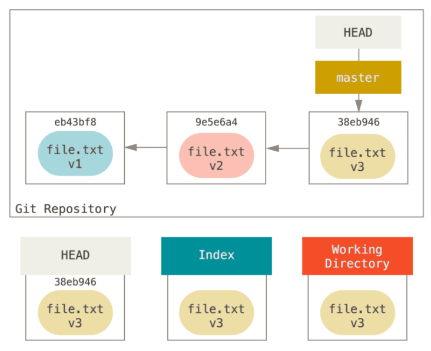

```bash
git reset --soft HEAD~ 
```

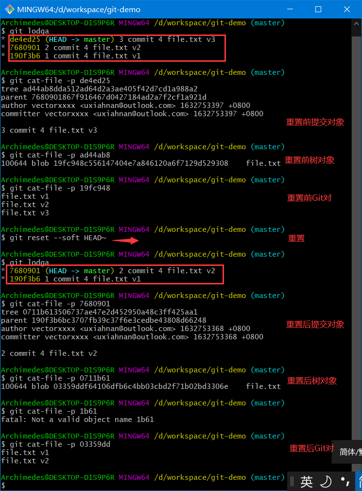

这与改变 HEAD 自身不同（`checkout`所做的）；`reset`移动 HEAD 指向的分支

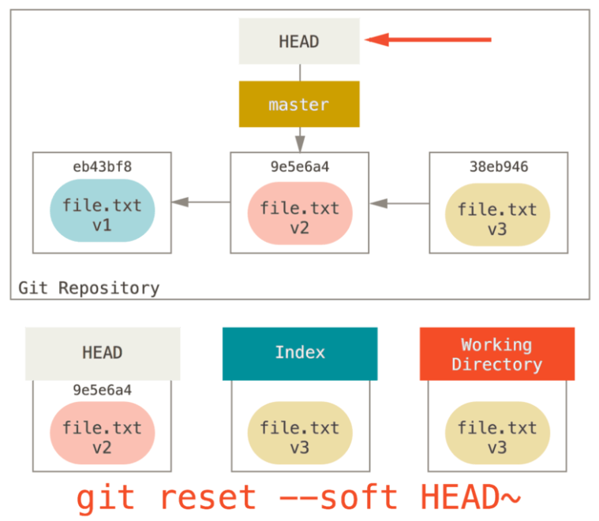

看一眼上图，理解一下发生的事情：它本质上是撤销了上一次`git commit`命令。  当你在运行`git commit`时，Git 会创建一个新的提交，并移动 HEAD 所指向的分支来使其指向该提交。当你将它`reset`回 HEAD~（HEAD  的父结点）时，其实就是把该分支移动回原来的位置，而不会改变索引和工作目录。现在你可以更新索引并再次运行`git commit`来完成`git commit --amend`所要做的事情了

#### 第二部：更新暂存区

```bash
git reset [--mixed] HEAD~
```

**注意**：`git reset HEAD~`等同于`git reset –-mixed HEAD~`

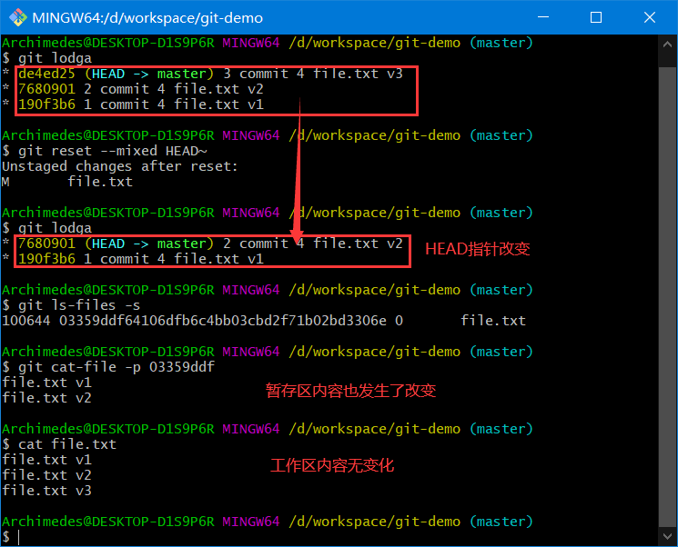

如下图所示

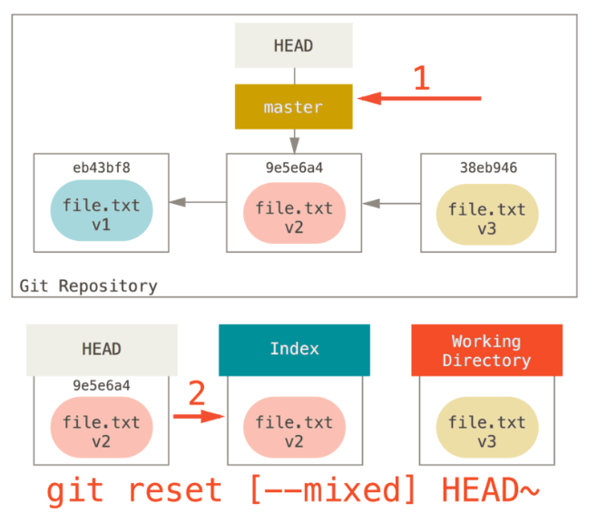

理解一下发生的事情：它依然会撤销上次提交，但还会取消暂存所有的东西。于是，我们回滚到了所有`git add`和`git commit`的命令执行之前

#### 第三部：更新工作区

```bash
git reset --hard HEAD~
```

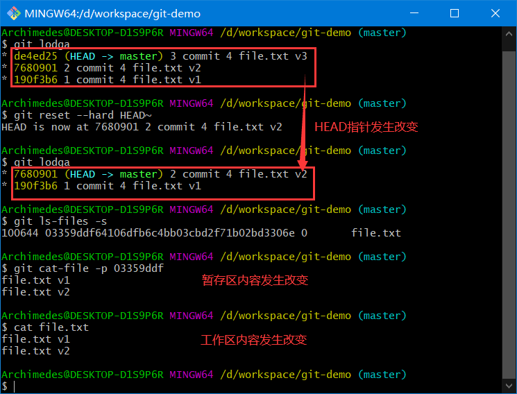

如下图所示

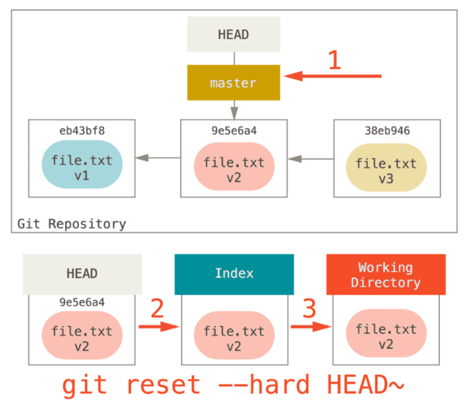

你撤销了最后的提交、`git add`和`git commit`命令以及工作目录中的所有工作

**注意**：必须注意，`--hard`标记是`reset`命令唯一的危险用法，它也是 Git 会真正地销毁数据的仅有的几个操作之一。其他任何形式的`reset`调用都可以轻松撤消，但是`--hard`选项不能，因为它强制覆盖了工作目录中的文件。在这种特殊情况下，我们的 Git 数据库中的一个提交内还留有该文件的 v3 版本，我们可以通过`reflog`来找回它。但是若该文件还未提交，Git 仍会覆盖它从而导致无法恢复

### 9.3、路径 reset

前面讲述了`reset`基本形式的行为，不过你还可以给它提供一个作用路径。若指定了一个路径，<mark>`reset`将会跳过第 1 步</mark>，并且将它的作用范围限定为指定的文件或文件集合。这样做自然有它的道理，因为 HEAD 只是一个指针，你无法让它同时指向两个提交中各自的一部分。不过索引和工作目录可以部分更新，所以重置会继续进行第 2、3 步。 现在，假如我们运行`git reset file.txt` （这其实是`git reset --mixed HEAD file.txt`的简写形式），它会：

- 移动 HEAD 分支的指向（因为是文件，这一步忽略）
- 让索引看起来像 HEAD

所以它本质上只是将 file.txt 从 HEAD 复制到索引中

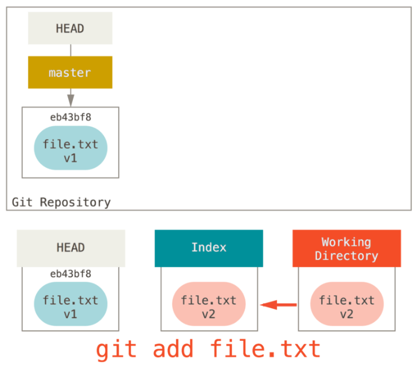

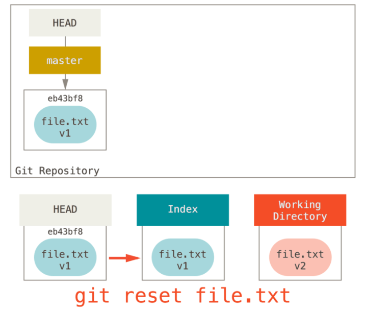

### 9.4、checkout 与 reset 对比（无路径）

运行`git checkout [branch]`与运行`git reset --hard [branch]`非常相似，它会更新三者使其看起来像 [branch]，不过有两点重要的区别

1. 首先不同于`reset --hard`，`checkout`对工作目录是安全的，它会通过检查来确保不会将已更改的文件弄丢。而`reset --hard`则会不做检查就全面地替换所有东西
2. 第二个重要的区别是如何更新 HEAD。 `reset`会移动 HEAD 分支的指向，而`checkout`只会移动 HEAD 自身来指向另一个分支

例如，假设我们有 master 和 develop 分支，它们分别指向不同的提交；我们现在在 develop 上，如果我们运行`git reset master`，那么 develop 自身现在会和 master 指向同一个提交。而如果我们运行`git checkout master`的话，develop 不会移动，HEAD 自身会移动。现在 HEAD 将会指向 master

所以，虽然在这两种情况下我们都移动 HEAD 使其指向了提交 A，但做法是非常不同的。`reset`会移动 HEAD 分支的指向，而`checkout`则移动 HEAD 自身

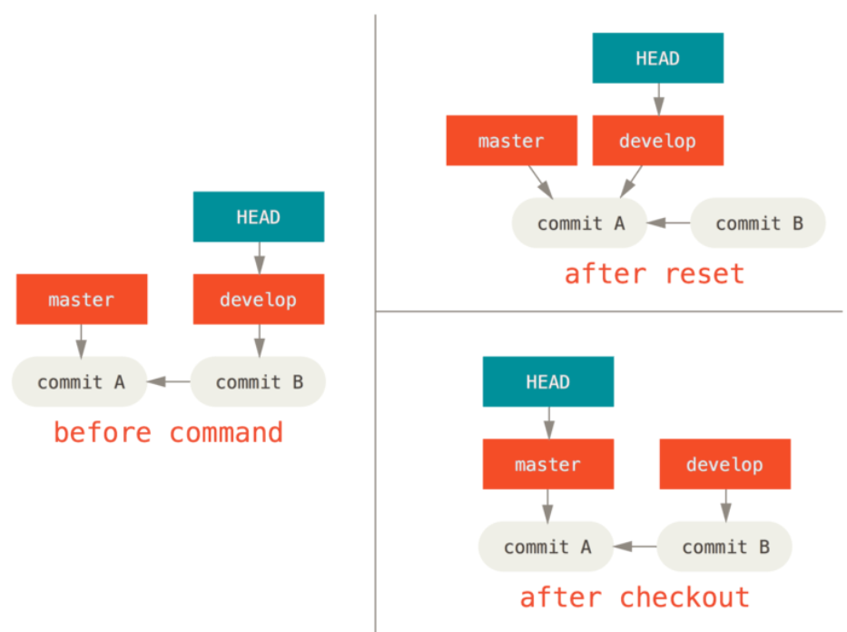

### 9.5、checkout 与 reset 对比（有路径）

`git checkout commithash`运行`checkout`的另一种方式就是指定一个文件路径，这会像`reset`一样不会移动 HEAD。它就像是`git reset --hard [branch] file`。 这样对工作目录并不安全，它也不会移动 HEAD，将会跳过第 1 步更新暂存区和工作目录。`git checkout --`相比于`git reset -- hard commitHash`跟文件名的形式，第 1、第 2 步都没做

### 9.6、数据恢复

在你使用 Git 的时候，你可能会意外丢失一次提交。通常这是因为你强制删除了正在工作的分支，但是最后却发现你还需要这个分支；亦或者硬重置了一个分支，放弃了你想要的提交。如果这些事情已经发生，该如何找回你的提交呢？

#### 实例

假设你已经提交了五次

```bash
$ git log --pretty=oneline
ab1afef80fac8e34258ff41fc1b867c702daa24b    modified repo a bit 
484a59275031909e19aadb7c92262719cfcdf19a    added repo.rb 
1a410efbd13591db07496601ebc7a059dd55cfe9    third commit
cac0cab538b970a37ea1e769cbbde608743bc96d    second commit 
fdf4fc3344e67ab068f836878b6c4951e3b15f3d    first commit
```

现在，我们将 master 分支硬重置到第三次提交

```bash
$ git reset --hard 1a410efbd13591db07496601ebc7a059dd55cfe9 
HEAD is now at 1a410ef third commit
$ git log --pretty=oneline 
1a410efbd13591db07496601ebc7a059dd55cfe9  third commit 
cac0cab538b970a37ea1e769cbbde608743bc96d  second commit 
fdf4fc3344e67ab068f836878b6c4951e3b15f3d  first commit 
```

现在顶部的两个提交已经丢失了  -  没有分支指向这些提交。你需要找出最后一次提交的  SHA-1  然后增加一个指向它的分支。  窍门就是找到最后一次的提交的  SHA-1 -  但是估计你记不起来了，对吗？

最方便，也是最常用的方法，是使用一个名叫`git reflog`的工具。当你正在工作时，Git 会默默地记录每一次你改变 HEAD 时它的值。每一次你提交或改变分支，引用日志都会被更新

```bash
$ git reflog 
1a410ef HEAD@{0}: reset: moving to 1a410ef 
ab1afef HEAD@{1}: commit: modified repo.rb a bit 
484a592 HEAD@{2}: commit: added repo.rb
```

`git reflog`并不能显示足够多的信息。为了使显示的信息更加有用，我们可以执行`git log -g`，这个命令会以标准日志的格式输出引用日志

#### 恢复

看起来下面的那个就是你丢失的提交，你可以通过创建一个新的分支指向这个提交来恢复它。例如 ，你可以创建一个名为`recover-branch`的分支指向这个提交（ab1afef） 

```bash
git branch recover-branch ab1afef
```

现在有一个名为 recover-branch 的分支是你的 master 分支曾经指向的地方，再一次使得前两次提交可到达了

### 9.7、总结

```bash
# 撤回修改
git checkout -- file
# 撤回暂存
git reset file  <==>  git reset --mixed HEAD file
# 撤回提交
git commit --amend

# 移动HEAD
git reset --soft commithash
# 更新暂存区
git reset --mixed commithash  <==>  git reset commithash
# 更新工作区
git reset --hard commithash

# 引用日志
git reflog
# 引用日志（详细）
git log -g
```


## 10、打 tag

Git 可以给历史中的某一个提交打上标签，以示重要。比较有代表性的是人们会使用这个功能来标记发布结点（v1.0  等等）

### 10.1、列出标签

```bash
git tag
git tag -l 'v1.8.5*'
# v1.8.5 v1.8.5-rc0 v1.8.5-rc1 v1.8.5-rc2 v1.8.5-rc3 v1.8.5.1 v1.8.5.2 v1.8.5.3
```

### 10.2、创建标签

Git 使用两种主要类型的标签：**轻量标签**与**附注标签**。**轻量标签**很像一个不会改变的分支，它只是一个特定提交的引用   

```bash
git tag v1.0
git tag v1.0 commitHash
```

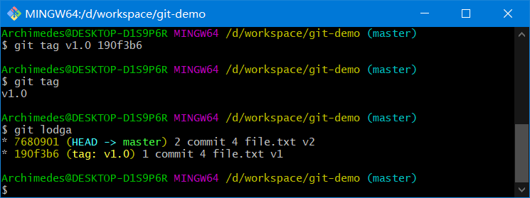

**附注标签**是存储在 Git 数据库中的一个完整对象。它们是可以被校验的；其中包含打标签者的名字、电子邮件地址、日期时间；还有一个标签信息；<mark>通常建议创建附注标签，这样你可以拥有以上所有信息；但是如果你只是想用一个临时的标签，或者因为某些原因不想要保存那些信息，轻量标签也是可用的</mark>

```bash
git tag -a v1.4 
git tag -a v1.4 commitHash
git tag -a v1.4 commitHash -m 'my version 1.4
```

### 10.3、查看特定标签

`git show`可以显示任意类型的对象

- git 对象
- 树对象
- 提交对象
- tag 对象

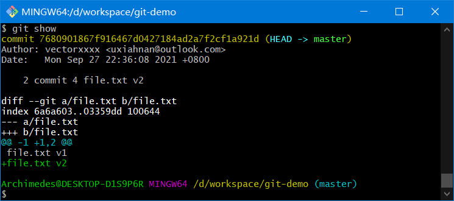

```bash
git show tagname
```

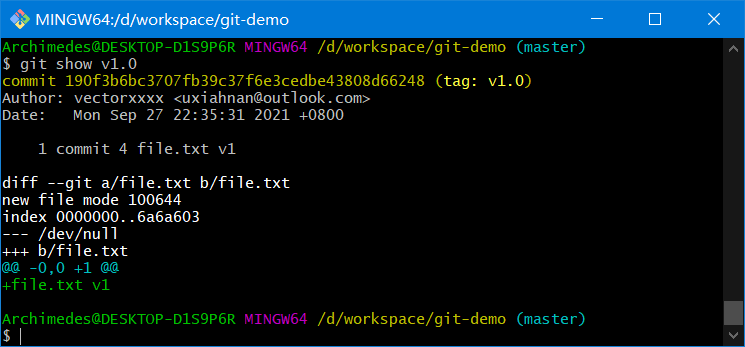

### 10.4、远程标签

默认情况下，`git push`命令并不会传送标签到远程仓库服务器上。在创建完标签后你必须显式地推送标签到共享服务器上。你可以运行 

```bash
git push origin [tagname]
```

如果想要一次性推送很多标签，也可以使用带有`--tags`选项的`git push`命令。这将会把所有不在远程仓库服务器上的标签全部传送到那里

```bash
git push origin --tags
```

### 10.5、删除标签

删除标签  要删除掉你本地仓库上的标签，可以使用命令

```bash
git tag -d <tagname>
```

例如，可以使用下面的命令删除掉一个轻量级标签： 

```bash
git tag -d v1.0
```

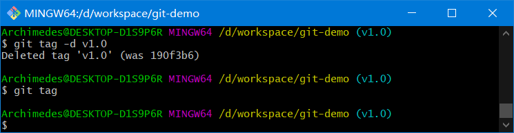

应该注意的是上述命令并不会从任何远程仓库中移除这个标签，你必须使用

```bash
git push <remote> :refs/tags/<tagname>
```

来更新你的远程仓库： 

```bash
git push origin :refs/tags/v1.4
```

### 10.6、检出标签

如果你想查看某个标签所指向的文件版本，可以使用`git checkout`命令

```bash
git checkout tagname
```

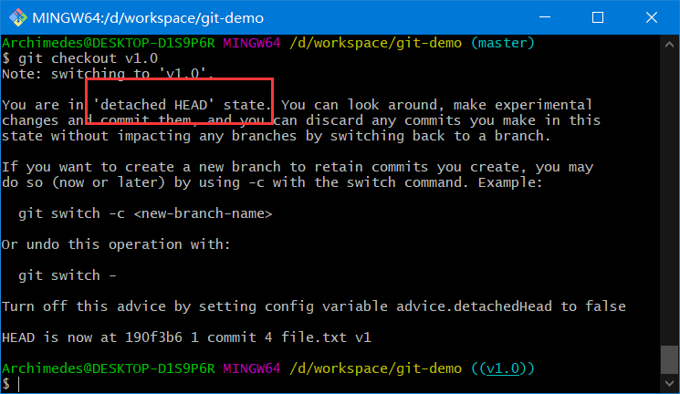

虽然说这会使你的仓库处于“分离头指针（detacthed HEAD）”状态。在“分离头指针”状态下，如果你做了某些更改然后提交它们，标签不会发生变化，但你的新提交将不属于任何分支，并且将无法访问，除非访问确切的提交哈希。因此，如果你需要进行更改——比如说你正在修复旧版本的错误——这通常需要创建一个新分支： 

```bash
git checkout -b version2
```

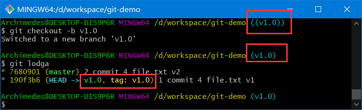


## 11、Git 特点

在开始学习 Git 的时候，请不要尝试把各种概念和其他版本控制系统（诸如 Subversion 和 Perforce 等）相比拟，否则容易混淆每个操作的实际意义。Git 在保存和处理各种信息的时候，虽然操作起来的命令形式非常相近，但它与其他版本控制系统的做法颇为不同。理解这些差异将有助于你准确地使用 Git 提供的各种工具

### 11.1、直接记录快照，而非差异比较

Git  和其他版本控制系统的主要差别在于，Git 只关心文件数据的整体是否发生变化，而大多数其他系统则只关心文件内容的具体差异

这类系统（CVS，Subversion，Perforce，Bazaar  等等）每次记录有哪些文件作了更新，以及都更新了哪些行的什么内容

(下图)其他系统在每个版本中记录着各个文件的具体差异

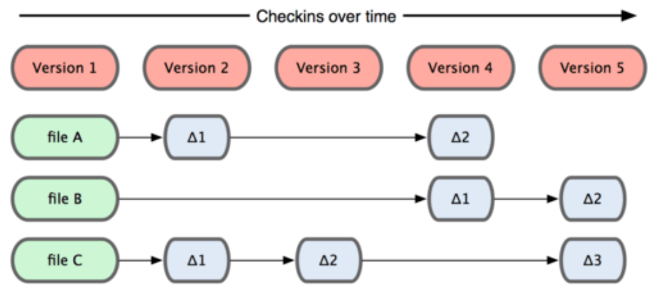

Git 并不保存这些前后变化的差异数据。实际上，Git 更像是把变化的文件作快照后，记录在一个微型的文件系统中。每次提交更新时，它会纵览一遍所有文件的指纹信息并对文件作一快照，然后保存一个指向这次快照的索引。为提高性能，若文件没有变化，Git 不会再次保存，而只对上次保存的快照作一链接。Git 的工作方式就像下图所示（保存每次更新时的文件快照）

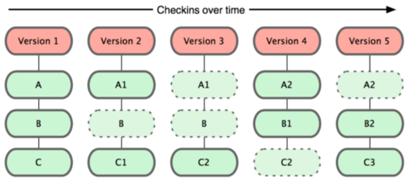

这是 Git 同其他系统的重要区别。它完全颠覆了传统版本控制的套路，并对各个环节的实现方式作了新的设计。Git 更像是个小型的文件系统，但它同时还提供了许多以此为基础的超强工具，而不只是一个简单的 VCS。稍后在讨论 Git 分支管理的时候，我们会再看看这样的设计究竟会带来哪些好处

### 11.2、近乎所有操作都是本地执行

在 Git 中的绝大多数操作都只需要访问本地文件和资源，不用连网。但如果用 CVCS 的话，差不多所有操作都需要连接网络。因为 Git 在本地磁盘上就保存着所有当前项目的历史更新，所以处理起来速度飞快

### 11.3、时刻保持数据完整性

在保存到 Git 之前，所有数据都要进行内容的校验和计算，并将此结果作为数据的唯一标识和索引。换句话说，不可能在你修改了文件或目录之后，Git 一无所知。这项特性作为 Git 的设计哲学，建在整体架构的最底层。所以如果文件在传输时变得不完整，或者磁盘损坏导致文件数据缺失，Git 都能立即察觉。Git 使用 SHA-1 算法计算数据的校验，通过对文件的内容或目录的结构计算出一个 SHA-1 哈希值，作为指纹字符串。该字串由 40 个十六进制字符（0-9  及  a-f）组成，看起来就像是

```bash
24b9da6552252987aa493b52f8696cd6d3b00373
```

Git  的工作完全依赖于这类指纹字串，所以你会经常看到这样的哈希值。实际上，所有保存在 Git 数据库中的东西都是用此哈希值来作索引的，而不是靠文件名

### 11.4、多数操作仅添加数据

常用的 Git 操作大多仅仅是把数据添加到数据库。因为任何一种不可逆的操作，比如删除数据，都会使回退或重现历史版本变得困难重重。在别的 VCS  中，若还未提交更新，就有可能丢失或者混淆一些修改的内容，但在 Git 里，一旦提交快照之后就完全不用担心丢失数据，特别是养成定期推送到其他仓库的习惯的话。 这种高可靠性令我们的开发工作安心不少，尽管去做各种试验性的尝试好了，再怎样也不会弄丢数据

### 11.5、文件的三种状态

对于任何一个文件，在 Git 内都只有三种状态（Git 外的状态就是一个普通文件）：

- **已提交（committed）**： 已提交表示该文件已经被安全地保存在本地数据库中了
- **已修改（modified）**：已修改表示修改了某个文件，但还没有提交保存
- **已暂存（staged）**：已暂存表示把已修改的文件放在下次提交时要保存的清单中

由此我们看到 Git 管理项目时，文件流转的三个工作区域： 

Git 的**工作目录**，**暂存区域**，**本地仓库**！！！！

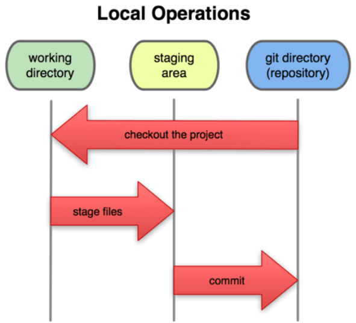


## 12、Git 工作流程

每个项目都有一个 Git 目录（.git ）它是 Git 用来保存元数据和对象数据库的地方。该目录非常重要，每次克隆镜像仓库的时候，实际拷贝的就是这个目录里面的数据

1. 在工作目录中修改某些文件

   a) 从项目中取出某个版本的所有文件和目录，用以开始后续工作的叫做工作目录。这些文件实际上都是从 Git 目录中的压缩对象数据库中提取出来的，接下来就可以在工作目录中对这些文件进行编辑

2. 保存到暂存区域，对暂存区做快照
   a) 暂存区域只不过是个简单的文件，一般都放在 Git 目录中。有时候人们会把这个文件叫做索引文件，不过标准说法还是叫暂存区域

3. 提交更新，将保存在暂存区域的文件快照永久转储到本地数据库（Git 目录）中
   我们可以从文件所处的位置来判断状态：如果是 Git 目录中保存着的特定版本文件，就属于已提交状态；如果作了修改并已放入暂存区域，就属于已暂存状态；如果自上次取出后，作了修改但还没有放到暂存区域，就是已修改状态


## 13、什么是远程仓库

为了能在任意 Git 项目上团队协作，你需要知道如何管理自己的远程仓库。远程仓库是指托管在因特网或其他网络中的你的项目的版本库。你可以有好几个远程仓库，通常有些仓库对你只读，有些则可以读写。<mark>与他人协作涉及管理远程仓库以及根据需要推送或拉取数据</mark>。管理远程仓库包括了解如何添加远程仓库、移除无效的远程仓库、管理不同的远程分支并定义它们是否被跟踪等等

### 13.1、远程协作基本流程

GitHub 是最大的 Git 版本库托管商，是成千上万的开发者和项目能够合作进行的中心。  大部分 Git 版本库都托管在 GitHub，很多开源项目使用 GitHub 实现 Git 托管、问题追踪、代码审查以及其它事情。所以，尽管这不是 Git 开源项目的直接部分，但如果想要专业地使用 Git，你将不可避免地与 GitHub 打交道

地址：[https://github.com/](https://github.com/) <mark>注册成功之后邮箱内有份邮件一定要点！！！</mark>

#### 项目经理创建远程仓库

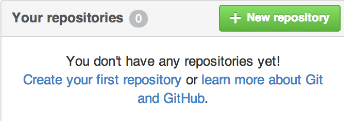

通过点击面板右侧的“New repository”按钮，或者顶部工具条你用户名旁边的`+`按钮。点击后会出现“new repository”表单:

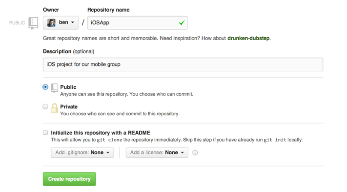

这里除了一个你必须要填的项目名，其他字段都是可选的。现在只需要点击  “Create  Repository”  按钮，Duang!!!  –  你就在 GitHub 上拥有了一个以`<user>/<project_name>`命名的新仓库了

因为目前暂无代码，GitHub 会显示有关创建新版本库或者关联到一个已有的 Git 版本库的一些说明

现在你的项目就托管在 GitHub 上了，你可以把 URL 给任何你想分享的人 。GitHub 上的项目可通过 HTTP 或 SSH 访问 ，格式是：

- HTTP： `https://github.com/<user>/<project_name>`
- SSH：`git@github.com:<user>/<project_name>`

Git 可以通过以上两种 URL 进行抓取和推送，但是用户的访问权限又因连接时使用的证书不同而异

通常对于公开项目可以优先分享基于 HTTP 的 URL，因为用户克隆项目不需要有一个 GitHub 帐号。  如果你分享 SSH URL，用户必须有一个帐号并且上传 SSH 密钥才能访问你的项目。HTTP URL 与你贴到浏览器里查看项目用的地址是一样的

#### 项目经理创建本地库

```bash
git init
```

#### 项目经理为远程仓库配置别名&用户信息

添加一个新的远程 Git 仓库，同时指定一个你可以轻松引用的简写

```bash
git remote add <shortname> <url>
```

显示远程仓库使用的 Git 别名与其对应的 URL 

```bash
git remote –v
```

查看某一个远程仓库的更多信息 

```bash
git remote show [remote-name]
```

重命名

```bash
git remote rename pb paul
```

 如果因为一些原因想要移除一个远程仓库  -  你已经从服务器上搬走了或不再想使用某一个特定的镜像了，又或者某一个贡献者不再贡献了

```bash
git remote rm [remote-name] 
```

#### 项目经理推送本地项目到远程仓库

初始化一个本地仓库然后：

```bash
git push [remote-name] [branch-name]
```

将本地项目的 master 分支推送到 origin （别名）服务器

#### 成员克隆远程仓库到本地

```bash
git clone url  #（克隆时不需要git init） 
```

默认克隆时为远程仓库起的别名为 origin，远程仓库名字  “origin”，与分支名字  “master”  一样，在 Git 中并没有任何特别的含义一样

同时  “master”  是当你运行`git init`时默认的起始分支名字，原因仅仅是它的广泛使用，“origin”  是当你运行`git clone`时默认的远程仓库名字。如果你运行`git clone -o booyah`，那么你默认的远程仓库别名为 booyah  

#### 项目经理邀请成员加入团队

如果你想与他人合作，并想给他们提交的权限，你需要把他们添加为“Collaborators”。  如果  Ben，Jeff，Louise  都在 GitHub 上注册了，你想给他们推送的权限，你可以将他们添加到你的项目。这样做会给他们  “推送”  权限，就是说他们对项目有读写的权限

点击边栏底部的  “Settings”  链接

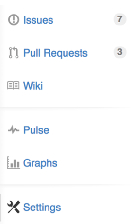

然后从左侧菜单中选择  “Collaborators”  。然后，在输入框中填写用户名，点击  “Add collaborator.”。如果你想授权给多个人，你可以多次重复这个步骤。如果你想收回权限，点击他们同一行右侧的  “X” 

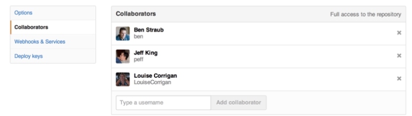

#### 成员推送提交到远程仓库

```bash
git push [remote-name] [branch-name]
```

只有当你有所克隆服务器的写入权限，并且之前没有人推送过时，这条命令才能生效。当你和其他人在同一时间克隆，他们先推送到上游然后你再推送到上游，你的推送就会毫无疑问地被拒绝。你必须先将他们的工作拉取下来并将其合并进你的工作后才能推送 

#### 项目经理更新成员提交的内容

```bash
git fetch [remote-name] 
```

这个命令会访问远程仓库，从中拉取所有你还没有的数据。执行完成后，你将会拥有那个远程仓库中所有分支的引用，可以随时合并或
查看必须注意`git fetch`命令会将数据拉取到你的本地仓库  -  它并不会自动合并或修改你当前的工作。当准备好时你必须手动将其合并
入你的工作

```bash
git merge [remote-name]
```

### 13.2、深入理解远程库

#### 13.2.1、远程跟踪分支

**远程跟踪分支**是远程分支状态的引用。它们是你不能移动的本地分支。当你做任何网络通信操作时，它们会自动移动

它们以 (remote)/(branch) 形式命名，例如，如果你想要看你最后一次与远程仓库 origin 通信时 master 分支的状态，你可以查看 origin/master 分支

当克隆一个仓库时，它通常会自动地创建一个跟踪 origin/master 的 master 分支 

假设你的网络里有一个在 git.ourcompany.com 的 Git 服务器。如果你从这里克隆，Git 的`clone`命令会为你自动将其命名为 origin，拉取它的所有数据，创建一个指向它的 master 分支的指针，并且在本地将其命名为 origin/master。Git 也会给你一个与 origin/master 分支在指向同一个地方的本地 master 分支，这样你就有工作的基础

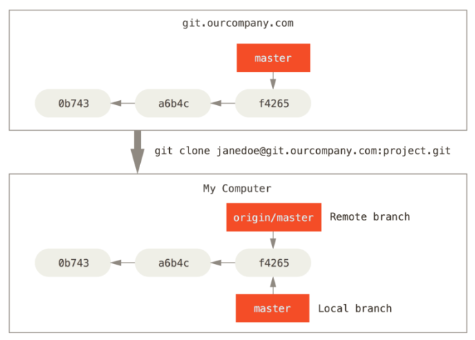

如果你在本地的 master 分支做了一些工作，然而在同一时间，其他人推送提交到 git.ourcompany.com 并更新了它的 master 分支，那么你们的提交历史将向不同的方向前进。只要你不与 origin 服务器连接，你的 origin/master 指针就不会移动

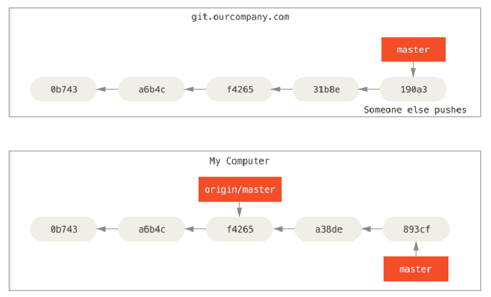

如果要同步你的工作，运行`git fetch origin`命令。这个命令查找 “origin” 是哪一个服务器（在本例中，它是 git.ourcompany.com），从中抓取本地没有的数据，并且更新本地数据库，移动 origin/master 指针指向新的、更新后的位置

#### 13.2.2、推送其他分支

当你想要公开分享一个分支时，需要将其推送到有写入权限的远程仓库上。本地的分支并不会自动与远程仓库同步  -  你必须显式地推送想要分享的分支。这样，你就可以把不愿意分享的内容放到私人分支上，而将需要和别人协作的内容推送到公开分支

如果希望和别人一起在名为 serverfix 的分支上工作，你可以像推送第一个分支那样推送它

```bash
git push origin serverfix
```

这里有些工作被简化了。Git 自动将 serverfix 分支名字展开为 refs/heads/serverfix:refs/heads/serverfix

你也可以运行`git push origin serverfix:serverfix`，它会做同样的事  -  相当于它说，“推送本地的 serverfix 分支，将其作为远程仓库的 serverfix 分支

```bash
git push origin serverfix:awesomebranch
```

如果并不想让远程仓库上的分支叫做 serverfix，可以运行以上命令将本地的 serverfix 分支推送到远程仓库上的 awesomebranch 分支

```bash
git fetch origin
```

下一次其他协作者从服务器上抓取数据时，他们会在本地生成一个远程跟踪分支 origin/serverfix， 指向服务器的 serverfix 分支的引用

要特别注意的一点是当抓取到新的远程跟踪分支时，本地不会自动生成一份可编辑的副本（拷贝）。换一句话说，这种情况下，不会有一个新的 serverfix 分支  -  只有一个不可以修改的 origin/serverfix 指针

```bash
git merge origin/serverfix 
```

可以运行`git merge origin/serverfix`将这些工作合并到当前所在的分支。如果想要在自己的 serverfix 分支上工作，可以将其建立在远程跟踪分支之上

```bash
git checkout -b serverfix origin/serverfix  #（其他协作者） 
```

#### 13.2.3、跟踪分支

从一个远程跟踪分支（origin/master）检出一个本地分支会自动创建一个叫做  “跟踪分支”（有时候也叫做 “上游分支” ：master）。**只有主分支并且克隆时才会自动建跟踪分支**

跟踪分支是与远程分支有直接关系的本地分支。如果在一个跟踪分支上输入`git pull`，Git  能自动地识别去哪个服务器上抓取、合并到哪个分支。 如果你愿意的话可以设置其他的跟踪分支，或者不跟踪 master 分支

```bash
git checkout -b [branch] [remotename]/[branch] 
git checkout -b serverfix origin/serverfix
```

这是一个十分常用的操作，所以 Git 提供了`--track`快捷方式

```bash
git checkout --track origin/serverfix
```

如果想要将本地分支与远程分支设置为不同名字

```bash
git checkout -b sf origin/serverfix
```

设置已有的本地分支跟踪一个刚刚拉取下来的远程分支，或者想要修改正在跟踪的跟踪分支，你可以在任意时间使用`-u`选项运行`git 
branch`来显式地设置

```bash
git branch -u origin/serverfix  #（ --set-upstream-to） 
```

查看设置的所有跟踪分支

```bash
git branch -vv
```

iss53 分支正在跟踪 origin/iss53 并且 “ahead” 是 2，意味着本地有两个提交还没有推送到服务器上。 master 分支正在跟踪 origin/master 分支并且是最新的。serverfix 分支正在跟踪  teamone 服务器上的 server-fix-good 分支并且领先 3 落后 1，意味着服务器上有一次提交还没有合并入同时本地有三次提交还没有推送。testing 分支并没有跟踪任何远程分支

需要重点注意的一点是这些数字的值来自于你从每个服务器上最后一次抓取的数据。这个命令并没有连接服务器，它只会告诉你关于本地缓存的服务器数据。如果想要统计最新的领先与落后数字，需要在运行此命令前抓取所有的远程仓库。可以像这样做

```bash
git fetch --all
git branch –vv
```

#### 13.2.4、删除远程分支

```bash
git push origin --delete serverfix  #删除远程分支
git remote prune origin --dry-run  #列出仍在远程跟踪但是远程已被删除的无用分支
git remote prune origin  #清除上面命令列出来的远程跟踪
```

#### 13.2.5、pull request 流程

如果你想要参与某个项目，但是并没有推送权限，这时可以对这个项目进行“派生”（Fork）。  派生的意思是指，GitHub 将在你的空间中创建一个完全属于你的项目副本，且你对其具有推送权限。通过这种方式，项目的管理者不再需要忙着把用户添加到贡献者列表并给予他们推送权限。人们可以派生这个项目，将修改推送到派生出的项目副本中，并通过创建合并请求（Pull Request）来让他们的改动进入源版本库

基本流程：

1. 从 master 分支中创建一个新分支（自己 fork 的项目） 

2. 提交一些修改来改进项目（自己 fork 的项目） 

3. 将这个分支推送到 GitHub 上（自己 fork 的项目） 

4. 创建一个合并请求

5. 讨论，根据实际情况继续修改

6. 项目的拥有者合并或关闭你的合并请求

注意点：每次在发起新的 Pull Request 时，要去拉取最新的源仓库的代码，而不是自己 fork 的那个仓库。

#### 13.2.6、SSH

```bash
ssh-keygen –t rsa –C 你的邮箱  #生成公私钥
ssh -T git@github.com  #测试公私钥是否已经配对 
```

.ssh 文件位置：C:\Users\Administrator\.ssh

### 13.3、总结

- 克隆时，会自动生成一个 master 分支和对应的远程跟踪分支 origin/master
- 新建其他分支，可以指定跟踪远程分支`git checkout --track 远程跟踪分支`
- 已有分支尚未跟踪远程分支时，通过`git branch -u 远程跟踪分支`来跟踪远程分支