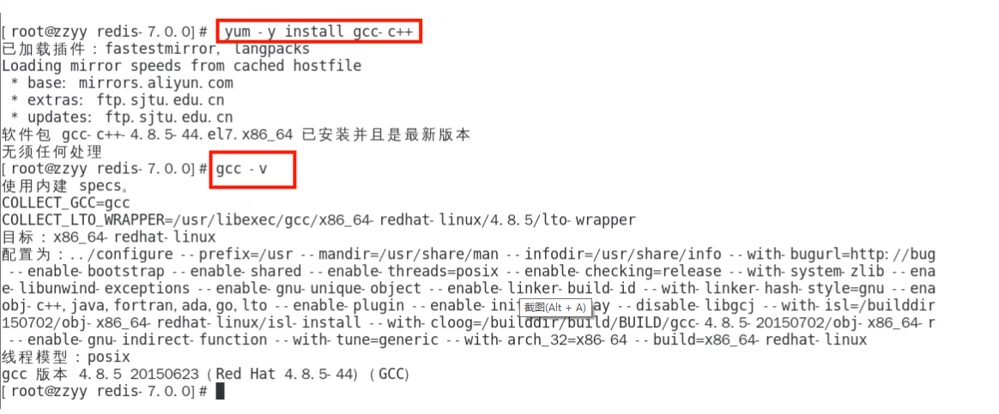
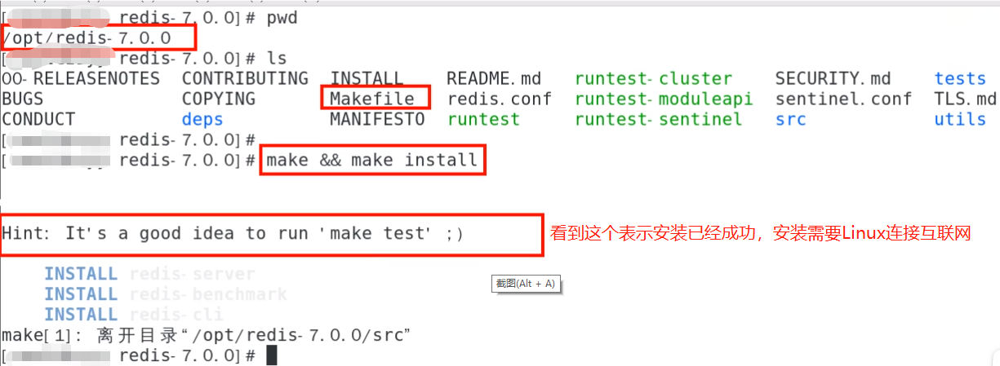
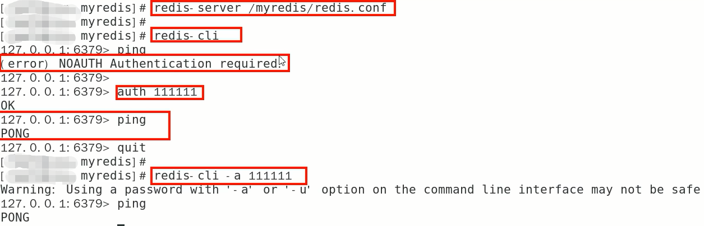
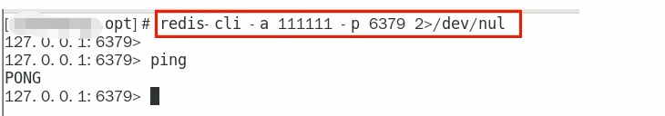

## Redis安装配置


### 1 自行购买云服务器

自己购买阿里云、青牛云、腾讯云或华为云服务器，自带 centoOS 或者 Ubuntu 环境，直接开干


### 2 VMware本地虚拟机

通过命令 `getconf LONG_BIT` 查看，它返回结果是多少就是多少位


### 3 redis的安装

Windows 版安装：

下载地址：https://github.com/zkteco-home/redis-windows

Linux 版安装：

::: tip

Linux 环境安装 Redis 必须先具备 gcc 编译环境

:::

**① 什么是 gcc**

gcc 是 linux 下的一个编译程序，是 C 程序的编译工具。

`GCC(GNU Compiler Collection)` 是 `GUN(GUN's Not Unix)` 计划

提供的编译器家族，它能够支持 C，C++，Objective-C，Fortran，Java 和 Ada 等等程序设计语言前端，同时能路运在 `X86，X86-64，IA-64，PowerPC，SPARC和Alpha` 等等几乎目前所有的硬件平台上。鉴于这些特征，以及 GCC 编译代码的高效性，使得 GCC 成为绝大多数自由软件开发编译的首选工具。虽然对于程序员们来说，编译器只是一个工具，除了开发和维护人员，很少有人关注编译器的发展，但是 GCC 的影响力是如此之大，它的性能提升甚至有望改善所有的自由软件的运行效率，同时它的内部结构的变化也体现出现代编译器发展的新特征。


**② 查看 gcc**

```bash
gcc -v
```


**③ 安装**

安装 redis 之前需要具备 C++ 库环境

```bash
yum -y install gcc-c++
```

命令案例：



##### 版本选择

1. 查看自己redis版本的命令：redis -server -v
2. 安全Bug按照官网提示，升级成为6.0.8及以上

3. <font color= 'red'>目前建议都需要升级到6.0.8版本以上</font>
4. 本次使用redis7.0


## Redis7安装步骤

### 1 总览

::: tip

1. 下载获取redis-7.0.0.tar.gz后将它放入我们的Linux目录/opt
2. /opt目录下解压 redis
3. 进入目录
4. 在 redis-7.0.0 目录下执行 make 命令
5. 查看默认安装目录 usr/local/bin
6. 将默认的 redis.conf 拷贝到自己定义好的一个路径下，比如 /myredis
7. 修改 /myredis 目录下的 redis.conf 配置文件做初始化设置
8. 启动服务
9. 连接服务
10. 大家知道 Redis 端口为啥是 6379 吗？
11. 永远的 helloworld
12. 关闭

:::

### 2 步骤

1.下载获取redis-7.0.0.tar.gz后将它放入我们的Linux目录/opt

2./opt目录下解压redis，tar -zxvf redis-7.0.0.tar.gz，解压后会多一个redis-7.0.0的文件夹

3进入目录，cd redis-7.0.0

4.在redis-7.0.0目录下执行make命令



5.查看默认安装目录：/usr/local/bin，Linux下的/usr/local类似我们Windows系统的C:\Program Files，安装完成后，去/usr/local/bin下查看

redis-benchmark:性能测试工具，服务启动后运行该命令，看看自己电脑性能如何

redis-check-aof:修复有问题的AOF文件，RDB和AOF后续学习

redis-check-dump:修复有问题的dump.rdb文件

<font color='red'>redis-cli:客户端操作入口</font>

redis-sentinel:redis集群使用

<font color='red'>reids-server:redis服务器启动命令</font>

6.将默认的redis.conf拷贝到自己定义好的一个路径下，比如/myredis  ，cp redis.conf  /myredis/redis7.conf

7.<font color='red'>修改/myredis目录下redis.conf配置文件做初始化设置</font>

redis.conf配置文件，改完后确保生效，<font color='red'>记得重启</font>

1. 默认daemonize no		改为 daemonize yes
2. 默认protected-mode yes	改为 protected-mode no

3. 默认bind 127.0.0.1		改为 直接注释掉(默认bind 127.0.0.1只能本机访问)或改成本机IP，否则影响远程IP连接

4. 默认redis密码 			改为 requirepass 自己设定的密码

8.启动服务

/usr/local/bin目录下运行redis-server命令，启用/myredis目录下的redis.conf配置文件

执行命令：redis-server /myredis/redis7.conf

9.连接服务

redis-cli -a 123456 -p 6379(-a 后面是redis设置的密码)



**备注说明：**

Warning: Using a password with '-a' or '-u' option on the command line interface may not be safe.这段警告看着不舒服怎么办?

warning 这串输出并不是普通输出，shell的标准输出包含两种：

1. （标准输出）
2. （标准错误）我们的命令，即包含1也包含2，2即是我们想要除去的提示

解决办法将标准错误去除即可，追加2>/dev/null，将标准错误丢弃即可，就没有烦人的警告了。



10.Redis端口为什么是6379？

Redis的默认端口是6379，是由手机键盘字母MERZ的位置决定的。MERZ在Antirez的朋友圈语言中是"愚蠢和傻B"的代名词，源于意大利广告女郎Alessia Merz在电视节目上说了一堆愚蠢的话，redis之父对她有"特殊"印象，就给她弄成端口号了

11.关闭Redis服务器

单实例关闭：在Redis服务器外面关闭命令：redis-cli -a 123456 shutdown，如果在Redis服务器里面可以直接使用shutdown命令

多实例关闭，指定端口关闭：redis-cli -p 6379 shutdown


## 卸载Redis步骤

### 1.停止redis-server服务


### 2.删除/usr/local/bin目录下与redis相关的文件

ls -l /usr/local/bin/redis-*

rm -rf /usr/local/bin/redis-*


