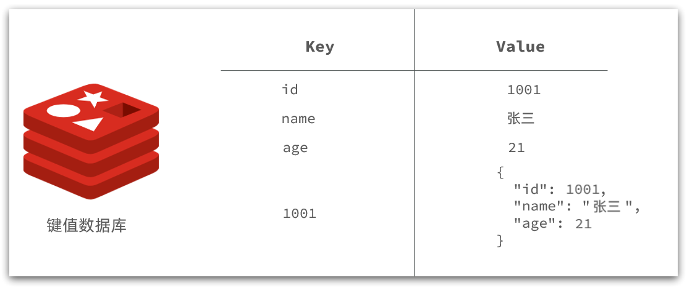
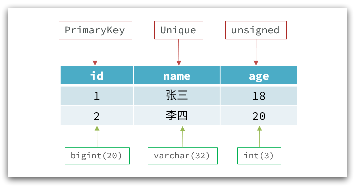
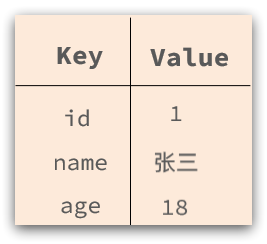
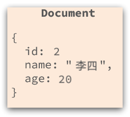
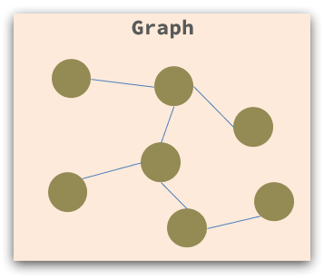
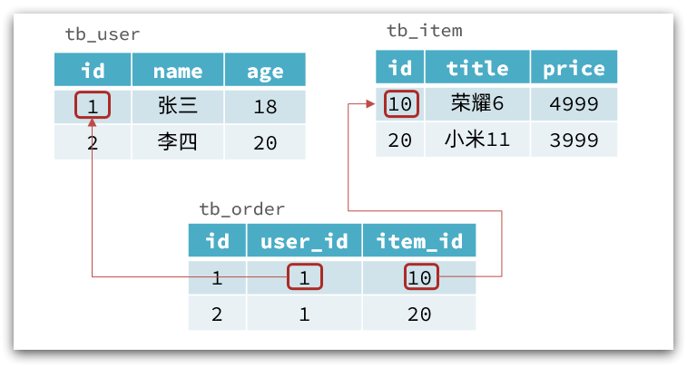
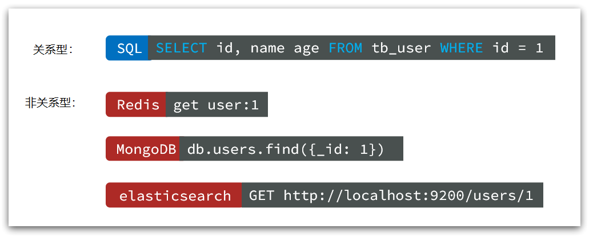
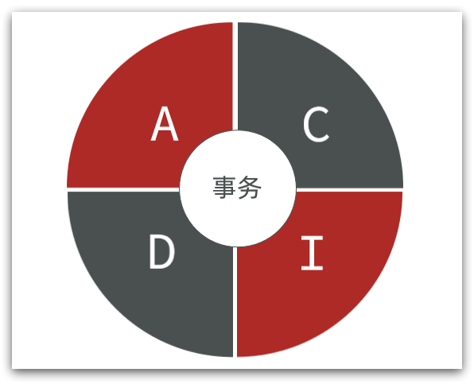
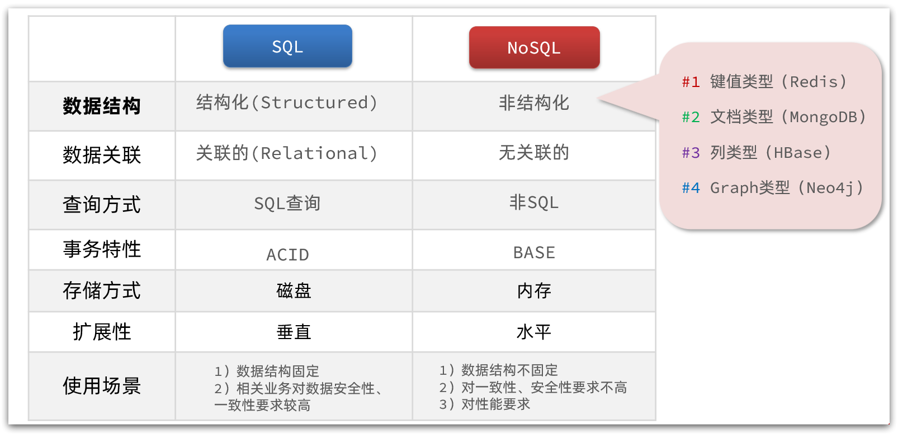

## 初识 Redis

::: tip

① 认识 NoSQL

② 认识 Redis

③ 安装 Redis

:::

Redis 是一种键值型的 NoSql 数据库，这里有两个关键字：

- 键值型
- NoSql

其中**键值型**，是指 Redis 中存储的数据都是以 key、value 的形式多种多样，可以是字符串、数值、甚至 json：



而 NoSql 则是相对于传统关系型数据库而言，有很大差异的一种数据库。


## ① 认识 NoSQL

**NoSql** 可以翻译做 `Not Only Sql` （不仅仅是 SQL），或者是 No Sql（非 sql 的）数据库。是相对于传统关系型数据库而言，有很大差异的一种特殊的数据库，因此也称之为**非关系型数据库**。

###  Ⅰ结构化与非结构化

传统关系型数据库是结构化数据，没一张表都有严格的约束信息：字段名、字段数据类型、字段约束等等信息，插入的数据必须遵守这些约束：



而 NoSql 则对数据库格式没有严格约束，往往形式松散，自由。

- 可以实键值型

  

- 可以是文档型

  

- 甚至是图格式

  


###  Ⅱ 关联和非关联

传统数据库的表与表之间往往存在关联，例如外键：



而非关系型数据库不存在关联关系，维护关系要么靠代码中的业务逻辑，要么靠数据之间的耦合：

```json
{
  id: 1,
  name: "张三",
  orders: [
    {
       id: 1,
       item: {
           id: 10, title: "荣耀6", price: 4999
       }
    },
    {
       id: 2,
       item: {
           id: 20, title: "小米11", price: 3999
       }
    }
  ]
}
```

此处要维护**张三**的订单与商品**荣耀**和**小米11**的关系，不得不冗余的将这两个商品保存在张三的订单文档中，不够优雅。还是建议用业务来维护关联关系。


###  Ⅲ 查询方式

传统关系型数据库会基于 Sql 语句做查询，语法有统一标准；

而不同的非关系数据库查询语法差异极大，五花八门各种各样。



###  Ⅳ 事务

传统关系型数据库能满足事务 ACID 的原则。



而非关系型数据库往往不支持事务，或者蹦年严格保证 ACID 的特性，只能实现基本的一致性。


###  Ⅴ 总结

除了上述四点以外，在存储方式、扩展性、查询性能上关系型与非关系型也都有着显著差异，总结如下：



- 存储方式
  - 非关系型数据库基于磁盘进行存储，会有大量的磁盘 IO，对性能有一定影响
  - 非关系型数据库，他们的操作更多的是依赖于内存来操作，内存读写速度会非常快，性能自然会好一些
- 扩展性
  - 关系型数据库集群模式一般时主从，主从数据一直，起到数据备份的作用，称为垂直扩展
  - 非关系型数据库可以将数据拆分，存储在不同机器上，可以保存海量数据，解决内存大小有限的问题，称为水平扩展
  - 关系型数据库因为表之间存在关联关系，如果做水平扩展会给数据查询带来很多麻烦


## ② 认识 Redis

Redis诞生于2009年全称是**Re**mote  **Di**ctionary **S**erver 远程词典服务器，是一个基于内存的键值型NoSQL数据库。

**特征：**

- 键值（key-value）型，value 支持多种不同数据结构，功能丰富
- 单线程，每个命令具备原子性
- 低延迟，速度快（基于内存、IO 多路复用、良好的编码）
- 支持数据持久化
- 支持主从集群、分片集群
- 支持多语言客户端

**作者：**Antirez

Redis的官方网站地址：https://redis.io/


## ③ 安装 Redis

大多数企业都是基于 Linux 服务器来部署项目，而且 Redis 官方也没有提供 Windows 版本的安装包。

此处选择的 Linux 版本为 CentOS 7.


### Ⅰ 依赖库

Redis 是基于 C 语言编写的，因此首先需要安装 Redis 所需要的 gcc 依赖

```sh
yum install -y gcc tcl
```


### Ⅱ 安装方式

1. Docker
2. Linux
3. Windows 安装包
