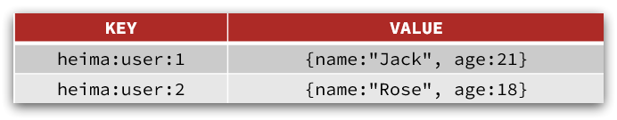

## Redis 常见命令

::: tip

① Redis 数据结构介绍

② Redis 通用命令

③ String 类型

④ Hash 类型

⑤ List 类型

⑥ Set 类型

⑦ SortedSet 类型

:::


## ① Redis 数据结构介绍

Redis 是典型的 key-value 数据库，key 一般是字符串，而 value 包含很多不同的数据类型：


Redis 为了方便我们学习，将操作不同数据类型的命令也做了分组，在官网（ [https://redis.io/commands ](https://redis.io/commands)）可以查看到不同的命令：


不同类型的命令称为一个 group ，我们也可以通过 help 命令查看各种不同 group 的命令：


接下来，我们就学习常见的五种基本数据类型的相关命令。


## ② Redis 通用命令

通用指令是部分数据类型的，都可以使用的指令，常见的有：

- `KEYS`：查看符合模板的所有 key，<font color= 'red'>不建议在生产环境设备上使用</font>
- `DEL`：删除一个指定的 key
- `EXISTS`：判断 key 是否存在
- `EXPIRE`：给一个 key 设置有效期，有效期到期时该 key 会被自动删除
- `TTL`：查看一个 key 的剩余有效期（大于0为剩余的秒数，-2为无效，-1为永久有效）

通过 help [command] 命令可以查看一个命令的具体用法，例如：

```sh
# 查看keys命令的帮助信息：
127.0.0.1:6379> help keys

KEYS pattern
summary: Find all keys matching the given pattern
since: 1.0.0
group: generic
```


## ③ String 类型

String 类型，也就是字符串类型，是 Redis 中最简单的存储类型。

其 value 是字符串，不过根据字符串的格式不同，又可以分为 3 类：

- `String`：普通字符串
- `int`：整数类型，可以做自增、自减操作
- `float`：浮点类型，可以做自增、自减操作

不管是哪种格式，底层都是字节数组形式存储，只不过是编码方式不同。字符串类型的最大空间不能超过 512m.


### 1 String 的常见命令

String 的常见命令有：

- `SET`：添加或者修改已经存在的一个 String 类型的键值对
- `GET`：根据 key 获取 String 类型的 value
- `MSET`：批量添加多个 String 类型的键值对
- `MGET`：根据多个 key 获取多个 String 类型的 value
- `INCR`：让一个整形 key 自增 1
- `INCRBY`：让一个整形的 key 自增并指定步长，例如 incrby num 2 让 num 值自增 2
- `INCRBYFLOAT`：让一个浮点类型的数字自增并指定步长
- `SETNX`：添加一个 String 类型的键值对，前提是这个 key 不存在，否则不执行
- `SETEX`：添加一个 String 类型的键值对，并且指定有效期

```sh
127.0.0.1:6379[5]> set name jack
OK
127.0.0.1:6379[5]> get name
"jack"
127.0.0.1:6379[5]> mset k1 v1 k2 v2 k3 v3
OK
127.0.0.1:6379[5]> mget k1 k2 k3
1) "v1"
2) "v2"
3) "v3"
127.0.0.1:6379[5]> set age 18
OK
127.0.0.1:6379[5]> incr age
(integer) 19
127.0.0.1:6379[5]> get age
"19"
127.0.0.1:6379[5]> incrby age 2
(integer) 21
127.0.0.1:6379[5]> get age
"21"
127.0.0.1:6379[5]> incrby age 2
(integer) 23
127.0.0.1:6379[5]> get age
"23"
127.0.0.1:6379[5]> set score 82.5
OK
127.0.0.1:6379[5]> get score
"82.5"
127.0.0.1:6379[5]> incrbyfloat score 12.5
"95"
127.0.0.1:6379[5]> get score
"95"
```

```sh
# setnx 类似于 set ... nx
127.0.0.1:6379[5]> help setnx

  SETNX key value
  summary: Set the value of a key, only if the key does not exist
  since: 1.0.0
  group: string

127.0.0.1:6379[5]> keys *
1) "k2"
2) "age"
3) "k3"
4) "k1"
5) "name"
6) "score"
127.0.0.1:6379[5]> setnx name lisi
(integer) 0
127.0.0.1:6379[5]> get name
"jack"
127.0.0.1:6379[5]> setnx name2 lisi
(integer) 1
127.0.0.1:6379[5]> get name2
"lisi"
127.0.0.1:6379[5]> help set

  SET key value [expiration EX seconds|PX milliseconds] [NX|XX]
  summary: Set the string value of a key
  since: 1.0.0
  group: string

127.0.0.1:6379[5]> set name wnagwu nx
(nil)
127.0.0.1:6379[5]> get name
"jack"
```

```sh
# 将set于expire结合起来了，添加并设置有效期
127.0.0.1:6379[5]> setex name 10 jack
OK
127.0.0.1:6379[5]> ttl name
(integer) 5
127.0.0.1:6379[5]> ttl name
(integer) 4
127.0.0.1:6379[5]> ttl name
(integer) 2
127.0.0.1:6379[5]> ttl name
(integer) 1
127.0.0.1:6379[5]> ttl name
(integer) -2
```


### 2 key 结构

Redis 没有类似 MySQL 中的 Table 的概念，我们该如何区分不同类型的 key 呢？

例如，需要存储用户、商品信息到 redis ，有一个用户 id 是 1 ，有一个商品 id 恰好也是 1，此时如果使用 id 作为 key ，那就会冲突了，该怎么办呢？

我们可以通过给 key 添加前缀加以区分，不过这个前缀不是随便加的，有一定的规范：

Redis 的 key 允许有多个单词形成层级结构，多个单词之间用 `:` 隔开，格式如下：

```java
项目名:业务名:类型:id
```

这个格式并非固定，也可以根据自己的需求来删除或添加词条。这样一来，我们就可以把不同类型的数据区分开来了。从而避免了 key 的冲突问题。

例如我们的项目名称叫 heima，有 user 和 product 两种不同类型的数据，我们可以这样定义 key：

- user 相关的 key ：`heima:user:1`
- product 相关的 key：`heima:product:1`


如果 value 是一个 java 对象，例如一个 User 对象，则可以将对象序列化为 JSON 字符串后存储：

```json
| KEY             | VALUE                                      |
| :-------------- | ------------------------------------------ |
| heima:user:1    | '{"id":1,  "name": "Jack", "age": 21}'       |
| heima:product:1 | '{"id":1,  "name": "小米11", "price": 4999}' |
```

并且，在 Redis 的桌面客户端中，还会以相同前缀作为层级结构，让数据看起来层次分明，关系清晰：


## ④ Hash 类型

Hash 类型，也叫散列，其 value 是一个无序字典，类似于 Java 中的 HashMap 结构。

String 结构是将对象序列化为 JSON 字符串后存储，当需要修改对象某个字段时很不方便：



Hash 结构可以将对象中的每个字段独立存储，可以针对单个字段做 CRUD：


Hash 的常见命令有：

- `HSET key field value`：添加或者修改 hash 类型的 key 的 field 的值
- `HGET key field`：获取一个 hash 类型的 key 的 field 的值
- `HMSET`：批量添加多个 hash 类型 key 的 field 的值
- `HMGET`：批量获取多个 hash 类型 key 的 field 的值
- `HGETALL`：获取一个 hash 类型的 key 中的所有的 field 和 value
- `HKEYS`：获取一个 hash 类型的 key 中的所有 field
- `HVALS`：获取一个 hash 类型的 key 中的所有 value
- `HINCRBY`：让一个 hash 类型的 key 的字段值自增并指定步长
- `HSETNX`：添加一个 hash 类型的 key 的 field 值，前提是这个 field 不存在，否则不执行

```sh
127.0.0.1:6379[5]> hset heima:user:2 name jack
(integer) 1
127.0.0.1:6379[5]> hget heima:user:2 name
"jack"
127.0.0.1:6379[5]> hset heima:user:2 age 21
(integer) 1
127.0.0.1:6379[5]> hget heima:user:2 age
"21"
127.0.0.1:6379[5]> hset heima:user:2 age 17
(integer) 0
127.0.0.1:6379[5]> hget heima:user:2 age
"17"
127.0.0.1:6379[5]> hmset heima:user:3 name lisi age 20 sex man
OK
127.0.0.1:6379[5]> hmget heima:user:3 name age sex
1) "lisi"
2) "20"
3) "man"
127.0.0.1:6379[5]> hgetall heima:user:3
1) "name"
2) "lisi"
3) "age"
4) "20"
5) "sex"
6) "man"
127.0.0.1:6379[5]> hkeys heima:user:3
1) "name"
2) "age"
3) "sex"
127.0.0.1:6379[5]> hvals heima:user:3
1) "lisi"
2) "20"
3) "man"
127.0.0.1:6379[5]> hincrby heima:user:3 age 2
(integer) 22
127.0.0.1:6379[5]> hincrby heima:user:3 age 2
(integer) 24
127.0.0.1:6379[5]> hget heima:user:3 age
"24"
127.0.0.1:6379[5]> hsetnx heima:user:3 name zs
(integer) 0
127.0.0.1:6379[5]> hget heima:user:3 name
"lisi"
127.0.0.1:6379[5]> hsetnx heima:user:3 phone 17286537629
(integer) 1
127.0.0.1:6379[5]> hget heima:user:3 phone
"17286537629"
127.0.0.1:6379[5]>
```


