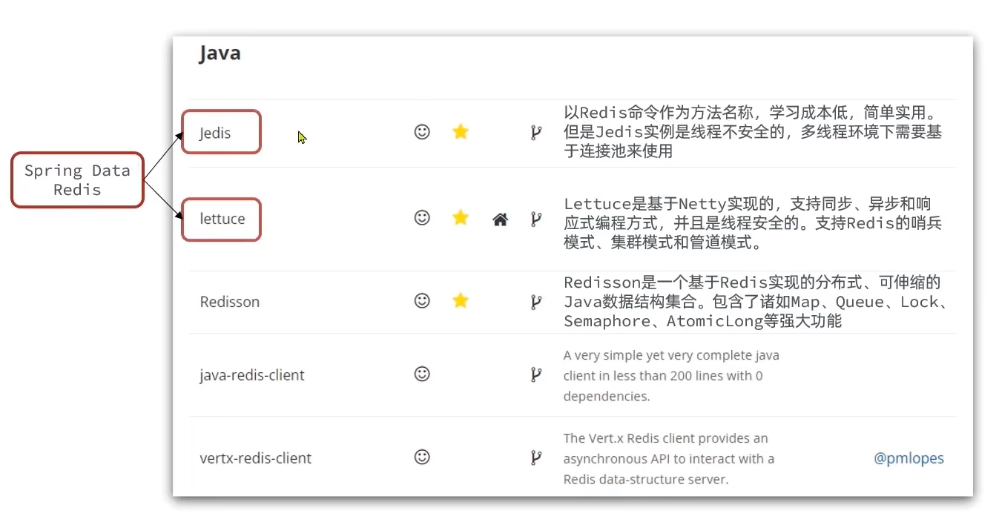

## Redis的Java客户端

::: tip

① Jedis 客户端

② SpringDataRedis 客户端

:::

在Redis官网中提供了各种语言的客户端，地址：https://redis.io/docs/clients/


其中Java客户端也包含很多：


标记为*的就是推荐使用的java客户端，包括：

- Jedis和Lettuce：这两个主要是提供了Redis命令对应的API，方便我们操作Redis，而SpringDataRedis又对这两种做了抽象和封装，因此我们后期会直接以SpringDataRedis来学习。
- Redisson：是在Redis基础上实现了分布式的可伸缩的java数据结构，例如Map、Queue等，而且支持跨进程的同步机制：Lock、Semaphore等待，比较适合用来实现特殊的功能需求。




## ① Jedis 客户端

Jedis的官网地址： https://github.com/redis/jedis


### 1 快速入门

1）引入依赖：

```xml
<!--jedis-->
<dependency>
    <groupId>redis.clients</groupId>
    <artifactId>jedis</artifactId>
    <version>3.7.0</version>
</dependency>
<!--单元测试-->
<dependency>
    <groupId>org.junit.jupiter</groupId>
    <artifactId>junit-jupiter</artifactId>
    <version>5.7.0</version>
    <scope>test</scope>
</dependency>
```


2）建立连接：

新建一个单元测试类，内容如下

```java
private Jedis jedis;

@BeforeEach
void setUp() {
    // 1.建立连接
    // jedis = new Jedis("192.168.150.101", 6379);
    jedis = JedisConnectionFactory.getJedis();
    // 2.设置密码
    jedis.auth("123321");
    // 3.选择库
    jedis.select(0);
}
```


3）测试：

```java
@Test
void testString() {
    // 存入数据
    String result = jedis.set("name", "虎哥");
    System.out.println("result = " + result);
    // 获取数据
    String name = jedis.get("name");
    System.out.println("name = " + name);
}

@Test
void testHash() {
    // 插入hash数据
    jedis.hset("user:1", "name", "Jack");
    jedis.hset("user:1", "age", "21");

    // 获取
    Map<String, String> map = jedis.hgetAll("user:1");
    System.out.println(map);
}
```


4）释放资源：

```java
@AfterEach
void tearDown() {
    if (jedis != null) {
        jedis.close();
    }
}
```


### 2 Jedis 连接池

Jedis 本身是线程不安全的，并且频繁的创建和销毁连接会有性能损耗，因此我们推荐大家使用 Jedis 连接池代替 jedis 的直连方式。

```java
package com.heima.jedis.util;

import redis.clients.jedis.*;

public class JedisConnectionFactory {

    private static JedisPool jedisPool;

    static {
        // 配置连接池
        JedisPoolConfig poolConfig = new JedisPoolConfig();
        poolConfig.setMaxTotal(8);
        poolConfig.setMaxIdle(8);
        poolConfig.setMinIdle(0);
        poolConfig.setMaxWaitMillis(1000);
        // 创建连接池对象，参数：连接池配置、服务端ip、服务端端口、超时时间、密码
        jedisPool = new JedisPool(poolConfig, "192.168.150.101", 6379, 1000, "123321");
    }

    public static Jedis getJedis(){
        return jedisPool.getResource();
    }
}
```


## ② SpringDataRedis

SpringData 是 Spring 中数据操作的模块，包含对各种数据库的集成，其中对 Redis 的集成模块就叫做 SpringDataRedis，官网地址：https://spring.io/projects/spring-data-redis

- 提供了对不同 Redis 客户端的整合
- 提供了 RedisTemplate 统一 API 来操作 Redis
- 支持 Redis 的发布订阅模型
- 支持 Redis 哨兵和 Redis 集群
- 支持基于 Lettuce 的响应式编程
- 支持基于 JDK、JSON、字符串、Spring 对象的数据序列化及反序列化
- 支持基于 Redis 的 JDKCollection 实现


SpringDataRedis 中提供了 RedisTemplate 工具类，其中封装了各种对 Redis 的操作。并且将不同数据类型的操作 API 封装到了不同的类型中：


### 1 SpringDataRedis 快速入门

SpringBoot 已经提供了对 SpringDataRedis 的支持，使用非常简单。

首先新建一个 Maven 项目，然后按照以下步骤执行：

1）引入依赖：

```xml
<?xml version="1.0" encoding="UTF-8"?>
<project xmlns="http://maven.apache.org/POM/4.0.0" xmlns:xsi="http://www.w3.org/2001/XMLSchema-instance"
         xsi:schemaLocation="http://maven.apache.org/POM/4.0.0 https://maven.apache.org/xsd/maven-4.0.0.xsd">
    <modelVersion>4.0.0</modelVersion>
    <parent>
        <groupId>org.springframework.boot</groupId>
        <artifactId>spring-boot-starter-parent</artifactId>
        <version>2.5.7</version>
        <relativePath/> <!-- lookup parent from repository -->
    </parent>
    <groupId>com.heima</groupId>
    <artifactId>redis-demo</artifactId>
    <version>0.0.1-SNAPSHOT</version>
    <name>redis-demo</name>
    <description>Demo project for Spring Boot</description>
    <properties>
        <java.version>1.8</java.version>
    </properties>
    <dependencies>
        <!--redis依赖-->
        <dependency>
            <groupId>org.springframework.boot</groupId>
            <artifactId>spring-boot-starter-data-redis</artifactId>
        </dependency>
        <!--commons-pool-->
        <dependency>
            <groupId>org.apache.commons</groupId>
            <artifactId>commons-pool2</artifactId>
        </dependency>
        <!--Jackson依赖-->
        <dependency>
            <groupId>com.fasterxml.jackson.core</groupId>
            <artifactId>jackson-databind</artifactId>
        </dependency>
        <dependency>
            <groupId>org.projectlombok</groupId>
            <artifactId>lombok</artifactId>
            <optional>true</optional>
        </dependency>
        <dependency>
            <groupId>org.springframework.boot</groupId>
            <artifactId>spring-boot-starter-test</artifactId>
            <scope>test</scope>
        </dependency>
    </dependencies>

    <build>
        <plugins>
            <plugin>
                <groupId>org.springframework.boot</groupId>
                <artifactId>spring-boot-maven-plugin</artifactId>
                <configuration>
                    <excludes>
                        <exclude>
                            <groupId>org.projectlombok</groupId>
                            <artifactId>lombok</artifactId>
                        </exclude>
                    </excludes>
                </configuration>
            </plugin>
        </plugins>
    </build>

</project>
```


2）配置 Redis：

```yaml
spring:
  redis:
    host: 192.168.150.101
    port: 6379
    password: 123321
    lettuce:
      pool:
        max-active: 8
        max-idle: 8
        min-idle: 0
        max-wait: 100ms
```


3）注入 RedisTemplate：

```java
@SpringBootTest
class RedisStringTests {

    @Autowired
    private RedisTemplate redisTemplate;
}
```


4）编写测试：

```java
@SpringBootTest
class RedisStringTests {

    @Autowired
    private RedisTemplate edisTemplate;

    @Test
    void testString() {
        // 写入一条String数据
        redisTemplate.opsForValue().set("name", "虎哥");
        // 获取string数据
        Object name = stringRedisTemplate.opsForValue().get("name");
        System.out.println("name = " + name);
    }
}
```


```java
package com.redis;

import com.fasterxml.jackson.core.JsonProcessingException;
import com.fasterxml.jackson.databind.ObjectMapper;
import com.redis.domain.entity.UserEntity;
import jakarta.annotation.Resource;
import org.junit.jupiter.api.Test;
import org.springframework.boot.test.context.SpringBootTest;
import org.springframework.data.redis.core.RedisTemplate;
import org.springframework.data.redis.core.StringRedisTemplate;

import java.util.Map;

/**
 * @author lixuan
 * @Date 2024/7/30 10:50
 */
@SpringBootTest
public class SpringDataRedisTest {
    @Resource
    private RedisTemplate<String,Object> redisTemplate;
    @Resource
    private StringRedisTemplate stringRedisTemplate;
    // JSON序列化工具
    private static final ObjectMapper mapper = new ObjectMapper();

    @Test
    void testString() {
        // 写入一条String数据
        redisTemplate.opsForValue().set("name", "虎哥");
        // 获取string数据
        Object name = redisTemplate.opsForValue().get("name");
        System.out.println("name = " + name);
    }

    @Test
    void testSaveUser() {
        UserEntity user = new UserEntity();
        user.setId(1L);
        user.setName("虎哥");
        user.setAge(18);
        user.setEmail("1111@qq.conm");
        redisTemplate.opsForValue().set("user:1", user);
        System.out.println("user = " + user);
        UserEntity user1 = (UserEntity) redisTemplate.opsForValue().get("user");
        System.out.println("user1 = " + user1);
    }

    @Test
    void testForString() {
        // 写入一条String数据
        stringRedisTemplate.opsForValue().set("name", "虎哥");
        // 获取string数据
        Object name = stringRedisTemplate.opsForValue().get("name");
        System.out.println("name = " + name);
    }

    /**
     * 推荐使用String序列化
     * @throws JsonProcessingException
     */
    @Test
    void testSaveUserEntity() throws JsonProcessingException {
        // 创建对象
        UserEntity user = new UserEntity();
        user.setId(2L);
        user.setName("杰哥");
        user.setAge(18);
        user.setEmail("1111@qq.conm");
        // 手动序列化
        String json = mapper.writeValueAsString(user);
        // 写入数据
        stringRedisTemplate.opsForValue().set("user:2", json);

        // 获取数据
        String jsonUser = stringRedisTemplate.opsForValue().get("user:2");
        // 手动反序列化
        UserEntity user1 = mapper.readValue(jsonUser, UserEntity.class);
        System.out.println("user1 = " + user1);
    }

    @Test
    void testHash() {
        stringRedisTemplate.opsForHash().put("user:3", "name", "Tom");
        stringRedisTemplate.opsForHash().put("user:3", "age", "18");
        Map<Object, Object> entries = stringRedisTemplate.opsForHash().entries("user:3");
        System.out.println("entries = " + entries);

    }
}

```


::: info

**总结：**

SpringDataRedis 的使用步骤：

1. 引入 spring-boot-stater-data-redis 依赖
2. 在 application.yml 配置 redis 信息
3. 注入 RedisTemplate

:::


### 2 SpringDataRedis 的序列化方式

RedisTemplate 可以接收任意 Object 作为值写入 Redis


只不过写入前会把 Object 序列化为字节形式，默认是采用 JDK 序列化，得到的结果是这样的：


缺点：

- 可读性差
- 内存占用较大


我们可以自定义 RedisTemplate 的序列化方式，代码如下：

```java
@Configuration
public class RedisConfig {

    @Bean
    public RedisTemplate<String, Object> redisTemplate(RedisConnectionFactory connectionFactory){
        // 创建RedisTemplate对象
        RedisTemplate<String, Object> template = new RedisTemplate<>();
        // 设置连接工厂
        template.setConnectionFactory(connectionFactory);
        // 创建JSON序列化工具
        GenericJackson2JsonRedisSerializer jsonRedisSerializer = 
            							new GenericJackson2JsonRedisSerializer();
        // 设置Key的序列化
        template.setKeySerializer(RedisSerializer.string());
        template.setHashKeySerializer(RedisSerializer.string());
        // 设置Value的序列化
        template.setValueSerializer(jsonRedisSerializer);
        template.setHashValueSerializer(jsonRedisSerializer);
        // 返回
        return template;
    }
}
```


这里采用了 JSON 序列化来代替默认的 JDK 序列化方式，最终结果如图：


整体可读性有了很大提升，并且能将 Java 对象自动的序列化为 JSON 字符串，并且查询时能自动把 JSON 反序列化为 Java 对象。不过，其中记录了序列化时对应的 class 名称，目的是为了查询时实现自动反序列化。这会带来额外的内存开销。


### 3 StringRedisTemplate

为了节省内存空间，我们可以不适用 JSON 序列化器来处理 value，而是统一使用 String 序列化器，要求智能存储 String 类型的 key 和 value。当需要存储 Java 对象时，手动完成对象的序列化和反序列化。


因为存入和读取时的序列化和反序列化都是我们自己实现的，SpringDataRedis 就不会将 class 信息写入 Redis 了。


这种方法比较普遍，因此 SpringDataRedis 就提供了 RedisTemplate 的子类：StringRedisTemplate，他的 key 和 value 的序列化方式默认就是 String 方式。


省去了我们自定义RedisTemplate的序列化方式的步骤，而是直接使用：

```java
@Autowired
private StringRedisTemplate stringRedisTemplate;
// JSON序列化工具
private static final ObjectMapper mapper = new ObjectMapper();

@Test
void testSaveUser() throws JsonProcessingException {
    // 创建对象
    User user = new User("虎哥", 21);
    // 手动序列化
    String json = mapper.writeValueAsString(user);
    // 写入数据
    stringRedisTemplate.opsForValue().set("user:200", json);

    // 获取数据
    String jsonUser = stringRedisTemplate.opsForValue().get("user:200");
    // 手动反序列化
    User user1 = mapper.readValue(jsonUser, User.class);
    System.out.println("user1 = " + user1);
}

```


::: info

**总结：**

RedisTemplate 的两种序列化实践方案：

`方案一：`

1. 自定义 RedisTemplate
2. 修改 RedisTemplate 的序列化器为 GenericJackson2JsonRedisSerializer

`方案二：`

1. 使用 StringRedisTemplate
2. 写入 Redis 时，手动把对象序列化为 JSON
3. 读取 Redis 时，手动把读取到的 JSON 反序列化为对象

:::


### 4 RedisTemplate操作Hash类型

```java
    @Test
    void testHash() {
        stringRedisTemplate.opsForHash().put("user:3", "name", "Tom");
        stringRedisTemplate.opsForHash().put("user:3", "age", "18");
        Map<Object, Object> entries = stringRedisTemplate.opsForHash().entries("user:3");
        System.out.println("entries = " + entries);

    }
```
