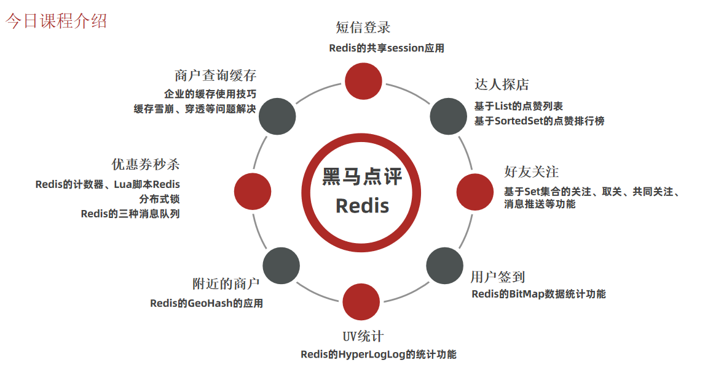

## 统计

接下来让我们一起看看实战篇要学习一些什么样的内容：

::: tip

- 短信登陆
- 商户查询缓存
- 优惠券秒杀
- 附近的商户
- UV统计
- 用户签到
- 好友关注
- 达人探店

:::

## 具体

- 短信登陆

  这一块我们会使用 Redis 共享 session 来实现

- 商户查询缓存

  通过本章节，我们会理解缓存击穿，缓存穿透，缓存雪崩等问题，让小伙伴对于这些概念不仅仅是停留在概念上，更是能在代码中看到对应的内容

- 优惠券秒杀

  通过本章节，我们可以学会 Redis 的计数器功能，结合 Lua 完成高性能的 redis 操作，同时学会 Redis 分布式锁的原理，包括 Redis 的三种消息队列

- 附近的商户

  我们利用 Redis 的 GEO Hash 来完成对于地理坐标的操作

- UV 统计

  主要是使用 Redis 来完成统计功能

- 用户签到

  使用 Redis 的 BitMap 数据统计功能

- 好友关注

  基于 Set 集合的关注、取消关注，共同关注等等功能

- 达人探店

  基于 List 来完成点赞列表的操作，同时基于 SortedSet 来完成点赞的排行榜功能

