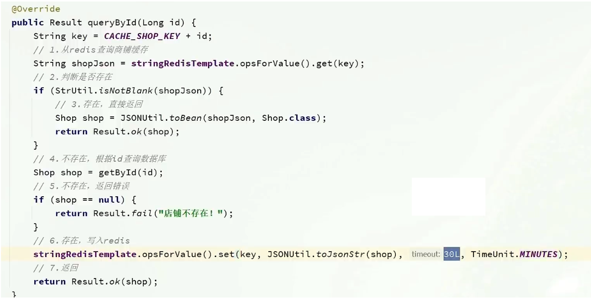

::: tip

① 什么是缓存？

② 添加商户缓存

③ 缓存更新策略

④ 实现商铺和缓存与数据库双写一致

⑤ 缓存穿透问题的解决思路

⑥ 编码解决商品查询的缓存穿透问题

⑦ 缓存雪崩问题及解决思路

⑧ 缓存击穿问题及解决思路

⑨ 利用互斥锁解决缓存击穿问题

⑩ 利用逻辑过期解决缓存击穿问题

⑪ 封装 Redis 工具类

:::


## ① 什么是缓存？

**前言：什么是缓存？**

就像自行车，越野车的避震器


举个例子：越野车，山地自行车，都拥有 `避震器` ，防止车体加速后因惯性，在酷似 U 字母的地形上飞跃，硬着陆导致的损害，像个弹簧一样

同样实际开发中，系统也需要避震器，防止过高的数据访问猛冲系统，导致器线程无法及时处理信息而瘫痪

这在实际开发中对企业来讲，对产品口碑，用户评价都是致命的，所以企业非常重视缓存技术

缓存（Cache），就是数据交换的缓冲区，俗称的缓存就是缓冲区内的数据，一般从数据库中获取，存储于本地代码，例如：

```java
例1:Static final ConcurrentHashMap<K,V> map = new ConcurrentHashMap<>(); 本地用于高并发

例2:static final Cache<K,V> USER_CACHE = CacheBuilder.newBuilder().build(); 用于redis等缓存

例3:Static final Map<K,V> map =  new HashMap(); 本地缓存
```

由于其被 `Static` 修饰，所以随着类的加载而被加载到`内存之中`，作为本地缓存，由于其又被 final 修饰，所以其引用 `例3：map 和对象 例3：new HashMap` 之间的关系是固定的，不能改变，因此不用担心赋值 `=` 导致缓存失效


### 1 为什么要使用缓存

一句话，因为速度快，好用

缓存数据存储于代码中，而代码运行在内存中，内存的读写性能远高于磁盘，缓存可以大大降低用户访问并发量带来的服务器读写压力

实际开发过程中，企业的数据量，少则几十万，多则几千万，这么大数据量，如果没有缓存来作为 避震器 ，系统几乎是撑不住的，所以企业会大量运用到缓存技术

但是缓存也会增加代码复杂度和运营成本


### 2 如何使用缓存

实际开发中，会构筑多级缓存来使系统运行速度进一步提升，例如：本地缓存于 redis 中的缓存并发使用

- **浏览器缓存**：主要用于存在于浏览器端的缓存
- **应用层缓存**：可以分为 tomcat 本地缓存，比如之前提到的 map，或者是使用 redis 作为缓存
- **数据库缓存**：在数据库中有一片空间是 buffer pool，增改查数据都会先加载到 mysql 的缓存中
- **CPU缓存**：当代计算机最大问题是 cpu 性能提升了但内存读写速度没有跟上，所以为了适应当下的情况，增加了 cpu 的 L1、L2、L3级缓存


## ② 添加商户缓存

在我们查询商户信息时，我们是直接操作从数据库中去进行查询，大致逻辑是这样，直接查询数据库那肯定慢，所以我们需要增加缓存

```java
@GetMapping("/{id}")
public Result queryShopById(@PathVariable("id") Long id) {
    //这里是直接查询数据库
    return shopService.queryById(id);
}
```


### 1 缓存模型和思路

标准的操作方式就是查询数据库之前先查询缓存，如果缓存数据存在，则直接从缓存中返回，如果缓存数据不存在，再查询数据库，然后将数据存入 redis。


### 2 代码如下

代码思路：如果缓存有，则直接返回，如果缓存不存在，则查询数据库，然后存入 redis。


## ③ 缓存更新策略

缓存更新是 redis 为了节约内存而设计出来的一个东西，主要是因为内存数据宝贵，当我们向 redis 插入太多数据，此时就可能会导致缓存中的数据过多，所以 redis 会对部分数据进行更新，或者把他叫为淘汰更合适。

- **内存淘汰**：redis 自动进行，当 redis 内存达到咱们设定的 max-memery 的时候，会自动触发淘汰机制，淘汰掉一些不重要的数据（可以自己设置策略方式）
- **超时剔除**：当我们给 redis 设置了过期时间 ttl 之后，redis 会将超时的数据进行删除，方便我们继续使用缓存
- **主动更新**：我们可以手动调用方法把缓存删掉，通常用于解决缓存和数据库不一致问题


### 1 数据库缓存不一致解决方案

由于我们的缓存的数据来自于数据库，而数据库的数据是会发生变化的，因此，如果当数据库中数据发生变化，而缓存却没有同步，此时就会有一致性问题存在，其后果是：

用户使用缓存中的过时数据，就会产生类似多线程数据安全问题，从而影响业务，产品口碑等，怎么解决呢？有如下几种方案：

Cache Aside Pattern 人工编码方式：缓存调用者在更新完数据库后再去更新缓存，也称之为双写方案

Read/Write Through Pattern：由系统本身完成，数据库与缓存的问题交由系统本身去处理

Write Behind Caching Pattern：调用者只操作缓存，其他线程去异步处理数据库，实现最终一致


### 2 数据库和缓存不一致采用什么方案

综合考虑使用方案一，但是方案一调用者如何处理呢？这里有几个问题

操作缓存和数据库有三个问题需要考虑：

如果采用第一个方案，那么假设我们每次操作数据库后，都操作缓存，但是中间如果没有人查询，那么这个更新动作实际上只有最后一次生效，中间的更新动作意义并不大，我们可以把缓存删除，等待再次查询时，将缓存中的数据加载出来

- 删除缓存还是更新缓存？
  - 更新缓存：每次更新数据库都更新缓存，无效写操作多❌
  - 删除缓存：更新数据库时让缓存失效，查询时再更新缓存✔
- 如何保证缓存与数据库的操作同时成功或失败？
  - 单体系统：将缓存与数据库操作放在一个事务
  - 分布式系统：利用 TCC 等分布式事务方案

应该具体操作缓存还是操作数据库，我们应当先操作数据库，再删除缓存，原因在于，如果你选择第一种方案，再两个线程并发来访问时，假设线程1先来，他把缓存删了，此时线程2过来，他查询数据并不存在，此时他写入缓存，当他写入缓存后，线程1在执行更新动作，实际上写入的就是旧的数据，新的数据被旧数据覆盖了

- 先操作缓存还是先操作数据库？
  - 先删除缓存，再操作数据库
  - 先操作数据库，再删除缓存


**总结：**

缓存更新策略的最佳实践方案：

1. 低一致性需求：使用 Redis 自带的内存淘汰机制
2. 高一致性需求：主动更新，并以超时剔除作为兜底方案
   - 读操作：
     - 缓存命中则直接返回
     - 缓存未命中则查询数据库，并写入缓存，设定超时时间
   - 写操作：
     - 先写数据库，然后再删除缓存
     - 要确保数据库与缓存操作的原子性


## ④ 实现商铺和缓存与数据库双写一致

核心思路如下：

修改 ShopController 中的业务逻辑，满足下面的需求：

根据 id 查询店铺时，如果缓存未命中，则查询数据库，将数据库结果写入缓存，并设置超时时间

根据 id 修改店铺时，先修改数据库，再删除缓存

**修改重点代码1**：修改 **ShopServiceImpl** 的  queryById 方法

**设置 redis 缓存时添加过期时间**



**修改重点代码2**

代码分析，通过之前的淘汰，我们确定了采用删除策略，来解决双写问题，当我们修改了数据之后，然后把缓存中的数据进行删除，查询时发现缓存中没有数据，则会从 mysql 中加载最新的数据，从而避免数据库和缓存不一致的问题


## ⑤ 缓存穿透问题的解决思路

缓存穿透：缓存穿透是指客户端请求的数据在缓存中和数据库中都不存在，这样缓存永远不会生效，这些请求都会打到数据库。

常见的解决方案有两种：

- 缓存空对象
  - 优点：实现简单，维护方便
  - 缺点：
    - 额外的内存消耗
    - 可能造成短期的不一致
- 布隆过滤
  - 优点：内存占用较少，没有多余的 key
  - 缺点：
    - 实现复杂
    - 存在误判可能

**缓存空对象思路分析**：当我们客户端访问不存在的数据时，先请求 redis ，但是此时 redis 中没有数据，此时会访问到数据库，但是数据库中也没有数据，这个数据穿透了缓存，直击数据库，我们都知道数据库能够承载的并发不如 redis 这么 高，如果大量的请求同时过来访问这种不存在的数据，这些请求都会访问到数据库，简单的解决方案就是哪怕这个数据在数据库中也不存在，我们也把这个数据存入到 redis 中去，这样，下次用户过来访问这个不存在的数据，那么在 redis 中也能找到这个数据就不会进入缓存了

**布隆过滤**：布隆过滤其实采用的是哈希思想来解决这个问题，通过一个庞大的二进制数组，走哈希思想来判断当前这个要查询的数据是否存在，如果布隆过滤器判断存在，则放行，这个请求回去访问 redis ，哪怕此时 redis 中的数据过期了，但是数据库中一定存在这个数据，在数据库中查询出来这个数据之后，再将其放入到 redis 中，假设布隆过滤判断这个数据不存在，则直接返回，这种方式的有点在于节约内存空间，缺点在于实现复杂并且可能存在误判，误判原因在于，布隆过滤器走的是哈希思想，只要是哈希思想，就可能存在哈希冲突


## ⑥ 编码解决商品查询的缓存穿透问题

核心思路如下：

在原来的逻辑中，我们如果发现这个数据在 mysql 中不存在，直接就返回 404 了，这样是会存在缓存穿透问题的

现在的逻辑中：如果这个数据不存在，我们不会返回 404 ，还是会把这个数据写入到 redis 中，并且将 value 设置为空，当再次发起查询时，我们如果发现命中之后，判断这个 value 是否是 null，如果是 null ，则是之前写入的数据，证明是缓存穿透数据，如果不是，则直接返回数据。


```java
    @Override
    public Result queryById(Long id) {
        //1、从redis查询缓存
        String shouJson = stringRedisTemplate.opsForValue().get(CACHE_SHOP_KEY + id);
        //2、判断是否存在
        if (StrUtil.isNotBlank(shouJson)) {
            // 3、存在，直接返回
            Shop shop = JSONUtil.toBean(shouJson, Shop.class);
            return Result.ok(shop);
        }
        //4、不存在，根据id查询数据库
        Shop shopEntity = getById(id);
        //5、不存在、返回错误
        if (shopEntity == null) {
            // 将空值写入 redis
            stringRedisTemplate.opsForValue().set(CACHE_SHOP_KEY + id, "", CACHE_SHOP_TTL, TimeUnit.MINUTES);
            return Result.fail("店铺不存在！");
        }
        //6、存在，写入redis
        stringRedisTemplate.opsForValue().set(CACHE_SHOP_KEY + id, JSONUtil.toJsonStr(shopEntity), CACHE_SHOP_TTL, TimeUnit.MINUTES);
        // 7.返回
        return Result.ok(shop);
    }

```

**小总结：**

缓存穿透产生的原因是什么？

- 用户请求的数据在缓存中和数据库中都不存在，不断发起这样的请求，给数据库带来巨大压力

缓存穿透的解决方案有哪些？

- 缓存 null 值
- 布隆过滤
- 增强 id 的复杂度，避免被猜测 id 规律
- 做好数据的基础格式校验
- 加强用户权限校验
- 做好热点参数的限流


## ⑦ 缓存雪崩问题及解决思路

缓存雪崩是指在同一时段大量的缓存 key 同时失效或者 Redis 服务宕机，导致大量请求达到数据库，带来巨大压力

解决方案：

- 给不同的 key 的 TTL 添加随机值
- 利用 Redis 集群提高服务的可用性
- 给缓存业务添加降级限流策略
- 给业务添加多级缓存


## ⑧ 缓存击穿问题及解决思路

缓存击穿问题也叫热点 key 问题，就是一个被高并发访问并且缓存重建业务比较复杂的 key 突然失效了，无数的请求访问会在瞬间给数据库带来巨大的冲击。

常见的解决方案有两种：

- 互斥锁
- 逻辑过期

逻辑分析：假设线程1在查询缓存之后，本来应该去查询数据库，然后把这个数据重新加载到缓存中，此时只要线程1走完这个逻辑，其他线程就都能冲缓存中加载这些数据了，但是假设在线程1没有走完的时候，后续的线程2，线程3，线程4同时过来访问当前这个方法，那么这些线程都不能冲缓存中查询到数据，那么他们就会同一时刻来访问查询缓存，都没有查到，接着同一时间去访问数据库，同时的执行数据库代码，对数据库访问压力过大


解决方案一、使用锁来解决：

因为锁能实现互斥性。假设线程过来，只能一个人一个人的来访问数据库，从而避免对于数据库访问压力过大，但这也会影响查询的性能。因为此时会让查询的性能从并行变成串行，我们可以采用 tryLock 方法 + double check 来解决这样的问题。

假设现在线程1 来访问，他查询缓存没有命中，但是此时他获得了锁的资源，那么线程1就会一个人去执行逻辑，假设现在线程2过来，线程2在执行过程中，并没有获得锁，那么线程2就可以进行到休眠，知道线程1把锁释放后，线程2获得到锁，然后再来执行逻辑，此时就能够从缓存中拿到数据了。  


解决方案二、逻辑过期方案：

方案分析：我们之所以会出现这个缓存击穿问题，主要原因是在于我们对 key 设置了过期时间，假设我们不设置过期时间，其实就不会有缓存击穿的问题，但是不设置过期时间，这样数据不就一直占用我们内存了吗，我们可以采用逻辑过期方案。

我们把过期时间设置在 redis 的 value 中，注意：这个过期时间并不会直接作用于 redis ，而是我们后续通过逻辑去处理。假设线程 1 去查询缓存，然后从 value 中判断出来当前的数据已经过期了，此时线程 1 去获得互斥锁，那么其他线程会进行阻塞，获得了锁的线程他会开启一个线程去进行以前的重构数据的逻辑，直到新开的线程完成这个逻辑后，才释放锁，而线程 1 直接进行返回，假设现在线程 3 过来访问，由于线程 2 持有着锁，所以线程 3 无法获得锁，线程 3 也直接返回数据，只有等到新开的线程 2 把重建数据构建完后，其他线程才能返回正确的数据。

这种方案巧妙在于，异步的构建缓存，缺点在于构建完缓存之前，返回的都是脏数据。


进行对比

**互斥锁方案**：由于保证了互斥性，所以数据一致，且实现简单，因为仅仅只需要加一把锁而已，也没其他的事情需要操心，所以没有额外的内存消耗，缺点在于有锁就有死锁问题的发生，且只能串行执行性能肯定受到影响

**逻辑过期方案**：线程读取过程中不需要等待，性能好，有一个额外的线程持有锁去进行重构数据，但是在重构数据完成前，其他的线程只能返回之前的数据，且实现起来麻烦


## ⑨ 利用互斥锁解决缓存击穿问题

核心思路：相较于原来从缓存中查询不到数据后直接查询数据库而言，现在的方案是，进行查询之后，如果从缓存没有查询到数据，则进行互斥锁的获取，获取互斥锁后，判断是否获得了锁，如果没有获得到，则休眠，过一会再进行尝试，直到获取到锁位置，才能进行查询

如果获取到了锁的线程，再去进行查询，查询后将数据写入 redis，再释放锁，返回数据，利用互斥锁就能保证只有一个线程去执行操作数据库的逻辑，防止缓存击穿


**操作锁的代码：**

核心思路就是利用 redis 的 setnx 方法来表示获取锁，该方法含义是 redis 中如果没有这个 key，则插入成功，返回 1 ，在 `StringRedisTemplate` 中返回 true ，如果有这个 key 则插入失败，则返回 0 ，在 `StringRedisTemplate` 返回 false ，我们可以通过 true ，或者是 false ，来表示是否有线程成功插入 key ，成功插入的 key 的线程我们认为他就是获得锁的线程。

```java
private boolean tryLock(String key) {
    Boolean flag = stringRedisTemplate.opsForValue().setIfAbsent(key, "1", 10, TimeUnit.SECONDS);
    return BooleanUtil.isTrue(flag);
}

private void unlock(String key) {
    stringRedisTemplate.delete(key);
}
```

**操作代码：**

```java
 public Shop queryWithMutex(Long id)  {
        String key = CACHE_SHOP_KEY + id;
        // 1、从redis中查询商铺缓存
        String shopJson = stringRedisTemplate.opsForValue().get("key");
        // 2、判断是否存在
        if (StrUtil.isNotBlank(shopJson)) {
            // 存在,直接返回
            return JSONUtil.toBean(shopJson, Shop.class);
        }
        //判断命中的值是否是空值
        if (shopJson != null) {
            //返回一个错误信息
            return null;
        }
        // 4.实现缓存重构
        //4.1 获取互斥锁
        String lockKey = "lock:shop:" + id;
        Shop shop = null;
        try {
            boolean isLock = tryLock(lockKey);
            // 4.2 判断否获取成功
            if(!isLock){
                //4.3 失败，则休眠重试
                Thread.sleep(50);
                return queryWithMutex(id);
            }
            //4.4 成功，根据id查询数据库
             shop = getById(id);
            // 5.不存在，返回错误
            if(shop == null){
                 //将空值写入redis
                stringRedisTemplate.opsForValue().set(key,"",CACHE_NULL_TTL,TimeUnit.MINUTES);
                //返回错误信息
                return null;
            }
            //6.写入redis
            stringRedisTemplate.opsForValue().set(key,JSONUtil.toJsonStr(shop),CACHE_NULL_TTL,TimeUnit.MINUTES);

        }catch (Exception e){
            throw new RuntimeException(e);
        }
        finally {
            //7.释放互斥锁
            unlock(lockKey);
        }
        return shop;
    }
```


## ⑩ 利用逻辑过期解决缓存击穿问题

**需求：修改根据 id 查询商铺的业务，基于逻辑过期方式来解决缓存击穿问题**

思路分析：当用户开始查询 redis 时，判断是否命中，如果没有命中则直接返回空数据，不查询数据库，而一旦命中后，将 value 取出，判断 value 中的过期时间是否满足，如果没有过期，则直接返回 redis 中的数据，如果过期，则在开启独立线程后直接返回之前的数据，独立线程去重构有数据，重构完成后释放互斥锁。


**步骤一：**

新建一个实体类，我们采用第二个方案，这个方案，对原来代码没有侵入性。

```java
@Data
public class RedisData {
    private LocalDateTime expireTime;
    private Object data;
}
```

**步骤二：**

在 `ShopServiceImpl` 新增此方法，利用单元测试进行缓存预热


在测试类中


**步骤三：**

正式代码

```java
private static final ExecutorService CACHE_REBUILD_EXECUTOR = Executors.newFixedThreadPool(10);
public Shop queryWithLogicalExpire( Long id ) {
    String key = CACHE_SHOP_KEY + id;
    // 1.从redis查询商铺缓存
    String json = stringRedisTemplate.opsForValue().get(key);
    // 2.判断是否存在
    if (StrUtil.isBlank(json)) {
        // 3.存在，直接返回
        return null;
    }
    // 4.命中，需要先把json反序列化为对象
    RedisData redisData = JSONUtil.toBean(json, RedisData.class);
    Shop shop = JSONUtil.toBean((JSONObject) redisData.getData(), Shop.class);
    LocalDateTime expireTime = redisData.getExpireTime();
    // 5.判断是否过期
    if(expireTime.isAfter(LocalDateTime.now())) {
        // 5.1.未过期，直接返回店铺信息
        return shop;
    }
    // 5.2.已过期，需要缓存重建
    // 6.缓存重建
    // 6.1.获取互斥锁
    String lockKey = LOCK_SHOP_KEY + id;
    boolean isLock = tryLock(lockKey);
    // 6.2.判断是否获取锁成功
    if (isLock){
        CACHE_REBUILD_EXECUTOR.submit( ()->{

            try{
                //重建缓存
                this.saveShop2Redis(id,20L);
            }catch (Exception e){
                throw new RuntimeException(e);
            }finally {
                unlock(lockKey);
            }
        });
    }
    // 6.4.返回过期的商铺信息
    return shop;
}
```


## ⑪ 封装Redis工具类

基于 StringRedisTemplate 封装一个缓存工具类，满足下列需求：

- 方法1：将任意 Java 对象序列化为 json 并存储在 string 类型的 key 中，并且可以设置 TTL 过期时间
- 方法2：将任意 Java 对象序列化为 json 并存储在 string 类型的 key 中，并且可以设置逻辑过期时间，用于处理缓存击穿问题
- 方法3：根据指定的 key 查询缓存，并反序列化为指定类型，利用缓存空值的方式解决缓存穿透问题
- 方法4：根据指定的 key 查询缓存，并反序列化为指定类型，需要利用逻辑过期解决缓存击穿问题

将逻辑进行封装

```java
@Slf4j
@Component
public class CacheClient {

    private final StringRedisTemplate stringRedisTemplate;

    private static final ExecutorService CACHE_REBUILD_EXECUTOR = Executors.newFixedThreadPool(10);

    public CacheClient(StringRedisTemplate stringRedisTemplate) {
        this.stringRedisTemplate = stringRedisTemplate;
    }

    public void set(String key, Object value, Long time, TimeUnit unit) {
        stringRedisTemplate.opsForValue().set(key, JSONUtil.toJsonStr(value), time, unit);
    }

    public void setWithLogicalExpire(String key, Object value, Long time, TimeUnit unit) {
        // 设置逻辑过期
        RedisData redisData = new RedisData();
        redisData.setData(value);
        redisData.setExpireTime(LocalDateTime.now().plusSeconds(unit.toSeconds(time)));
        // 写入Redis
        stringRedisTemplate.opsForValue().set(key, JSONUtil.toJsonStr(redisData));
    }

    public <R,ID> R queryWithPassThrough(
            String keyPrefix, ID id, Class<R> type, Function<ID, R> dbFallback, Long time, TimeUnit unit){
        String key = keyPrefix + id;
        // 1.从redis查询商铺缓存
        String json = stringRedisTemplate.opsForValue().get(key);
        // 2.判断是否存在
        if (StrUtil.isNotBlank(json)) {
            // 3.存在，直接返回
            return JSONUtil.toBean(json, type);
        }
        // 判断命中的是否是空值
        if (json != null) {
            // 返回一个错误信息
            return null;
        }

        // 4.不存在，根据id查询数据库
        R r = dbFallback.apply(id);
        // 5.不存在，返回错误
        if (r == null) {
            // 将空值写入redis
            stringRedisTemplate.opsForValue().set(key, "", CACHE_NULL_TTL, TimeUnit.MINUTES);
            // 返回错误信息
            return null;
        }
        // 6.存在，写入redis
        this.set(key, r, time, unit);
        return r;
    }

    public <R, ID> R queryWithLogicalExpire(
            String keyPrefix, ID id, Class<R> type, Function<ID, R> dbFallback, Long time, TimeUnit unit) {
        String key = keyPrefix + id;
        // 1.从redis查询商铺缓存
        String json = stringRedisTemplate.opsForValue().get(key);
        // 2.判断是否存在
        if (StrUtil.isBlank(json)) {
            // 3.存在，直接返回
            return null;
        }
        // 4.命中，需要先把json反序列化为对象
        RedisData redisData = JSONUtil.toBean(json, RedisData.class);
        R r = JSONUtil.toBean((JSONObject) redisData.getData(), type);
        LocalDateTime expireTime = redisData.getExpireTime();
        // 5.判断是否过期
        if(expireTime.isAfter(LocalDateTime.now())) {
            // 5.1.未过期，直接返回店铺信息
            return r;
        }
        // 5.2.已过期，需要缓存重建
        // 6.缓存重建
        // 6.1.获取互斥锁
        String lockKey = LOCK_SHOP_KEY + id;
        boolean isLock = tryLock(lockKey);
        // 6.2.判断是否获取锁成功
        if (isLock){
            // 6.3.成功，开启独立线程，实现缓存重建
            CACHE_REBUILD_EXECUTOR.submit(() -> {
                try {
                    // 查询数据库
                    R newR = dbFallback.apply(id);
                    // 重建缓存
                    this.setWithLogicalExpire(key, newR, time, unit);
                } catch (Exception e) {
                    throw new RuntimeException(e);
                }finally {
                    // 释放锁
                    unlock(lockKey);
                }
            });
        }
        // 6.4.返回过期的商铺信息
        return r;
    }

    public <R, ID> R queryWithMutex(
            String keyPrefix, ID id, Class<R> type, Function<ID, R> dbFallback, Long time, TimeUnit unit) {
        String key = keyPrefix + id;
        // 1.从redis查询商铺缓存
        String shopJson = stringRedisTemplate.opsForValue().get(key);
        // 2.判断是否存在
        if (StrUtil.isNotBlank(shopJson)) {
            // 3.存在，直接返回
            return JSONUtil.toBean(shopJson, type);
        }
        // 判断命中的是否是空值
        if (shopJson != null) {
            // 返回一个错误信息
            return null;
        }

        // 4.实现缓存重建
        // 4.1.获取互斥锁
        String lockKey = LOCK_SHOP_KEY + id;
        R r = null;
        try {
            boolean isLock = tryLock(lockKey);
            // 4.2.判断是否获取成功
            if (!isLock) {
                // 4.3.获取锁失败，休眠并重试
                Thread.sleep(50);
                return queryWithMutex(keyPrefix, id, type, dbFallback, time, unit);
            }
            // 4.4.获取锁成功，根据id查询数据库
            r = dbFallback.apply(id);
            // 5.不存在，返回错误
            if (r == null) {
                // 将空值写入redis
                stringRedisTemplate.opsForValue().set(key, "", CACHE_NULL_TTL, TimeUnit.MINUTES);
                // 返回错误信息
                return null;
            }
            // 6.存在，写入redis
            this.set(key, r, time, unit);
        } catch (InterruptedException e) {
            throw new RuntimeException(e);
        }finally {
            // 7.释放锁
            unlock(lockKey);
        }
        // 8.返回
        return r;
    }

    private boolean tryLock(String key) {
        Boolean flag = stringRedisTemplate.opsForValue().setIfAbsent(key, "1", 10, TimeUnit.SECONDS);
        return BooleanUtil.isTrue(flag);
    }

    private void unlock(String key) {
        stringRedisTemplate.delete(key);
    }
}
```

在ShopServiceImpl 中

```java
@Resource
private CacheClient cacheClient;

  @Override
    public Result queryById(Long id) {
        // 解决缓存穿透
        Shop shop = cacheClient
                .queryWithPassThrough(CACHE_SHOP_KEY, id, Shop.class, this::getById, CACHE_SHOP_TTL, TimeUnit.MINUTES);

        // 互斥锁解决缓存击穿
        // Shop shop = cacheClient
        //         .queryWithMutex(CACHE_SHOP_KEY, id, Shop.class, this::getById, CACHE_SHOP_TTL, TimeUnit.MINUTES);

        // 逻辑过期解决缓存击穿
        // Shop shop = cacheClient
        //         .queryWithLogicalExpire(CACHE_SHOP_KEY, id, Shop.class, this::getById, 20L, TimeUnit.SECONDS);

        if (shop == null) {
            return Result.fail("店铺不存在！");
        }
        // 7.返回
        return Result.ok(shop);
    }
```
