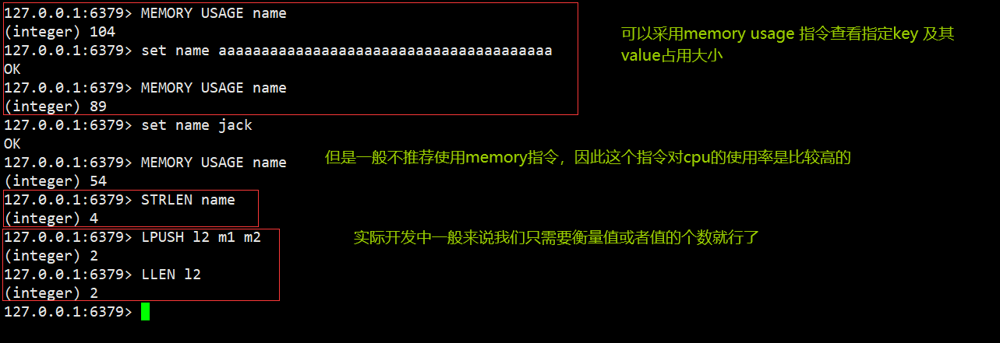
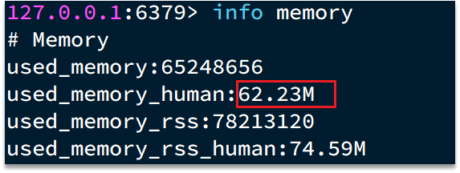
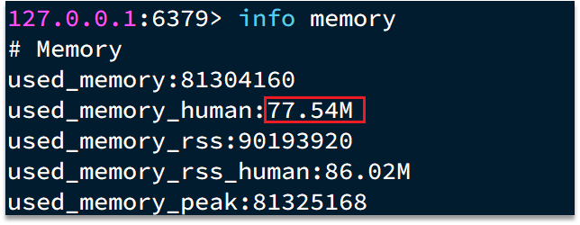
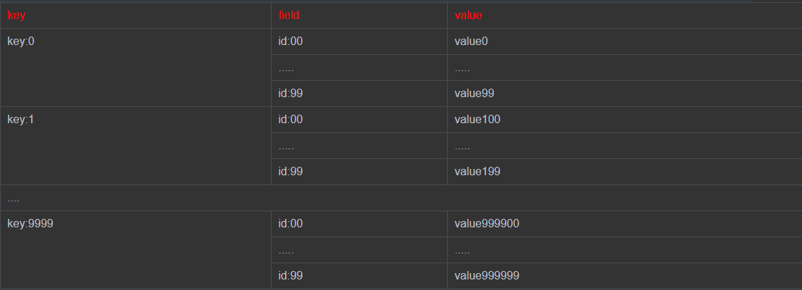

::: tip

① Redis键值设计

② 批处理优化

:::

## ① Redis键值设计

### 1.1、优雅的key结构

Redis的Key虽然可以自定义，但最好遵循下面的几个最佳实践约定：
      n          
- 遵循基本格式：[业务名称]:[数据名]:[id]
- 长度不超过44字节
- 不包含特殊字符

例如：我们的登录业务，保存用户信息，其key可以设计成如下格式：


这样设计的好处：

- 可读性强
- 避免key冲突
- 方便管理
- 更节省内存： key是string类型，底层编码包含int、embstr和raw三种。embstr在小于44字节使用，采用连续内存空间，内存占用更小。当字节数大于44字节时，会转为raw模式存储，在raw模式下，内存空间不是连续的，而是采用一个指针指向了另外一段内存空间，在这段空间里存储SDS内容，这样空间不连续，访问的时候性能也就会收到影响，还有可能产生内存碎片


### 1.2、拒绝BigKey

BigKey通常以Key的大小和Key中成员的数量来综合判定，例如：

- Key本身的数据量过大：一个String类型的Key，它的值为5 MB
- Key中的成员数过多：一个ZSET类型的Key，它的成员数量为10,000个
- Key中成员的数据量过大：一个Hash类型的Key，它的成员数量虽然只有1,000个但这些成员的Value（值）总大小为100 MB

那么如何判断元素的大小呢？redis也给我们提供了命令



推荐值：

- 单个key的value小于10KB
- 对于集合类型的key，建议元素数量小于1000

#### 1.2.1、BigKey的危害

- 网络阻塞
  - 对BigKey执行读请求时，少量的QPS就可能导致带宽使用率被占满，导致Redis实例，乃至所在物理机变慢
- 数据倾斜
  - BigKey所在的Redis实例内存使用率远超其他实例，无法使数据分片的内存资源达到均衡
- Redis阻塞
  - 对元素较多的hash、list、zset等做运算会耗时较旧，使主线程被阻塞
- CPU压力
  - 对BigKey的数据序列化和反序列化会导致CPU的使用率飙升，影响Redis实例和本机其它应用

#### 1.2.2、如何发现BigKey

`①redis-cli --bigkeys`

利用redis-cli提供的--bigkeys参数，可以遍历分析所有key，并返回Key的整体统计信息与每个数据的Top1的big key

命令：`redis-cli -a 密码 --bigkeys`


`②scan扫描`

自己编程，利用scan扫描Redis中的所有key，利用strlen、hlen等命令判断key的长度（此处不建议使用MEMORY USAGE）


scan 命令调用完后每次会返回2个元素，第一个是下一次迭代的光标，第一次光标会设置为0，当最后一次scan 返回的光标等于0时，表示整个scan遍历结束了，第二个返回的是List，一个匹配的key的数组

```java
import com.heima.jedis.util.JedisConnectionFactory;
import org.junit.jupiter.api.AfterEach;
import org.junit.jupiter.api.BeforeEach;
import org.junit.jupiter.api.Test;
import redis.clients.jedis.Jedis;
import redis.clients.jedis.ScanResult;

import java.util.HashMap;
import java.util.List;
import java.util.Map;

public class JedisTest {
    private Jedis jedis;

    @BeforeEach
    void setUp() {
        // 1.建立连接
        // jedis = new Jedis("192.168.150.101", 6379);
        jedis = JedisConnectionFactory.getJedis();
        // 2.设置密码
        jedis.auth("123321");
        // 3.选择库
        jedis.select(0);
    }

    final static int STR_MAX_LEN = 10 * 1024;
    final static int HASH_MAX_LEN = 500;

    @Test
    void testScan() {
        int maxLen = 0;
        long len = 0;

        String cursor = "0";
        do {
            // 扫描并获取一部分key
            ScanResult<String> result = jedis.scan(cursor);
            // 记录cursor
            cursor = result.getCursor();
            List<String> list = result.getResult();
            if (list == null || list.isEmpty()) {
                break;
            }
            // 遍历
            for (String key : list) {
                // 判断key的类型
                String type = jedis.type(key);
                switch (type) {
                    case "string":
                        len = jedis.strlen(key);
                        maxLen = STR_MAX_LEN;
                        break;
                    case "hash":
                        len = jedis.hlen(key);
                        maxLen = HASH_MAX_LEN;
                        break;
                    case "list":
                        len = jedis.llen(key);
                        maxLen = HASH_MAX_LEN;
                        break;
                    case "set":
                        len = jedis.scard(key);
                        maxLen = HASH_MAX_LEN;
                        break;
                    case "zset":
                        len = jedis.zcard(key);
                        maxLen = HASH_MAX_LEN;
                        break;
                    default:
                        break;
                }
                if (len >= maxLen) {
                    System.out.printf("Found big key : %s, type: %s, length or size: %d %n", key, type, len);
                }
            }
        } while (!cursor.equals("0"));
    }
    
    @AfterEach
    void tearDown() {
        if (jedis != null) {
            jedis.close();
        }
    }

}
```

`③第三方工具`

- 利用第三方工具，如 Redis-Rdb-Tools 分析RDB快照文件，全面分析内存使用情况
- https://github.com/sripathikrishnan/redis-rdb-tools

`④网络监控`

- 自定义工具，监控进出Redis的网络数据，超出预警值时主动告警
- 一般阿里云搭建的云服务器就有相关监控页面


#### 1.2.3、如何删除BigKey

BigKey内存占用较多，即便时删除这样的key也需要耗费很长时间，导致Redis主线程阻塞，引发一系列问题。

- redis 3.0 及以下版本
  - 如果是集合类型，则遍历BigKey的元素，先逐个删除子元素，最后删除BigKey


- Redis 4.0以后
  - Redis在4.0后提供了异步删除的命令：unlink

### 1.3、恰当的数据类型

**例1：比如存储一个User对象，我们有三种存储方式：**

`①方式一：json字符串`


优点：实现简单粗暴

缺点：数据耦合，不够灵活

`②方式二：字段打散`


优点：可以灵活访问对象任意字段

缺点：占用空间大、没办法做统一控制

`③方式三：hash（推荐）`


优点：底层使用ziplist，空间占用小，可以灵活访问对象的任意字段

缺点：代码相对复杂

**例2：假如有hash类型的key，其中有100万对field和value，field是自增id，这个key存在什么问题？如何优化？**


存在的问题：

- hash的entry数量超过500时，会使用哈希表而不是ZipList，内存占用较多
  - 
- 可以通过hash-max-ziplist-entries配置entry上限。但是如果entry过多就会导致BigKey问题

`方案一`

拆分为string类型


存在的问题：

- string结构底层没有太多内存优化，内存占用较多



- 想要批量获取这些数据比较麻烦

`方案二`



拆分为小的hash，将 id / 100 作为key， 将id % 100 作为field，这样每100个元素为一个Hash


```java
package com.heima.test;

import com.heima.jedis.util.JedisConnectionFactory;
import org.junit.jupiter.api.AfterEach;
import org.junit.jupiter.api.BeforeEach;
import org.junit.jupiter.api.Test;
import redis.clients.jedis.Jedis;
import redis.clients.jedis.Pipeline;
import redis.clients.jedis.ScanResult;

import java.util.HashMap;
import java.util.List;
import java.util.Map;

public class JedisTest {
    private Jedis jedis;

    @BeforeEach
    void setUp() {
        // 1.建立连接
        // jedis = new Jedis("192.168.150.101", 6379);
        jedis = JedisConnectionFactory.getJedis();
        // 2.设置密码
        jedis.auth("123321");
        // 3.选择库
        jedis.select(0);
    }

    @Test
    void testSetBigKey() {
        Map<String, String> map = new HashMap<>();
        for (int i = 1; i <= 650; i++) {
            map.put("hello_" + i, "world!");
        }
        jedis.hmset("m2", map);
    }

    @Test
    void testBigHash() {
        Map<String, String> map = new HashMap<>();
        for (int i = 1; i <= 100000; i++) {
            map.put("key_" + i, "value_" + i);
        }
        jedis.hmset("test:big:hash", map);
    }

    @Test
    void testBigString() {
        for (int i = 1; i <= 100000; i++) {
            jedis.set("test:str:key_" + i, "value_" + i);
        }
    }

    @Test
    void testSmallHash() {
        int hashSize = 100;
        Map<String, String> map = new HashMap<>(hashSize);
        for (int i = 1; i <= 100000; i++) {
            int k = (i - 1) / hashSize;
            int v = i % hashSize;
            map.put("key_" + v, "value_" + v);
            if (v == 0) {
                jedis.hmset("test:small:hash_" + k, map);
            }
        }
    }

    @AfterEach
    void tearDown() {
        if (jedis != null) {
            jedis.close();
        }
    }
}
```

### 1.4、总结

- Key的最佳实践
  - 固定格式：[业务名]:[数据名]:[id]
  - 足够简短：不超过44字节
  - 不包含特殊字符
- Value的最佳实践：
  - 合理的拆分数据，拒绝BigKey
  - 选择合适数据结构
  - Hash结构的entry数量不要超过1000
  - 设置合理的超时时间


## ② 批处理优化

### 2.1、Pipeline

**2.1.1、我们的客户端与redis服务器是这样交互的**

单个命令的执行流程


N条命令的执行流程


redis处理指令是很快的，主要花费的时候在于网络传输。于是乎很容易想到将多条指令批量的传输给redis


**2.1.2、MSet**

Redis提供了很多Mxxx这样的命令，可以实现批量插入数据，例如：

- mset
- hmset

利用mset批量插入10万条数据

```java
@Test
void testMxx() {
    String[] arr = new String[2000];
    int j;
    long b = System.currentTimeMillis();
    for (int i = 1; i <= 100000; i++) {
        j = (i % 1000) << 1;
        arr[j] = "test:key_" + i;
        arr[j + 1] = "value_" + i;
        if (j == 0) {
            jedis.mset(arr);
        }
    }
    long e = System.currentTimeMillis();
    System.out.println("time: " + (e - b));
}
```

**2.1.3、Pipeline**

MSET虽然可以批处理，但是却只能操作部分数据类型，因此如果有对复杂数据类型的批处理需要，建议使用Pipeline

```java
@Test
void testPipeline() {
    // 创建管道
    Pipeline pipeline = jedis.pipelined();
    long b = System.currentTimeMillis();
    for (int i = 1; i <= 100000; i++) {
        // 放入命令到管道
        pipeline.set("test:key_" + i, "value_" + i);
        if (i % 1000 == 0) {
            // 每放入1000条命令，批量执行
            pipeline.sync();
        }
    }
    long e = System.currentTimeMillis();
    System.out.println("time: " + (e - b));
}
```

### 2.2、集群下的批处理

如MSET或Pipeline这样的批处理需要在一次请求中携带多条命令，而此时如果Redis是一个集群，那批处理命令的多个key必须落在一个插槽中，否则就会导致执行失败。大家可以想一想这样的要求其实很难实现，因为我们在批处理时，可能一次要插入很多条数据，这些数据很有可能不会都落在相同的节点上，这就会导致报错了

这个时候，我们可以找到4种解决方案


第一种方案：串行执行，所以这种方式没有什么意义，当然，执行起来就很简单了，缺点就是耗时过久。

第二种方案：串行slot，简单来说，就是执行前，客户端先计算一下对应的key的slot，一样slot的key就放到一个组里边，不同的，就放到不同的组里边，然后对每个组执行pipeline的批处理，他就能串行执行各个组的命令，这种做法比第一种方法耗时要少，但是缺点呢，相对来说复杂一点，所以这种方案还需要优化一下

第三种方案：并行slot，相较于第二种方案，在分组完成后串行执行，第三种方案，就变成了并行执行各个命令，所以他的耗时就非常短，但是实现呢，也更加复杂。

第四种：hash_tag，redis计算key的slot的时候，其实是根据key的有效部分来计算的，通过这种方式就能一次处理所有的key，这种方式耗时最短，实现也简单，但是如果通过操作key的有效部分，那么就会导致所有的key都落在一个节点上，产生数据倾斜的问题，所以我们推荐使用第三种方式。

**2.2.1 串行化执行代码实践**

```java
public class JedisClusterTest {

    private JedisCluster jedisCluster;

    @BeforeEach
    void setUp() {
        // 配置连接池
        JedisPoolConfig poolConfig = new JedisPoolConfig();
        poolConfig.setMaxTotal(8);
        poolConfig.setMaxIdle(8);
        poolConfig.setMinIdle(0);
        poolConfig.setMaxWaitMillis(1000);
        HashSet<HostAndPort> nodes = new HashSet<>();
        nodes.add(new HostAndPort("192.168.150.101", 7001));
        nodes.add(new HostAndPort("192.168.150.101", 7002));
        nodes.add(new HostAndPort("192.168.150.101", 7003));
        nodes.add(new HostAndPort("192.168.150.101", 8001));
        nodes.add(new HostAndPort("192.168.150.101", 8002));
        nodes.add(new HostAndPort("192.168.150.101", 8003));
        jedisCluster = new JedisCluster(nodes, poolConfig);
    }

    @Test
    void testMSet() {
        jedisCluster.mset("name", "Jack", "age", "21", "sex", "male");

    }

    @Test
    void testMSet2() {
        Map<String, String> map = new HashMap<>(3);
        map.put("name", "Jack");
        map.put("age", "21");
        map.put("sex", "Male");
        //对Map数据进行分组。根据相同的slot放在一个分组
        //key就是slot，value就是一个组
        Map<Integer, List<Map.Entry<String, String>>> result = map.entrySet()
                .stream()
                .collect(Collectors.groupingBy(
                        entry -> ClusterSlotHashUtil.calculateSlot(entry.getKey()))
                );
        //串行的去执行mset的逻辑
        for (List<Map.Entry<String, String>> list : result.values()) {
            String[] arr = new String[list.size() * 2];
            int j = 0;
            for (int i = 0; i < list.size(); i++) {
                j = i<<2;
                Map.Entry<String, String> e = list.get(0);
                arr[j] = e.getKey();
                arr[j + 1] = e.getValue();
            }
            jedisCluster.mset(arr);
        }
    }

    @AfterEach
    void tearDown() {
        if (jedisCluster != null) {
            jedisCluster.close();
        }
    }
}
```

2.2.2 Spring集群环境下批处理代码

```java
   @Test
    void testMSetInCluster() {
        Map<String, String> map = new HashMap<>(3);
        map.put("name", "Rose");
        map.put("age", "21");
        map.put("sex", "Female");
        stringRedisTemplate.opsForValue().multiSet(map);


        List<String> strings = stringRedisTemplate.opsForValue().multiGet(Arrays.asList("name", "age", "sex"));
        strings.forEach(System.out::println);

    }
```

**原理分析**

在RedisAdvancedClusterAsyncCommandsImpl 类中

首先根据slotHash算出来一个partitioned的map，map中的key就是slot，而他的value就是对应的对应相同slot的key对应的数据

```Java
通过 RedisFuture<String> mset = super.mset(op);进行异步的消息发送

@Override
public RedisFuture<String> mset(Map<K, V> map) {

    Map<Integer, List<K>> partitioned = SlotHash.partition(codec, map.keySet());

    if (partitioned.size() < 2) {
        return super.mset(map);
    }

    Map<Integer, RedisFuture<String>> executions = new HashMap<>();

    for (Map.Entry<Integer, List<K>> entry : partitioned.entrySet()) {

        Map<K, V> op = new HashMap<>();
        entry.getValue().forEach(k -> op.put(k, map.get(k)));

        RedisFuture<String> mset = super.mset(op);
        executions.put(entry.getKey(), mset);
    }

    return MultiNodeExecution.firstOfAsync(executions);
}
```
