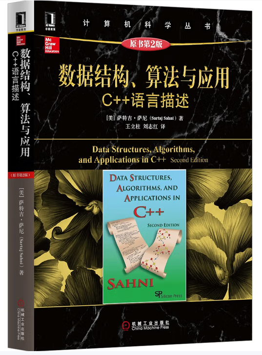
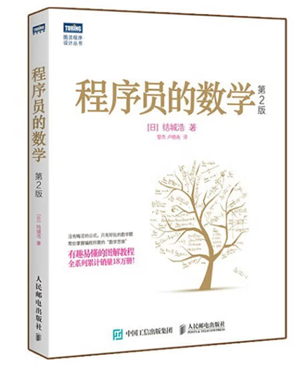
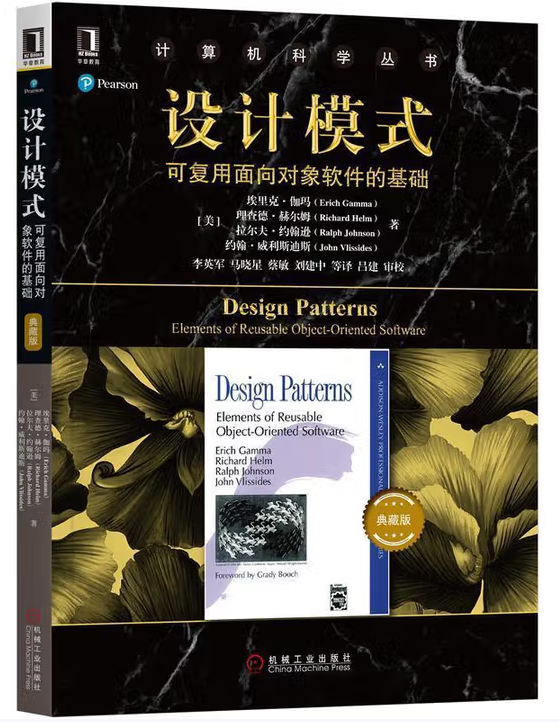

::: tip
① 数据结构
<a href="https://bugstack.cn/md/algorithm/data-structures/data-structures.html" target="_blank">数据结构</a>
<a href="https://pan.baidu.com/pfile/docview?path=%2FRoadBook%2FBase%2F2_Base%2F%E6%95%B0%E6%8D%AE%E7%BB%93%E6%9E%84%E3%80%81%E7%AE%97%E6%B3%95%E4%B8%8E%E5%BA%94%E7%94%A8.C%2B%2B%E8%AF%AD%E8%A8%80%E6%8F%8F%E8%BF%B0.%E5%8E%9F%E4%B9%A6%E7%AC%AC2%E7%89%88.pdf&fsid=200557370125597&size=114182952&view_from=personal_file&md5=5d1704986o56f88267237e48cf00e961&share=0&client=web&scene=main" target="_blank">数据结构、算法与应用.C++语言描述.原书第2版</a>
② 数学逻辑
<a href="https://bugstack.cn/md/algorithm/logic/math/2022-10-30-bits.html" target="_blank">数学逻辑</a>
<a href="https://pan.baidu.com/pfile/docview?path=%2FRoadBook%2FBase%2F2_Base%2F%E7%A8%8B%E5%BA%8F%E5%91%98%E7%9A%84%E6%95%B0%E5%AD%A6.pdf&fsid=485736540706038&size=14969169&view_from=personal_file&md5=130cf6d2el6343c6f426ad89bcf1e9ab&share=0&client=web&scene=main" target="_blank">程序员的数学</a>
③ 设计模式
<a href="https://bugstack.cn/md/develop/design-pattern/2020-05-20-%E9%87%8D%E5%AD%A6Java%E8%AE%BE%E8%AE%A1%E6%A8%A1%E5%BC%8F%E3%80%8A%E5%AE%9E%E6%88%98%E5%B7%A5%E5%8E%82%E6%96%B9%E6%B3%95%E6%A8%A1%E5%BC%8F%E3%80%8B.html" target="_blank">设计模式</a>
<a href="https://pan.baidu.com/pfile/docview?path=%2FRoadBook%2FBase%2F2_Base%2F%E8%AE%BE%E8%AE%A1%E6%A8%A1%E5%BC%8F%EF%BC%9A%E5%8F%AF%E5%A4%8D%E7%94%A8%E9%9D%A2%E5%90%91%E5%AF%B9%E8%B1%A1%E8%BD%AF%E4%BB%B6%E7%9A%84%E5%9F%BA%E7%A1%80.pdf&fsid=649424973519411&size=26084115&view_from=personal_file&md5=c49a942d3g91ea096264146f136d9639&share=0&client=web&scene=main" target="_blank">设计模式：可复用面向对象软件的基础</a>
:::

## 数据结构

<a href="https://bugstack.cn/md/algorithm/data-structures/data-structures.html" target="_blank">数据结构</a>

<a href="https://pan.baidu.com/pfile/docview?path=%2FRoadBook%2FBase%2F2_Base%2F%E6%95%B0%E6%8D%AE%E7%BB%93%E6%9E%84%E3%80%81%E7%AE%97%E6%B3%95%E4%B8%8E%E5%BA%94%E7%94%A8.C%2B%2B%E8%AF%AD%E8%A8%80%E6%8F%8F%E8%BF%B0.%E5%8E%9F%E4%B9%A6%E7%AC%AC2%E7%89%88.pdf&fsid=200557370125597&size=114182952&view_from=personal_file&md5=5d1704986o56f88267237e48cf00e961&share=0&client=web&scene=main" target="_blank">数据结构、算法与应用.C++语言描述.原书第2版</a>

## 数学逻辑
<a href="https://bugstack.cn/md/algorithm/logic/math/2022-10-30-bits.html" target="_blank">数学逻辑</a>
<a href="https://pan.baidu.com/pfile/docview?path=%2FRoadBook%2FBase%2F2_Base%2F%E7%A8%8B%E5%BA%8F%E5%91%98%E7%9A%84%E6%95%B0%E5%AD%A6.pdf&fsid=485736540706038&size=14969169&view_from=personal_file&md5=130cf6d2el6343c6f426ad89bcf1e9ab&share=0&client=web&scene=main" target="_blank">程序员的数学</a>

## 设计模式
<a href="https://bugstack.cn/md/develop/design-pattern/2020-05-20-%E9%87%8D%E5%AD%A6Java%E8%AE%BE%E8%AE%A1%E6%A8%A1%E5%BC%8F%E3%80%8A%E5%AE%9E%E6%88%98%E5%B7%A5%E5%8E%82%E6%96%B9%E6%B3%95%E6%A8%A1%E5%BC%8F%E3%80%8B.html" target="_blank">设计模式</a>
<a href="https://pan.baidu.com/pfile/docview?path=%2FRoadBook%2FBase%2F2_Base%2F%E8%AE%BE%E8%AE%A1%E6%A8%A1%E5%BC%8F%EF%BC%9A%E5%8F%AF%E5%A4%8D%E7%94%A8%E9%9D%A2%E5%90%91%E5%AF%B9%E8%B1%A1%E8%BD%AF%E4%BB%B6%E7%9A%84%E5%9F%BA%E7%A1%80.pdf&fsid=649424973519411&size=26084115&view_from=personal_file&md5=c49a942d3g91ea096264146f136d9639&share=0&client=web&scene=main" target="_blank">设计模式：可复用面向对象软件的基础</a>

