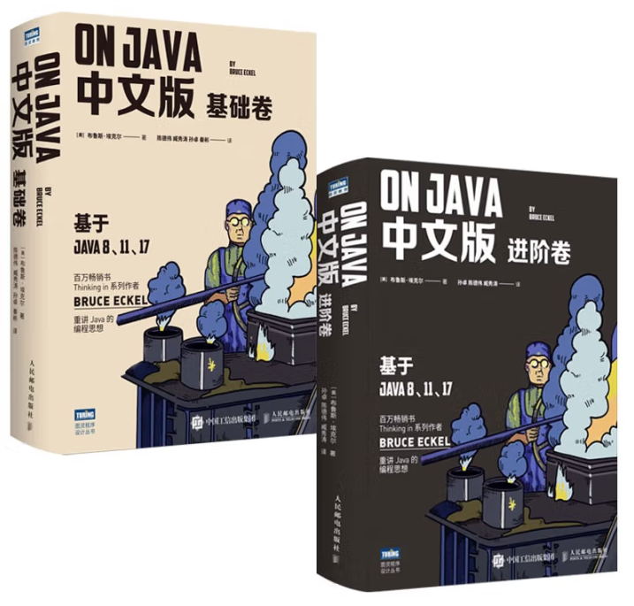

::: tip
① C语言
<a href="https://pan.baidu.com/pfile/docview?path=%2FRoadBook%2FBase%2F3_Base%2FC%20Primer%20Plus%20%E4%B8%AD%E6%96%87%E7%89%88(%E7%AC%AC6%E7%89%88)2020%E7%89%88.pdf&fsid=578287484278246&size=27062767&view_from=personal_file&md5=df5a179c6qaa978e9326e5f05e5f77fd&share=0&client=web&scene=main" target="_blank">C Primer Plus 中文版(第6版)2020版</a>
② Java
<a href="https://pan.baidu.com/pfile/docview?path=%2FRoadBook%2FBase%2F3_Base%2FOn%20Java%20%E4%B8%AD%E6%96%87%E7%89%88%20%E5%9F%BA%E7%A1%80%E5%8D%B7%20%E5%9F%BA%E4%BA%8EJava%208%E3%80%8111%E3%80%8117.pdf&fsid=41230737327293&size=71601825&view_from=personal_file&md5=ee9d4f9d2g9e1d04673c86b65eab336d&share=0&client=web&scene=main" target="_blank">On Java 中文版 基础卷 基于Java 8、11、17</a>
<a href="https://pan.baidu.com/pfile/docview?path=%2FRoadBook%2FBase%2F3_Base%2FOn%20Java%20%E4%B8%AD%E6%96%87%E7%89%88%20%E8%BF%9B%E9%98%B6%E5%8D%B7%20%E5%9F%BA%E4%BA%8EJava%208%E3%80%8111%E3%80%8117.pdf&fsid=267068788349400&size=46397716&view_from=personal_file&md5=c66044adbifcecc6890bc8d962cae890&share=0&client=web&scene=main" target="_blank">On Java 中文版 进阶卷 基于Java 8、11、17</a>
:::

## 一、C语言

<a href="https://pan.baidu.com/pfile/docview?path=%2FRoadBook%2FBase%2F3_Base%2FC%20Primer%20Plus%20%E4%B8%AD%E6%96%87%E7%89%88(%E7%AC%AC6%E7%89%88)2020%E7%89%88.pdf&fsid=578287484278246&size=27062767&view_from=personal_file&md5=df5a179c6qaa978e9326e5f05e5f77fd&share=0&client=web&scene=main" target="_blank">C Primer Plus 中文版(第6版)2020版</a>

## 二、Java
<a href="https://pan.baidu.com/pfile/docview?path=%2FRoadBook%2FBase%2F3_Base%2FOn%20Java%20%E4%B8%AD%E6%96%87%E7%89%88%20%E5%9F%BA%E7%A1%80%E5%8D%B7%20%E5%9F%BA%E4%BA%8EJava%208%E3%80%8111%E3%80%8117.pdf&fsid=41230737327293&size=71601825&view_from=personal_file&md5=ee9d4f9d2g9e1d04673c86b65eab336d&share=0&client=web&scene=main" target="_blank">On Java 中文版 基础卷 基于Java 8、11、17</a>
<a href="https://pan.baidu.com/pfile/docview?path=%2FRoadBook%2FBase%2F3_Base%2FOn%20Java%20%E4%B8%AD%E6%96%87%E7%89%88%20%E8%BF%9B%E9%98%B6%E5%8D%B7%20%E5%9F%BA%E4%BA%8EJava%208%E3%80%8111%E3%80%8117.pdf&fsid=267068788349400&size=46397716&view_from=personal_file&md5=c66044adbifcecc6890bc8d962cae890&share=0&client=web&scene=main" target="_blank">On Java 中文版 进阶卷 基于Java 8、11、17</a>

