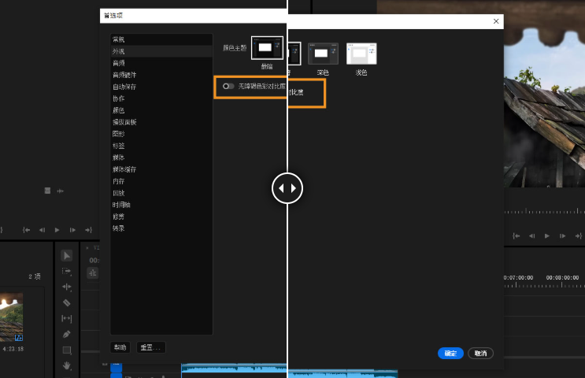

## Adobe Premiere Pro 入门

了解如何开始使用面向电影制作人、电视节目制作人、新闻记者、学生和视频制作人员的非线性编辑软件 Premiere Pro。从导入粗剪素材一直到生成完整视频，了解 Premiere Pro 的基本操作。

### 开始之前

- **收集素材和其他媒体文件：**Premiere Pro 支持多种文件格式。请查看我们[支持的文件格式](https://helpx.adobe.com/cn/premiere-pro/using/supported-file-formats.html)列表，以了解您的文件是否可以导入 Premiere Pro。将文件保存在计算机或专用存储驱动器中（推荐做法）。
- **检查您的系统要求：**如果您的计算机满足这些[系统要求](https://helpx.adobe.com/cn/premiere-pro/system-requirements.html)，请继续并[安装 Premiere Pro](https://creativecloud.adobe.com/apps/download/premiere)。如果不完全支持您的显卡，则启动应用时 Premiere Pro 将标记此问题。检查并更新您的驱动程序，以更好地利用 Premiere Pro。

### 基本工作流程

在计算机中准备好素材后，打开 Premiere Pro 并开始编辑。

> **提示:**
>
> 如果您没有现成的素材，请尝试使用 Premiere Pro 中的示例项目文件。在主页屏幕中，请选择**学习** > **快速入门**以使用示例项目。

#### 启动新项目或打开现有项目

- 要[创建新项目](https://helpx.adobe.com/cn/premiere-pro/using/import-media.html)，请选择***\*新建项目\****或按 **Ctrl** + **Alt** + **N** (Windows) 和 **Opt** + **Cmd** + **N** (macOS)。
- 要打开现有项目，请选择***\*打开项目\**。**
- 如果您要与他人协作，请通过选择***\*新建团队项目\****来创建新的团队项目。

#### 导入视频和音频

- 使用[媒体浏览器](https://helpx.adobe.com/cn/premiere-pro/using/transferring-importing-files.html#import_files_with_the_media_browser)或按 **Ctrl** + **Alt** + **I** (Windows) 或 **Opt** + **Cmd** + **I** (macOS)。
- 使用[动态链接](https://helpx.adobe.com/cn/premiere-pro/using/dynamic-link.html)引入来自 After Effects、Photoshop 或 Illustrator 的资源。

#### 组合和优化序列

要在**源监视器**中打开某个剪辑，请在**时间轴面板**中双击该剪辑。在将剪辑添加到序列之前，可以使用**源监视器**查看剪辑、设置编辑点及标记帧。通过操作[时间轴面板](https://helpx.adobe.com/cn/premiere-pro/using/creating-changing-sequences.html#timeline_panels)中的剪辑来优化序列。

将[剪辑添加至时间轴面板中的序列](https://helpx.adobe.com/cn/premiere-pro/using/adding-clips-sequences.html#adding_clips_to_a_sequence)，方法是从**项目面板**拖动剪辑，或通过使用**插入**或**覆盖**按钮。

#### 编辑视频 

[剪切或拆分剪辑](https://helpx.adobe.com/cn/premiere-pro/using/split-or-cut-clips.html)以移除多余的部分，并创建原始剪辑的新的独立实例。

在时间轴上构建粗剪序列后，您可以[修剪剪辑](https://helpx.adobe.com/cn/premiere-pro/using/trimming-clips.html)以优化编辑和时间。

您还可以[执行 J 剪切和 L 剪切](https://helpx.adobe.com/cn/premiere-pro/using/perform-j-and-l-cuts.html)，以使视频和音频流畅地跨场景过渡。

#### 添加字幕

要[开始使用字幕](https://helpx.adobe.com/cn/premiere-pro/using/essential-graphics-panel.html)，您可以从 Premiere Pro 中选择现有的动态图形模板。您还可以使用**节目监视器**中的文字工具直接创建字幕，或者使用键盘快捷键 **Ctrl** + **T** (Windows) **或 Cmd** + **T** (macOS)。

键入字幕，然后调整其外观。将字幕另存为动态图形模板，以便重复利用和共享。 

#### 添加过渡和效果

在剪辑之间[添加过渡](https://helpx.adobe.com/cn/premiere-pro/using/transition-overview-applying-transitions.html)，以顺畅地从一个剪辑过渡到另一个剪辑。**效果控件**面板包含大量过渡和效果列表，以供您选用。

[添加效果](https://helpx.adobe.com/cn/premiere-pro/using/applying-removing-finding-organizing-effects.html)或过渡到**时间轴**面板中的剪辑，可通过从**效果**面板拖动所需的效果或过渡来添加。使用**效果控件**面板调整效果、持续时间和对齐方式。

#### 编辑颜色

Premiere Pro 中提供了多个[颜色工作流程](https://helpx.adobe.com/cn/premiere-pro/using/color-workflows.html)。您可以：

- 应用颜色预设并进行调整。
- 使用 [RGB 和色相饱和度曲线](https://helpx.adobe.com/cn/premiere-pro/using/adjust-color-rgb-hsl-curves.html)优化外观。
- 跨剪辑比较和匹配颜色。
- 使用色轮调整阴影、中间调和高光。
- 应用 LUT 并对光线进行技术校正
- [色调映射](https://helpx.adobe.com/cn/premiere-pro/using/timeline-tone-mapping.html)和更多功能。

可以首先从外观开始尝试。选择时间轴中的某个剪辑，然后从 [Lumetri 颜色面板的创意部分](https://helpx.adobe.com/cn/premiere-pro/using/creative-lumetri-looks.html)中选择一个外观。调整“强度”和“调整”滑块以微调预设。

#### 混合音频

Premiere Pro 应用程序内部提供了完整的音频编辑解决方案。部分常见的音频编辑操作，包括[“将音频与视频同步”](https://helpx.adobe.com/cn/premiere-pro/using/synchronizing-audio-video-merge-clips.html)或[“减少背景噪音”](https://helpx.adobe.com/cn/premiere-pro/using/premiere-essential-sound-panel.html#auto-ducking)。您也可以选择在 [Audition](https://helpx.adobe.com/cn/premiere-pro/using/editing-audio-audition.html) 中编辑音频，以使用高级音频混合功能。

#### 更改持续时间和速度

可以设置视频或音频剪辑的持续时间，让它们通过加速或降速的方式填充持续时间。

您可以使用以下选项以[更改剪辑的速度和持续时间](https://helpx.adobe.com/cn/premiere-pro/using/duration-speed.html)：

- “速度/持续时间”命令（Windows：**Ctrl + R**，macOS：**Cmd + R**）
- 比率拉伸工具（Windows：**R**，macOS：**R**）
- 时间重映射功能

#### 导出

[快速轻松地将编辑后的序列导出到重点内容目标平台。](https://helpx.adobe.com/cn/premiere-pro/using/export-video.html)您还可以使用适用于流行社交平台（例如 YouTube、Vimeo、Facebook 或 Twitter）的优化渲染设置导出完成的视频。

### 跨平台工作

可以跨计算机平台处理项目。例如，您可以在 Windows 上开始操作，然后继续在 macOS 上进行处理。但是，当项目从一个平台移到另一个平台时，有几项功能会发生变化。

#### 序列设置

可在一个平台上创建项目，然后将其移到另一个平台。Premiere Pro 将为第二个平台设置等效的序列设置，但前提是存在等效设置。

#### 效果

macOS 上所有可用的视频效果均可在 Windows 上使用。如果在 Mac 上打开项目，则不可用于 Mac 的 Windows 效果将显示为脱机效果。所有音频效果均可用于这两个平台。效果预设适用于这两个平台（除非预设应用于给定平台上不可用的效果）。

#### Adobe Media Encoder 预设

在一个平台上创建的预设不可用于另一个平台。

#### 预览文件

在一个平台上创建的预览文件不可用于另一个平台。在不同的平台上打开项目时，Premiere Pro 会重新渲染预览文件。然后在其原始平台上打开该项目时，Premiere Pro 仍会再次渲染预览文件。

#### 高位深度文件

macOS 不支持包含 10 位 4:2:2 未压缩视频 (v210) 或 8 位 4:2:2 未压缩视频 (UYVU) 的 Windows AVI 文件。

#### 预览渲染

未渲染的非本机文件的回放质量不如这些文件在其本机平台上的回放质量那样高。例如，AVI 文件在 Mac OS 上回放的效果不如在 Windows 上回放的效果。Premiere Pro 会在当前平台上渲染非本机文件的预览文件。Premiere Pro 始终以本机格式渲染预览文件。时间轴中的红色栏指示哪些部分包含需要渲染的文件。

### Premiere Pro 的辅助功能

[辅助功能](https://helpx.adobe.com/cn/premiere-pro/using/accessibility.html)指的是：让具有视觉、听觉、运动能力或其他类别身体障碍的人士可方便地使用本产品。软件产品的辅助功能示例包括：屏幕阅读器支持、等效于图形的文本、键盘快捷键、将显示颜色更改为高对比度等等。

Premiere Pro 提供了多种工具，不仅可辅助软件的使用，还可帮助您创建出具备辅助功能的内容。

#### 相关资源

- [新建项目](https://helpx.adobe.com/cn/premiere-pro/using/import-media.html)
- [编辑视频](https://helpx.adobe.com/cn/premiere-pro/using/video-editing-basics.html)
- [导出视频](https://helpx.adobe.com/cn/premiere-pro/using/export-video.html)

## Premiere Pro 中的键盘快捷键

使用此实用列表可参考 Premiere Pro 的键盘快捷键，甚至可打印键盘快捷键的 PDF。 您也可以使用可视键盘布局自定义快捷键以及向命令分配多个快捷键。

### 用于分配键盘快捷键的可视键盘布局

您可以使用键盘 GUI 查看已分配的键和可用于分配的键。 将鼠标悬停于键盘布局中的某个键上时，工具提示会显示完整命令名称。 当您在键盘布局上选择一个修饰键时，键盘会显示需要该修饰键的所有快捷键。 您也可以在硬件键盘上按修饰键来实现该结果。

当您在键盘布局上选择一个键时，可以查看分配给该未修饰键和所有其他修饰键组合的所有命令。  

- Premiere Pro 检测键盘硬件和相应的键盘布局是否相应地显示。
- 当 Premiere Pro 检测到不支持的键盘时，默认视图将显示美式 英语键盘。 默认情况下，显示**“Adobe Premiere Pro 默认”**预设。
- 当您更改快捷键时，预设弹出式菜单会更改为**“自定义”**。 执行所需的更改之后，您可以选择**“另存为”**，将自定义快捷键组保存为预设。 

### 颜色编码

- 紫色阴影的键是应用程序范围的快捷键。 
- 绿色阴影的键是特定于面板的快捷键。 
- 同时带紫色阴影和绿色阴影的键代表已分配给键（这些键也分配有应用程序命令）的面板命令。

### 应用程序快捷键和面板快捷键

- 可为应用程序快捷键和命令快捷键分配命令。 
- 不管面板是否为焦点（有一些例外情况），应用程序快捷键都起作用，面板快捷键则只在面板为焦点时起作用。 
- 某些键盘快捷键只在特定面板中有用。 这意味着您可以为同一个键多次分配快捷键。 也可使用只显示特定批面板快捷键（例如仅对时间轴）的弹出式通知窗口。 
- 当“面板快捷键”将分配的相同快捷键用作应用程序快捷键时，如果切换到该面板，则应用程序快捷键不起作用。 
- 您可以在按搜索条件筛选的“命令列表”中搜索命令。 也可通过在快捷键列中单击来分配快捷键，以及在键盘上点击键来创建快捷键（包括添加修饰键）。 

当出现以下情况时，将显示一个指示快捷键冲突的警告：

1. 应用程序快捷键已被另一个应用程序快捷键使用。
2. 面板快捷键已被相同面板中的另一个命令使用。 
3. 当面板为焦点时，面板快捷键覆盖应用程序快捷键。

您也可以通过单击并拖动的方式，将命令分配给键盘布局或修饰键列表上的键。 

### 使用拖放分配快捷键

您也可以通过以下方式来分配快捷键：将命令从“命令列表”拖到“键盘布局”中的键上，或拖到“修饰键列表”中显示的当前所选键对应的修饰键组合上。 要随修饰键一起将命令分配给键，拖放过程中请按住修饰键。

### 冲突解决

当与另一个命令已使用的快捷键冲突时：

- 编辑器底端将显示警告 
- 右下角的“撤消”和“清除”按钮已启用。 
- 冲突的命令用蓝色高光显示，单击将在命令列表中自动选择命令。 
- 这可让用户为冲突的命令轻松更改分配。

> **注意:**
>
> 使用这种方法来代替以前版本使用的**“转到”**按钮。

### Premiere Pro 默认键盘快捷键

许多命令具有等效的键盘快捷键，因此可最大程度减少使用鼠标操作的情况。 也可创建或编辑键盘快捷键。

#### 文件

| **命令**          | **Windows**      | **macOS**       |
| ----------------- | ---------------- | --------------- |
| 项目...           | Ctrl + Alt + N   | Opt + Cmd + N   |
| 序列...           | Ctrl + N         | Cmd + N         |
| 素材箱            | Ctrl + B         | Cmd + /         |
| 打开项目...       | Ctrl + O         | Cmd + O         |
| 关闭项目          | Ctrl + Shift + W | Shift + Cmd + W |
| 关闭              | Ctrl + W         | Cmd + W         |
| 保存              | Ctrl + S         | Cmd + S         |
| 另存为...         | Ctrl + Shift + S | Shift + Cmd + S |
| 保存副本...       | Ctrl + Alt + S   | Opt + Cmd + S   |
| 从媒体浏览器导入  | Ctrl + Alt + I   | Opt + Cmd + I   |
| 导入...           | Ctrl + I         | Cmd + I         |
| 导出媒体          | Ctrl + M         | Cmd + M         |
| 选择...           | Ctrl + Shift + H | Shift + Cmd + H |
| 退出 Premiere Pro | Ctrl + Q         | Cmd + Q         |

#### 编辑

| 命令       | **Windows**      | **macOS**              |
| ---------- | ---------------- | ---------------------- |
| 撤消       | Ctrl + Z         | Cmd + Z                |
| 重做       | Ctrl + Shift + Z | Shift + Cmd + Z        |
| 剪切       | Ctrl + X         | Cmd + X                |
| 复制       | Ctrl + C         | Cmd + C                |
| 粘贴       | Ctrl + V         | Cmd + V                |
| 粘贴插入   | Ctrl + Shift + V | Shift + Cmd + V        |
| 粘贴属性   | Ctrl + Alt + V   | Opt + Cmd + V          |
| 清除       | Delete           | Forward Delete         |
| 波纹删除   | Shift + Delete   | Shift + Forward Delete |
| 重复       | Ctrl + Shift + / | Shift + Cmd + /        |
| 全选       | Ctrl + A         | Cmd + A                |
| 取消全选   | Ctrl + Shift + A | Shift + Cmd + A        |
| 查找...    | Ctrl + F         | Cmd + F                |
| 编辑原始   | Ctrl + E         | Cmd + E                |
| 键盘快捷键 | Ctrl + Alt + K   | Cmd + Opt + K          |

#### 剪辑

| 命令             | **Windows**      | **macOS**       |
| ---------------- | ---------------- | --------------- |
| 制作子剪辑...    | Ctrl + U         | Cmd + U         |
| 音频声道...      | Shift + G        | Shift + G       |
| 音频增益         | G                | G               |
| 速度/持续时间... | Ctrl + R         | Cmd + R         |
| 插入             | **,**            | **,**           |
| 覆盖             | **.**            | **.**           |
| 启用             | Shift + E        | Shift + Cmd + E |
| 链接             | Ctrl + L         | Cmd + L         |
| 编组             | Ctrl + G         | Cmd + G         |
| 取消编组         | Ctrl + Shift + G | Shift + Cmd + G |

#### 序列

| 命令                       | **Windows**         | **macOS**          |
| -------------------------- | ------------------- | ------------------ |
| 渲染工作区域内的效果       | Enter               | Enter              |
| 匹配帧                     | F                   | F                  |
| 反转匹配帧                 | Shift + R           | Shift + R          |
| 添加编辑                   | Ctrl + K            | Cmd + K            |
| 添加编辑到所有轨道         | Ctrl + Shift + K    | Shift + Cmd + K    |
| 修剪编辑                   | Shift + T           | Cmd + T            |
| 将所选编辑点扩展到播放指示 | E                   | E                  |
| 应用视频过渡               | Ctrl + D            | Cmd + D            |
| 应用音频过渡               | Ctrl + Shift + D    | Shift + Cmd + D    |
| 将默认过渡应用到选择项     | Shift + D           | Shift + D          |
| 提升                       | **;**               | **;**              |
| 提取                       | **'**               | **'**              |
| 放大                       | **=**               | **=**              |
| 缩小                       | **-**               | **-**              |
| 序列中下一段               | Shift + ;           | Shift + ;          |
| 序列中上一段               | Ctrl + Shift + ;    | Opt + ;            |
| 在时间轴中对齐             | S                   | S                  |
| 制作子序列                 | Shift + U           | Cmd + U            |
| 添加新字幕轨道             | Ctrl + Alt + A      | Opt + Cmd + A      |
| 在播放指示器处添加字幕     | Ctrl + Alt + C      | Opt + Cmd + C      |
| 转到下一个字幕段           | Ctrl + Alt + 向下键 | Opt + Cmd + 向下键 |
| 转到上一个字幕段           | Ctrl + Alt + 向下键 | Opt + Cmd + Up     |

#### 标记

| 命令           | **Windows**            | **macOS**       |
| -------------- | ---------------------- | --------------- |
| 标记入点       | I                      | I               |
| 标记出点       | O                      | O               |
| 标记剪辑       | X                      | X               |
| 标记选择项     | /                      | /               |
| 转到入点       | Shift + I              | Shift + I       |
| 转到出点       | Shift + O              | Shift + O       |
| 清除入点       | Ctrl + Shift + I       | Opt + I         |
| 清除出点       | Ctrl + Shift + O       | Opt + O         |
| 清除入点和出点 | Ctrl + Shift + X       | Opt + X         |
| 添加标记       | M                      | M               |
| 转到下一个标记 | Shift + M              | Shift + M       |
| 转到上一个标记 | Ctrl + Shift + M       | Shift + Cmd + M |
| 清除所选的标记 | Ctrl + Alt + M         | Opt + M         |
| 清除所有标记   | Ctrl + Alt + Shift + M | Opt + Cmd + M   |

#### 图形和字幕

| 命令           | **Windows**      | **macOS**       |
| -------------- | ---------------- | --------------- |
| **新建图层**   |                  |                 |
| 文本           | Ctrl + T         | Cmd + T         |
| 矩形           | Ctrl + Alt + R   | Opt + Cmd + R   |
| 椭圆           | Ctrl + Alt + E   | Opt + Cmd + E   |
| **排列**       |                  |                 |
| 移到最前       | Ctrl + Shift + ] | Shift + Cmd + ] |
| 前移           | Ctrl + ]         | Cmd + ]         |
| 后移           | Ctrl + [         | Cmd + [         |
| 移到最后       | Ctrl + Shift + [ | Shift + Cmd + [ |
| **选择**       |                  |                 |
| 选择下一个图层 | Ctrl + Alt + ]   | Opt + Cmd + ]   |
| 选择上一个图层 | Ctrl + Alt + [   | Opt + Cmd + [   |

#### 窗口

| 命令               | **Windows**     | **macOS**       |
| ------------------ | --------------- | --------------- |
| 重置为已保存的布局 | Alt + Shift + 0 | Opt + Shift + 0 |
| 音频剪辑混合器     | Shift + 9       | Shift + 9       |
| 音轨混合器         | Shift + 6       | Shift + 6       |
| 效果控件           | Shift + 5       | Shift + 5       |
| 效果               | Shift + 7       | Shift + 7       |
| 媒体浏览器         | Shift + 8       | Shift + 8       |
| 节目监视器         | Shift + 4       | Shift + 4       |
| 项目               | Shift + 1       | Shift + 1       |
| 源监视器           | Shift + 2       | Shift + 2       |
| 时间轴             | Shift + 3       | Shift + 3       |

#### 帮助

| **命令**             | **Windows** | **macOS** |
| -------------------- | ----------- | --------- |
| Premiere Pro 帮助... | F1          | F1        |

#### 音频轨道混合器”面板

| 命令          | Windows          | macOS            |
| ------------- | ---------------- | ---------------- |
| 显示/隐藏轨道 | Ctrl + Alt + T   | Opt + Cmd + T    |
| 循环          | Ctrl + L         | Cmd + L          |
| 仅计量器输入  | Ctrl + Shift + I | Ctrl + Shift + I |

#### “效果控件”面板

| 命令           | Windows   | macOS   |
| -------------- | --------- | ------- |
| 移除所选效果   | Backspace | Delete  |
| 仅循环播放音频 | Ctrl + L  | Cmd + L |

#### “效果”面板

| 命令             | Windows   | macOS   |
| ---------------- | --------- | ------- |
| 新建自定义素材箱 | Ctrl + B  | Cmd + / |
| 删除自定义项目   | Backspace | Delete  |

#### 字幕

| 命令                                   | 操作                                                         |
| -------------------------------------- | ------------------------------------------------------------ |
| 当没有活动轨道时                       | 当所有轨道都静音时，这些快捷键将不会执行任何操作             |
| 当所有轨道都处于活动状态               | 当所有轨道都处于活动状态时，这些快捷键将不会执行任何操作     |
| 确定基准轨道                           | 最高活动字幕轨道被用作基准轨道                               |
| 激活下一个字幕轨道                     | 立即激活基准轨道旁边的轨道。 如果基准轨道是最高轨道，则会进行循环 |
| 激活上一个字幕轨道                     | 从基准轨道向后循环，激活第一个静音轨道                       |
| 在菜单或反馈菜单项中导航               | 使用 Tab 和 Shift + Tab                                      |
| 打开菜单项、字幕翻译对话框和反馈对话框 | Shift + Enter                                                |
| 在菜单或反馈菜单项中导航               | Options + 箭头                                               |
| 移动到下一个和上一个字幕区段           | 向上和向下箭头                                               |

例如，如果有 6 个字幕轨道（C1、C2、C3、C4、C5 和 C6），其中 C1、C4 和 C5 处于活动状态，而其他轨道处于非活动状态：

- 基准轨道为 C5（最高活动字幕轨道）
- 激活下一个字幕轨道 → 激活 C6
- 激活上一个字幕轨道 → 激活 C3

#### “历史记录”面板

| 命令   | Windows       | macOS      |
| ------ | ------------- | ---------- |
| 后退   | **左**        | **左**     |
| 前进   | **右**        | **右**     |
| Delete | **Backspace** | **Delete** |

#### “媒体浏览器”面板

| 命令             | Windows            | macOS              |
| ---------------- | ------------------ | ------------------ |
| 在源监视器中打开 | **Shift + O**      | **Shift + O **     |
| 选择目录列表     | **Shift + 向左键** | **Shift + 向左键** |
| 选择媒体列表     | **Shift + 向右键** | **Shift + 右侧**   |

#### “元数据”面板

| 命令 | Windows      | macOS       |
| ---- | ------------ | ----------- |
| 循环 | **Ctrl + L** | **Cmd + L** |
| 播放 | **空格键**   | **空格键**  |

#### 多机位

| 命令                             | **Windows**               | **macOS**                |
| -------------------------------- | ------------------------- | ------------------------ |
| 转到下一个编辑点                 | **向下键**                | **向下键**               |
| 转到任意轨道上的下一个编辑点     | **Shift + 向下键**        | **Shift + 向下键**       |
| 转到上一个编辑点                 | **上**                    | **上**                   |
| 转到任意轨道上的上一个编辑点     | **Shift + 向上键**        | **Shift + 向上键**       |
| 转到所选剪辑结束点               | **Shift + End**           | **Shift + End**          |
| 转到所选剪辑起始点               | **Shift + Home**          | **Shift + Home**         |
| 转到序列剪辑结束点               | **结束**                  | **结束**                 |
| 转到序列剪辑起始点               | **主页**                  | **主页**                 |
| 提高剪辑音量                     | **]**                     | **]**                    |
| 大幅提高剪辑音量                 | **Shift + ]**             | **Shift + ]**            |
| 最大化或恢复活动帧               | **Shift + `**             | **Shift + `**            |
| 最大化或在光标下恢复帧           | **`**                     | **`**                    |
| 最小化所有轨道                   | **Shift + -**             | **Shift + -**            |
| 播放邻近区域                     | **Shift + K**             | **Shift + K**            |
| 从入点播放到出点                 | **Ctrl + Shift + 空格键** | **Opt + K**              |
| 通过预卷/过卷从入点播放到出点    | **Shift + 空格键**        | **Shift + 空格键**       |
| 从播放指示器播放到出点           | **Ctrl + 空格键**         | **Ctrl + 空格键**        |
| 播放-停止切换                    | **空格键**                | **空格键**               |
| 显示嵌套序列                     | **Ctrl + Shift + F**      | Ctrl + Shift + F         |
| 波纹修剪下一个编辑点到播放指示器 | **宽**                    | **宽**                   |
| 波纹修剪上一个编辑点到播放指示器 | **Q**                     | **Q**                    |
| 选择摄像机 1                     | **1**                     | **1**                    |
| 选择摄像机 2                     | **2**                     | **2**                    |
| 选择摄像机 3                     | **3**                     | **3**                    |
| 选择摄像机 4                     | **4**                     | **4**                    |
| 选择摄像机 5                     | **5**                     | **5**                    |
| 选择摄像机 6                     | **6**                     | **6**                    |
| 选择摄像机 7                     | **7**                     | **7**                    |
| 选择摄像机 8                     | **8**                     | **8**                    |
| 选择摄像机 9                     | **9**                     | **9**                    |
| 选择查找框                       | **Shift + F**             | **Shift + F**            |
| 在播放指示器上选择剪辑           | **D**                     | **D**                    |
| 选择下一个剪辑                   | **Ctrl + 向下键**         | **Cmd + 向下键**         |
| 选择下一个面板                   | **Ctrl + Shift + .**      | **Ctrl + Shift + .**     |
| 选择上一个剪辑                   | **Ctrl + 向上键**         | **Cmd + 向上键**         |
| 选择上一个面板                   | **Ctrl + Shift + ,**      | **Ctrl + Shift + ,**     |
| 设置标识帧                       | **Shift + P**             | **Cmd + P**              |
| 向左往复                         | **J**                     | **J**                    |
| 向右往复                         | **L**                     | **L**                    |
| 向左慢速往复                     | **Shift + J**             | **Shift + J**            |
| 向右慢速往复                     | **Shift + L**             | **Shift + L**            |
| 停止往复                         | **K**                     | **K**                    |
| 后退                             | **左**                    | **左**                   |
| 后退五帧 - 单位                  | **Shift + 向左键**        | **Shift + 向左键**       |
| 前进                             | **向右键**                | **向右键**               |
| 前进五帧 - 单位                  | **Shift + 向右键**        | **Shift + 向右键**       |
| 切换所有音频目标                 | **Ctrl + 9**              | **Cmd + 9**              |
| 切换所有源音频                   | **Ctrl + Alt + 9**        | **Opt + Cmd + 9**        |
| 切换所有源视频                   | **Ctrl + Alt + 0**        | **Opt + Cmd + 0**        |
| 切换所有视频目标                 | **Ctrl + 0**              | **Cmd + 0**              |
| 在快速搜索期间开关音频           | **Shift + S**             | **Shift + S**            |
| 切换操纵面板剪辑混合器模式       |                           |                          |
| 全屏切换                         | **Ctrl + `**              | **Ctrl + `**             |
| 切换多机位视图                   | **Shift + 0**             | **Shift + 0**            |
| 切换修剪类型                     | **Shift + T**             | **Ctrl + T**             |
| 向后修剪                         | **Ctrl + 向左键**         | **Opt + 向左键**         |
| 大幅向后修剪                     | **Ctrl + Shift + 向左键** | **Opt + Shift + 向左键** |
| 向前修剪                         | **Ctrl + 向右键**         | **Opt + 向右键**         |
| 大幅向前修剪                     | **Ctrl + Shift + 向右键** | **Opt + Shift + 向右键** |
| 修剪下一个编辑点到播放指示器     | **Ctrl + Alt + W**        | **Opt + W**              |
| 修剪上一个编辑点到播放指示器     | **Ctrl + Alt + Q**        | **Opt + Q**              |

#### “节目监视器”面板

> **注意:**
>
> 要对图形图层进行微调，请确保：
>
> - 已经选中了单个图形中至少一个图层（蓝色选框）
> - 当前聚焦于节目监视器或基本图形面板

| 命令                   | Windows                | macOS                 |
| ---------------------- | ---------------------- | --------------------- |
| 显示标尺               | Ctrl + R               | Cmd + R               |
| 显示参考线             | Ctrl + ;               | Cmd + ;               |
| 在节目监视器中对齐     | Ctrl + Shift + ;       | Shift + Cmd + ;       |
| 锁定参考线             | Ctrl + Alt + Shift + R | Opt + Shift + Cmd + R |
| 将选定对象向上微移五帧 | Shift + Ctrl + 向上键  | Shift + Cmd + 向上键  |
| 将选定对象向右微移五帧 | Shift + Ctrl + 向右键  | Shift + Cmd + 向右键  |
| 将选定对象向左微移五帧 | Shift + Ctrl + 向左键  | Shift + Cmd + 向左键  |
| 将选定对象向下微移五帧 | Shift + Ctrl + 向下键  | Shift + Cmd + 向下键  |
| 将选定对象向上微移一帧 | Ctrl + 向上键          | Cmd + 向上键          |
| 将选定对象向右微移一帧 | Ctrl + 向右键          | Cmd + 向右键          |
| 将选定对象向左微移一帧 | Ctrl + 向左键          | Cmd + 向左键          |
| 将选定对象向下微移一帧 | Ctrl + 向下键          | Cmd + 向下键          |

#### “项目”面板

| 命令               | Windows          | macOS                |
| ------------------ | ---------------- | -------------------- |
| 新建素材箱         | Ctrl + B         | Cmd + B              |
| Delete             | Backspace        | Delete               |
| 列表               | Ctrl + Page Up   | Cmd + Page Up        |
| 图标               | Ctrl + Page Down | Cmd + Page Down      |
| 悬停划动           | Shift + H        | Shift + H            |
| 删除带选项的选择项 | Ctrl + Delete    | Cmd + Forward Delete |
| 向下展开选择项     | Shift + 向下键   | Shift + 向下键       |
| 向左展开选择项     | Shift + 向左键   | Shift + 向左键       |
| 向右展开选择项     | Shift + 向右键   | Shift + 向右键       |
| 向上展开选择项     | Shift + 向上键   | Shift + 向上键       |
| 向下移动选择项     | 向下键           | 下                   |
| 移动选择项到结尾   | End              | End                  |
| 移动选择项到开始   | Home             | Home                 |
| 向左移动选择项     | 左               | 左                   |
| 移动选择项到下一页 | Page Down        | Page Down            |
| 移动选择项到上一页 | Page Up          | Page Up              |
| 向右移动选择项     | 右               | 右                   |
| 向上移动选择项     | 向上键           | 上                   |
| 下一列字段         | Tab              | Tab                  |
| 下一行字段         | Enter            | Return               |
| 在源监视器中打开   | Shift + O        | Shift + O            |
| 上一列字段         | Shift + Tab      | Shift + Tab          |
| 上一行字段         | Shift + Enter    | Shift + Return       |
| 下一缩览图大小     | Shift + ]        | Shift + ]            |
| 上一缩览图大小     | Shift + [        | Shift + [            |
| 切换视图           | Shift + \        | Shift + \            |
| 放大               | =                | =                    |
| 缩小               | -                | -                    |

#### 源修补和轨道目标定位

| 键盘快捷键                     | 源修补                                | 轨道目标定位                          |
| ------------------------------ | ------------------------------------- | ------------------------------------- |
| **单击显示在框中的**           | 切换选定状态                          | 切换选定状态                          |
| **按住 Cmd/Ctrl 并拖动**       | 根据第一个轨道，单击和拖动时打开/关闭 | 根据第一个轨道，单击和拖动时打开/关闭 |
| **拖动**                       | 交换轨道                              | 不适用                                |
| **按住 Shift 并拖动**          | 向上或向下移动整个轨道集              | 不适用                                |
| **按住 Shift 并滚动**          | 统一更改所有视频或音频轨道高度        | 统一更改所有视频或音频轨道高度        |
| **按住 Cmd 并滚动**            | macOS：滚动时间轴Windows：无          | macOS：滚动时间轴Windows：无          |
| **按住 Opt 并单击**            | 切换“间隙”                            | 不适用                                |
| **按住 Opt 并滚动**            | 更改单个轨道的高度                    | 更改单个轨道的高度                    |
| **按住 Cmd/Ctrl + Opt 并拖动** | 切换“间隙”                            | 不适用                                |

#### “时间轴”面板

| **命令 **              | **Windows**                 | **macOS**                  |
| ---------------------- | --------------------------- | -------------------------- |
| 清除选择项             | Backspace                   | Delete                     |
| 降低音频轨道高度       | Alt + -                     | Opt + -                    |
| 降低视频轨道高度       | Ctrl + -                    | Cmd + -                    |
| 增加音频轨道高度       | Alt + =                     | Opt + =                    |
| 增加视频轨道高度       | Ctrl + =                    | Cmd + =                    |
| 将所选剪辑向左轻移五帧 | Alt + Shift + 向左键        | Shift + Cmd + 向左键       |
| 将所选剪辑向左轻移一帧 | Alt + 向左键                | Cmd + 向左键               |
| 将所选剪辑向右轻移五帧 | Alt + Shift + 向右键        | Shift + Cmd + 向右键       |
| 将所选剪辑向右轻移一帧 | Alt + 向右键                | Cmd + 向右键               |
| 波纹删除               | Alt + 退格键                | Opt + Delete               |
| 设置工作区域栏的入点   | Alt + [                     | Opt + [                    |
| 设置工作区域栏的出点   | Alt + ]                     | Opt + ]                    |
| 显示下一屏幕           | Page Down                   | Page Down                  |
| 显示上一屏幕           | Page Up                     | Page Up                    |
| 将所选剪辑向左内滑五帧 | Alt + Shift + ,             | Opt + Shift + ,            |
| 将所选剪辑向左内滑一帧 | Alt + ,                     | Opt + ,                    |
| 将所选剪辑向右内滑五帧 | Alt + Shift + .             | Opt + Shift + .            |
| 将所选剪辑向右内滑一帧 | Alt + .                     | Opt + .                    |
| 将所选剪辑向左外滑五帧 | Ctrl + Alt + Shift + 向左键 | Opt + Shift + Cmd + 向左键 |
| 将所选剪辑向左外滑一帧 | Ctrl + Alt + 向左键         | Opt + Cmd + 向左键         |
| 将所选剪辑向右外滑五帧 | Ctrl + Alt + Shift + 向右键 | Opt + Shift + Cmd + 向右键 |
| 将所选剪辑向右外滑一帧 | Ctrl + Alt + 向右键         | Opt + Cmd + 向右键         |

### 在对话框中导航

1. 要在对话框中的各个选项之间移动，请按 **Tab** 键。
2. 使用箭头键可在选项的各种选择之间移动。
3. 如果对话框包含**类别**列表（如**键盘快捷键**对话框），请按 **Control** + **Tab** (Windows) 或 **Command** + **Return** (macOS) 将焦点移至类别列表。然后使用箭头键，滚动浏览列表中的不同菜单选项。

### 查找键盘快捷键

通过执行以下任一操作，查找工具、按钮和菜单命令的键盘快捷键：

- 对于工具或按钮，将指针悬停在工具或按钮的上方，直至其工具提示出现。 如果有键盘快捷键可用，它会出现在工具描述后的工具提示中。
- 对于菜单命令，可在命令的右侧查找键盘快捷键。
- 对于未显示在工具提示中或菜单上的最常用键盘快捷键，请参阅本文中的表格。 如需默认快捷键和当前快捷键的完整列表，请选择“编辑”>“键盘快捷键”(Windows) 或 Premiere Pro >“键盘快捷键”(Mac OS)
- 使用“键盘自定义”对话框中的“搜索”字段，快速查找特定命令。

### 自定义或加载键盘快捷键

您可以将快捷键设置为与所使用的其他软件中的快捷键匹配。 如果提供了其他键组，可以从“键盘自定义”对话框的“组”菜单中进行选择。

1. 如需自定义键盘快捷键，请选择以下操作之一：

    

   - 在 Windows 中，选择“编辑”>“键盘快捷键”
   - 在 Mac OS 中，选择 Premiere Pro >“键盘快捷键”

2. 在“键盘自定义”对话框中，从菜单中选择一个选项：

   **应用程序**

   显示位于菜单栏中的命令，这些命令按类别组织。

   **面板**

   显示与面板和菜单相关的命令。

   **工具**

   显示工具图标列表。

3. 在“命令”列中，查看要为其创建或更改快捷键的命令。 如果需要，可单击类别名称旁的三角形来显示其所含的命令。

4. 单击项目的快捷键字段，将其选中。

5. 键入要用于项目的快捷键。 如果所选快捷键已被使用，“键盘自定义”对话框会显示一个警告。

6. 执行以下操作之一：

   - 要清除某快捷键并将其返回到其原来所属的命令，请单击“撤消”。
   - 要跳到之前拥有该快捷键的命令，请单击“转到”。
   - 要仅删除所键入的快捷键，请单击“清除”。
   - 要重新输入之前键入的快捷键，可单击“重做”。

7. 重复该过程以输入所需数量的快捷键。 完成后，单击“另存为”，键入“键组”的名称，然后单击“保存”。

   > **注意:**
   >
   > 操作系统会保留一些命令。 您无法将这些命令重新分配给 Premiere Pro。 另外，不能分配数字小键盘上的加号 (+) 和减号 (-) 键，因为它们是输入相对时间码值时需要使用的键。 但可以分配主键盘上的减号 (–) 键。

### 将一台计算机上的键盘快捷键设置复制到另一台计算机上

#### 使用 Creative Cloud 同步键盘快捷键设置

利用 Premiere Pro 的“同步设置”功能，可轻松快捷地在计算机之间同步键盘快捷键设置。 使用“同步设置”，可将自有计算机上自定义的键盘快捷键设置上传到 Creative Cloud。 随后，可将 Creative Cloud 上的键盘快捷键设置同步到任何其他计算机上。

更多信息，请参阅[“使用 Adobe Creative Cloud 同步设置”](https://helpx.adobe.com/cn/premiere-pro/using/sync-settings-cc.html)。

**注意:**

键盘快捷键同步仅适用于同样的平台，不能在 Windows 和 Mac OS 平台之间进行同步。 即是说，在 Windows 系统中创建的键盘快捷键智能与 Windows 计算机同步。 Mac OS 键盘快捷键仅与 Mac OS 计算机同步。

#### 手动复制键盘快捷键

可将自定义键盘快捷键从一台计算机复制到另一台计算机，或者复制到计算机上的另一个位置。  

1. 查找要复制到另一台计算机的键盘快捷键文件 (.kys)。

    

   自定义键盘快捷键文件的位置，取决于是否已在 Premiere Pro 中登录了 Creative Cloud 同步设置。

   *登录 Creative Cloud 同步设置*

   - Win：Users\[用户名]\Documents\Adobe\Premiere Pro\[版本号]\Profile-CreativeCloud-\Win\
   - Mac：Users/[用户名]/Documents/Adobe/Premiere Pro/[版本号]/Profile-CreativeCloud-/Mac/

   *注销 Creative Cloud 同步设置*

   - Win：Users\[用户名]\Documents\Adobe\Premiere Pro\[版本号]\Profile-username\Win\
   - Mac：Users/[用户名]/Documents/Adobe/Premiere Pro/[版本号]/Profile-username/Mac/

    

   > **注意:**
   >
   > [版本号] 可以是 7.0 或 8.0

2. 复制键盘快捷键文件 (.kys) 并粘贴到所需的文件位置。

   要将键盘快捷键文件复制到其他计算机上的某个位置，请将 .kys 文件复制到可移动驱动器（如 U 盘）上。 然后，将 .kys 文件从可移动驱动器复制到新计算机中适当的位置。

### 为命令分配多个键盘快捷键

可以为单个命令分配多个键盘快捷键。

“键盘快捷键”对话框会将键盘快捷键显示为可编辑的按钮，您可在此更改、添加多个快捷键或删除快捷键。

**添加更多快捷键**

要为某个命令添加更多快捷键，请单击现有快捷键的右侧。 如果当前不存在快捷键，请单击快捷键列中的任意位置。 随即会生成新的快捷键按钮，您可将快捷键输入其中。

**编辑快捷键**

要编辑快捷键，请单击快捷键列中的快捷键文本。 文本将替换为一个可编辑的按钮。 输入要使用的快捷键。 如果您输入的快捷键已在使用中，将显示一条警告。

**删除快捷键**

要删除快捷键，请单击可编辑快捷键按钮中的“**x**”。

### 移除快捷键

1. 执行以下操作之一：
   - 在 Windows 中，选择“编辑”>“键盘快捷键”
   - 在 Mac OS 中，选择 Premiere Pro >“键盘快捷键”
2. 执行以下操作之一：
   - 要移除快捷键，可选择要移除的快捷键，然后单击“清除”。
   - 要移除快捷键组，可从“组”菜单选择键组，然后单击“删除”。 当警告对话框中出现提示时，单击“删除”以确认您的选择。

### 打印键盘快捷键

许多编辑器都倾向于配备键盘快捷键文档，便于用户搜索和参考。 Premiere Pro 提供了一种方式，可将键盘快捷键复制并粘贴到文档中，然后打印出来。 另外，“帮助”文档中也存在类似的页面，用户可将其打印出来或保存为 PDF。

无论是复制并粘贴到文档中，打印 PDF，还是检视“键盘快捷键”对话框，都务必了解可映射到键盘的命令。 通过添加新键盘快捷键，可以更多地使用键盘操作工作流程。

#### 打印键盘快捷键电子表格

您可将来自“键盘自定义”对话框的键盘快捷键列表粘贴到文本文档中，形成类似于电子表格的形式，并可用其进行打印。 复制和粘贴方法的优点在于，操作的同时，可复查自定义的键盘快捷键。 如果选择“Final Cut Pro”、“Avid Media Composer”或“自定义键盘快捷键”，则这些键盘快捷键就会成为打印对象。

- 执行以下操作之一：
  - 按 Ctrl + Shift，然后选择“编辑”>“键盘快捷键”(Windows)。
  - 按 Command + Shift，然后选择 Premiere Pro >“键盘快捷键”(Mac OS)。
- 单击“剪贴板”按钮。
- 在文本编辑器或电子表格程序中建立一个新文档。
- 将剪贴板的内容粘贴至该文档中。
- 保存该文档，然后打印。

## Premiere Pro 的辅助功能

了解 Premiere Pro 如何在视觉、听觉和移动性方面提供辅助。 还可了解如何使用 Premiere Pro 创建可供障碍者使用的视频。

辅助功能指的是：让具有视觉、听觉、运动能力或其他类别身体障碍的人士可方便地使用本产品。

软件产品的辅助功能示例包括：屏幕讲述器支持、等效于图形的文本、键盘快捷键、将显示颜色更改为高对比度等等。

Premiere Pro 提供了多种工具，不仅可辅助软件的使用，还可帮助您创建出具备辅助功能的内容。

对于需要辅助功能的 Premiere Pro 视频编辑人员，应用程序提供了部分屏幕放大器支持、键盘导航和操作系统辅助功能支持（存在一些例外情况）。

有关 Premiere Pro 支持特定辅助功能功能的更多信息，请参阅 [Adobe 解决方案辅助功能遵从性报告](https://www.adobe.com/cn/accessibility/compliance.html)。

Premiere Pro 提供了帮助视频编辑人员创建无障碍视频的工具。 例如，使用 Premiere Pro 可创建遵循以下辅助功能指导方针的视频：

- 视频不含任何移动、闪烁、闪光、滚动或自动更新内容。
- 视频内的文本具有足够的对比度。
- 视频包含说明性字幕。 有关更多信息，请参阅[使用说明性字幕](https://helpx.adobe.com/cn/premiere-pro/using/working-with-captions.html)。
- 视频包含音频说明。

### 支持屏幕讲述器和屏幕放大器

屏幕讲述器可朗读计算机屏幕上显示的文字。 它还可朗读非文本信息，如应用程序中通过辅助功能标记或属性提供的按钮标签或图像描述。 

Premiere 为辅助技术（包括屏幕讲述器和屏幕放大器）提供了有限度的支持。 有关更多信息，请参阅 [Adobe 解决方案辅助功能遵从性报告。](https://www.adobe.com/cn/accessibility/compliance/adobe-premiere-pro-cc-acr.html)

### 支持操作系统辅助功能

Premiere Pro 支持 Mac 提供的辅助功能。 例如，在 Mac 中，可通过“通用访问首选项”对话框中的 **Apple >“系统首选项”**，设置视觉首选项。 您的设置将会反映到 Premiere Pro 工作区中。

**注意:**

Premiere Pro 并不完全支持 Windows 高对比度模式。 本产品除标题栏和菜单之外的部分，均不会响应 Windows 高对比度模式。

### 使用键盘导航 Premiere Pro

您可使用键盘来导航面板和对话框。

#### 在面板中导航

1. 在 Premiere Pro 工作区中，按 **Ctrl+Shift+.** （句点）(Windows) 或 **Control+Shift+.** （句点）(Mac)，以按顺时针旋转方式激活面板。 

   要激活以逆时针方式旋转的面板，请按**Ctrl+Shift+,**（逗号）(Windows) 或 **Control+Shift+,**（逗号）(Mac)。

   面板周边显示蓝线表示已聚焦该面板。 

   聚焦某个面板后，可使用一些额外的快捷键来使用该面板。

   例如，如果聚焦“时间轴”面板，则可使用键盘快捷键执行以下任务：

   - 按空格键开始/停止回放。 
   - 使用左箭头键和右箭头键，进行逐帧切换。

   要为每个窗口查找所有可用的快捷键列表，请打开**“键盘快捷键”对话框**（Win：**Ctrl+Alt+K**；Mac：**Cmd+Opt+K**）。 这些键盘快捷键仅适用于已经聚焦父级面板的情况。

2. 如果要操作的面板尚未打开，请使用**“窗口”**菜单中的键盘快捷键以显示相应的面板。

3. 如果面板已打开但尚未展开，请按 ~（代字号按键）快捷键以展开面板。

#### 方便易用的键盘快捷键

此处提供了一些 Premiere Pro 窗口常用的、方便易用的键盘快捷键：

- “项目”窗口：Shift-1
- “效果控件”窗口：Shift-5
- 音频剪辑混合器：Shift-6
- “效果”窗口：Shift-7
- 媒体浏览器：Shift-8

有关键盘快捷键的列表，请参阅 [Premiere Pro 默认键盘快捷键](https://helpx.adobe.com/cn/premiere-pro/using/default-keyboard-shortcuts-cc.html#id_96215)。

### 在对话框中导航

1. 要在对话框中各个选项之间移动，请按 **Tab** 键。
2. 使用箭头键可在选项的各种选择之间移动。
3. 如果对话框包含**类别**列表（如**键盘快捷键**对话框），请按 **Control** + **Tab** (Windows) 或 **Command** + **Return** (macOS) 将焦点移至类别列表。然后使用箭头键滚动浏览列表中的不同菜单选项。

使用键盘可访问和处理大多数面板和对话框。 但是，仍然存在例外情况：

- **“新建项目”**对话框中无法导航选项卡。 
- **“新建序列”**对话框中无法遍历树控件。
- 只用键盘无法访问“Lumetri 颜色”面板中的控件，也无法选择“效果”面板中的效果。
- 使用键盘无法导航至**“效果”**和**“项目”**面板。
- 许多时间轴和编辑操作（例如使用钢笔工具绘图和分层剪辑），要求使用鼠标。

### 设置视觉首选项的功能

在[外观首选项](https://helpx.adobe.com/cn/premiere-pro/using/preferences.html#Appearance-preferences)下，您可以使用切换功能在高对比度和低对比度模式之间切换。高对比度下可以更轻松地获得可见性和可访问性，低对比度下可以专注于您的内容。 

*新提供的高低对比度之间的切换功能可让您自定义选项。* 

借助这一设计系统，您将感受到 Adobe 应用程序之间的视觉连续性更强、可读性更好、UI 交互更轻松。

[Spectrum](https://spectrum.adobe.com/) 设计系统使 Adobe 应用程序设计的理念更加统一，使其具有包容性、可扩展性和针对性。 

